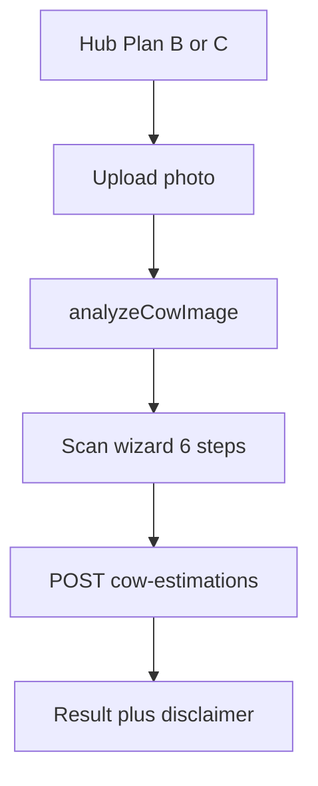

# Cow Weight & Meat Estimation (AI) — Living Tracker

> **Living tracker** for FarmBondhu cow weight: status, what should work, changelog, phases, API/DB.  
> **Pipeline / keypoints / training details:** [`frontend/src/lib/cowWeight/cowweight.md`](../../frontend/src/lib/cowWeight/cowweight.md)

Update this file at the **start** and **end** of every cow-weight task.

---

## Status

| Field | Value |
|-------|-------|
| **Status** | `phase_1_done` |
| **Current phase** | 1 — AI Plan B + C (shipped) |
| **Last updated** | 2026-05-20 (body-first head direction: tail → head, torso thirds) |
| **Owner** | — |

---

## Changelog

| Date | Author | Summary |
|------|--------|---------|
| 2026-05-20 | Agent | Head direction: tail-first from full body (`tailSideFromMaskTorsoThirds`, hind/length-row thirds, outward length-end mass); head = opposite(tail); no leg-vote refine or `head_left` fallback; re-analyze after deploy |
| 2026-05-18 | Agent | Seg ONNX setup: `npm run cow:models:seg` exports `yolov8n-seg.onnx` to `public/models/` (gitignored); required for exact ML curved border (`yolov8n-seg-onnx`) |
| 2026-05-18 | Agent | Body outline fix: Moore contour trace + largest CC + ribbon fallback (`buildBodyOutline`); removed atan2 star polygon; Step 1 outline label (AI vs estimated) |
| 2026-05-18 | Agent | YOLOv8-seg: `yoloSegDetect.ts`, body outline overlay, mask-based head/legs/length; heuristic outline fallback |
| 2026-05-18 | Agent | Horizontal head side: `headSideFromLengthEnds` (bbox-edge); fix `detectHeadSide` inverted fallback; remove tail-biased `facingFromLengthAndLegs` |
| 2026-05-18 | Agent | Unified `resolveHeadSide` (length protrusion → `detectHeadSide` edge); two-pass legs; Step 1 Head left/right toggle; removed centroid/`invertFacing` |
| 2026-05-18 | Agent | Head detection (`detectHeadSideInPhoto`) + `assignLegsByFacing`; `resolveCowFacing`; keep facing stack |
| 2026-05-18 | Agent | Final doc check: hub preload, confidence caps, confirm route note |
| 2026-05-18 | Agent | Tracker sync: shipped flow, expected behavior, API/DB, facing badge, link to cowweight.md |
| 2026-05-18 | Agent | Add `frontend/src/lib/cowWeight/cowweight.md` — full technical guide |
| 2026-05-18 | Agent | Facing badge: `detectDisplayFacing` (leg protrusion + head fallback); leg zones use `facingForLegs` |
| 2026-05-18 | Agent | Leg2 fix: `detectPhotoOrientation`; `pickRightLegColumn` facing bands + hoof Y |
| 2026-05-20 | Agent | Removed face/nose luminance (`detectHeadSide`) and head-edge protrusion vote; head from body mask band + tail only |
| 2026-05-20 | Agent | Head-first resolver on upload: head band → else tail (rump) → head = opposite(tail); unknown if both fail |
| 2026-05-20 | Agent | Color-independent head: mask tip + length-end head mass priority (black/white cows); tighter head wedges 12%/88% |
| 2026-05-18 | Agent | C1 top chest: `detectTopChestY` (6–32% scan, 14% fallback), clamped above C2 |
| 2026-05-18 | Agent | C2 brisket: scan 48–58%, 58% cap, width gate, leg ceiling |
| 2026-05-18 | Agent | Plan B/C 6-step scan wizard, keypoints, overlay, EN/BN |
| 2026-05-18 | Agent | Phase 1 shipped: browser AI, API, DB, farmer sidebar |
| 2026-05-18 | Agent | Initial tracker doc created |

---

## What should work today (Phase 1)

Use this section to verify weight detection after code or model changes.

### End-to-end (farmer)

| Step | Route | Expected result |
|------|-------|-----------------|
| Hub | `/dashboard/cow-weight` | Choose Plan B or C; `preloadCowModels()` on hub mount |
| Upload | `upload?mode=plan_b\|plan_c` | Pick side-view photo |
| Analyze | `analyze` | `analyzeCowImage` → auto-navigate to `scan` with `analysis` |
| Scan 1–6 | `scan` | Primary wizard: bbox, keypoints, adjust lines, save |
| Confirm | `confirm` | Legacy/alternate confirm UI (main path uses `scan`) |
| Result | `result` | Live weight, meat breakdown, disclaimer text |

### Cow detection (browser)

| Check | Expected |
|-------|----------|
| Model | **Seg:** `yolov8n-seg.onnx` → `yolov8n-seg-onnx`; else **detect:** `yolov8n.onnx` or COCO-SSD `cow` |
| Body outline | Green **curved path** along cow border: **seg ONNX** = ML mask contour; **no seg** = largest blob + row ribbon (no center “star” spokes). Invalid/self-intersecting polygons hidden (dashed bbox only). Step 1 badge: “AI body outline” vs “Estimated outline”. |
| Output | Confidence badge step 1; faint dashed bbox when outline shown |
| Failure | Clear error if no cow (bad angle, occlusion, missing model) |
| Coordinates | `displayImageUrl` and bbox share same resized canvas (max side 1280 px) |

### Auto keypoints (step 1 overlay)

| Marker | Expected placement |
|--------|-------------------|
| Leg1 / Leg2 | **Leg1** = front leg on **head side**; **Leg2** = hind on tail side (`assignLegsByFacing`) |
| C1 | Top chest / withers (not bbox top edge) |
| C2 | Lower chest / brisket (not belly or penis) |
| L1 / L2 | Body length ends at ~32% bbox height |
| Facing badge | **Head left** = head on **left side of photo**; **Head right** = head on **right side** |

**Head side definition (image horizontal position):**

- **Head left** — cow's head is toward the left of the image (smaller X).
- **Head right** — cow's head is toward the right of the image (larger X).

**Segmentation + keypoints (`cowMask.ts`, `yoloSegDetect.ts`):**

| Step | Function | Notes |
|------|----------|-------|
| Detect | `detectCowWithSeg` | Mask from YOLOv8-seg protos; polygon via `maskToOutlinePolygon` |
| Fallback outline | `heuristicMaskFromCanvas` | Threshold inside bbox when seg ONNX absent |
| Head | `detectCowBodyDirection` → `resolveBodyHeadDirection` | **Head-first:** head-band wedges → centroid → length-end head mass; **fallback:** rump/torso tail → head = opposite |
| Legs | `legColumnsFromMask` | Hoof-band column peaks on mask; else photo silhouette |
| Length | `lengthEndsFromMask` | Left/right mask extent at length row |
| Pass B legs | `detectLegColumnsFromPhoto(..., headSide)` | When mask legs missing |
| Assign | `assignLegsByFacing` | Leg1 front on head side, Leg2 hind |
| UI override | Step 1 toggle + `reassignKeypointsForHeadSide` | Fixes auto label without retake |

**Leg rules after detection:**

- Head **left** → Leg1 = left column (front), Leg2 = right column (hind)
- Head **right** → Leg1 = right column (front), Leg2 = left column (hind)

Removed `facingFromLengthAndLegs` (tail protrusion past legs biased toward head_right on head-left cows).

**Tail → head rules:** tail on photo **right** → head **left** (normal); tail on photo **left** → head **right** (reverse).

After app updates: **retake or re-analyze** — cached `analysis.keypoints` keeps old facing/legs. Use Step 1 **Head left / Head right** toggle to correct without retake.

### Measurements and weight

| Mode | Scale | Expected confidence |
|------|-------|---------------------|
| **Plan B** | Chest: `150 / bbox_height`; length: `150 / (bbox_width × 0.72)` (axis-aware) | Preview capped ~0.55 (`scanMetrics`); saved `confidence` may cap at 0.5 (`api.resolveDimensions`) |
| **Plan C** | `100 cm / reference_line_px` (1 m stick) | Higher when stick detected or user taps R1/R2 |

Formula (backend + preview):

```text
live_weight_kg = (chest_width_cm² × body_length_cm) / 660
edible_meat_kg   = live_weight_kg × 0.55
```

Divisor overridable: backend env `COW_WEIGHT_FORMULA_DIVISOR` (implemented).

### Save API

| Check | Expected |
|-------|----------|
| POST | 201 with `estimated_live_weight_kg`, `breakdown`, `detection_mode` |
| `input_method` | `ai_assisted` from wizard |
| `annotation_json` | bbox, lines, model, `scanWizard: true` |
| Image | Uploaded to Cloudinary `cow-estimation` if configured; **row still saves** if Cloudinary off |
| Auth | 401/403 if not signed in |

### Known limitations (not bugs)

- Plan B weight is **rough** without a reference stick.
- Side-view only; head-on or rear-only photos fail detection.
- Keypoints are **heuristics**, not learned pose — user can drag C1/C2/L1/L2 in steps 2–3.
- Facing badge can be wrong on unusual poses; legs/C1/C2 may still be usable.

---

## 1. Product summary

### Shipped user flow

```text
Hub (Plan B or C)
  → upload photo
  → analyze (YOLO/COCO + keypoints + proposed lines)
  → 6-step scan wizard (detect → chest → length → scale → measure → review)
  → POST estimation + optional Cloudinary image
  → result screen with disclaimer
```

### System goals

| Goal | Phase 1 status |
|------|----------------|
| Detect / frame cow in image | **Shipped** (YOLO ONNX + COCO-SSD) |
| Propose chest + length lines | **Shipped** (heuristics + user drag) |
| Estimate live weight + meat | **Shipped** (formula) |
| Save history per farmer | **Shipped** (Postgres) |
| Learn from scale weights | Phase 4 (not shipped) |

### Disclaimer

**Shipped** on result screen (`cowWeight.disclaimer`):

- Estimates only — not a substitute for a physical scale.
- Not legal/market certification for Qurbani or sale pricing.
- Verify on a scale before financial decisions.

---

## 2. Canonical formula

Uses **chest width** and **body length** in **centimeters** (domain default cm; expert sign-off pending).

```text
live_weight_kg = (chest_width_cm × chest_width_cm × body_length_cm) / DIVISOR
edible_meat_kg   = live_weight_kg × 0.55
```

**Default divisor:** `660` — override via backend `COW_WEIGHT_FORMULA_DIVISOR` (`cowEstimationFormula.js`).

**Example** (chest 55 cm, length 65 cm):

```text
(55 × 55 × 65) / 660 ≈ 297.92 kg live weight
edible meat ≈ 297.92 × 0.55 ≈ 163.86 kg
```

### Meat breakdown (% of live weight)

| Part | % of live weight | Example @ 300 kg |
|------|------------------|------------------|
| Solid meat | 30% | 90 kg |
| Bone | 15% | 45 kg |
| Fat | 5% | 15 kg |
| Head meat | 3% | 9 kg |
| Liver & heart | 2% | 6 kg |
| **Total edible** | **55%** | **165 kg** |

---

## 3. Measurement strategy

A single 2D photo has **no inherent scale**. Reliable cm values require:

1. **Plan C** — 1 m reference in frame (best)
2. **Plan B** — assumed cow height from bbox (low confidence)
3. **Phase 4** — ML trained on photos + scale weights (future)

### Approved approach per phase

| Phase | Mode | How dimensions are obtained |
|-------|------|----------------------------|
| 1 (shipped) | **Plan B** `plan_b` | Detect → keypoints → 6-step wizard → dual-axis bbox scale (chest from height, length from width) |
| 1 (shipped) | **Plan C** `plan_c` | Same + 100 cm reference (auto edge or tap R1/R2) |
| 2 (later) | `manual` | Farmer enters cm without AI |
| 3 (later) | `ml` | Trained model + feedback loop |

### Pixel → cm (shipped)

```text
Plan B (axis-aware):
  chest_cm_per_pixel  = 150 / bbox_height_px
  length_cm_per_pixel = 150 / (bbox_width_px × 0.72)
  chest_width_cm      = chest_line_px × chest_cm_per_pixel   (vertical C1–C2)
  body_length_cm      = length_line_px × length_cm_per_pixel (horizontal L1–L2)

Plan C:
  cm_per_pixel = 100 / reference_line_px
  chest_width_cm  = chest_line_px × cm_per_pixel
  body_length_cm  = length_line_px × cm_per_pixel
```

**Why dual-axis:** A single `150 / bbox_height` scale on a **horizontal** length line inflates `body_length_cm` when `bbox.width > bbox.height` (common side views), which drives weights of 800–1200 kg on ~440 kg cows.

**Sanity (Plan B):** With auto lines near ~40% bbox height (chest) and ~72% bbox width (length), `chest_width_cm ≈ 60` and `body_length_cm ≈ 150`; formula `(60² × 150) / 660 ≈ 818 kg` is still an estimate — retune lines or use Plan C for scale truth. Wide photos where old length hit 180+ cm should drop toward ~150 cm length and ~350–650 kg for typical dairy geometry.

### Shipped app flow



**Scan steps:** 1 Detect → 2 Chest → 3 Length → 4 Scale → 5 Measure → 6 Review.

### Capture rules (farmer guidance)

1. Side profile — full body (head to tail), cow standing still.
2. Camera ~90° to cow; avoid ultra-wide lens.
3. Plan C: 1 m stick at **body height**, same depth as cow.
4. Good lighting; minimal occlusion on chest and back.
5. Chest width — consistent widest-chest definition.
6. Body length — shoulder to rear along back line.

### Why not LLM-only?

Do **not** use `aiFarmChat` for numeric weight. Use formula + measured cm or dedicated CV/ML.

---

## 4. Phased implementation checklist

### Phase 0 — Doc & decisions

- [x] Create tracker doc (`docs/ai/cow_weight_detection.md`)
- [ ] Confirm units (cm) and divisor `660` with domain expert
- [x] i18n keys (EN/BN) in `frontend/src/i18n/translations.ts`

### Phase 1 — AI Plan B + C (shipped)

- [x] DB: `cow_weight_estimations` in `backend/src/db/ensureSchema.js`
- [x] Service: `backend/src/services/cowEstimationFormula.js` (+ `COW_WEIGHT_FORMULA_DIVISOR`)
- [x] Routes: `backend/src/routes/v1/cowEstimation.js` → `/api/v1/cow-estimations`
- [x] Cloudinary folder `cow-estimation` (optional; save without image if unset)
- [x] UI: `frontend/src/pages/dashboard/cowWeight/*` + `CowWeightEstimator.tsx`
- [x] Route: `/dashboard/cow-weight/*` in `frontend/src/App.tsx`
- [x] Nav: `FarmSidebar` + `sidebar.cowWeight`
- [x] Browser AI: `yoloDetect.ts` (ONNX YOLOv8n if present, else COCO-SSD)
- [x] 6-step scan wizard: `CowWeightScan.tsx`
- [x] Keypoints: `cowKeypoints.ts` (legs, C1/C2, L1/L2, facing badge)
- [x] Overlay: `CowWeightOverlay.tsx` + `ScanStepper` / `ScanDetailPanel`
- [x] Plan C reference: `referenceScale.ts` + tap fallback
- [x] Technical guide: `frontend/src/lib/cowWeight/cowweight.md`
- [x] Disclaimer on `CowWeightResult.tsx`

### Phase 2 — Manual fallback (later)

- [ ] Manual cm entry screen (no AI)

### Phase 3 — Stronger CV (later)

- [ ] Bundle `yolov8n.onnx` in repo / CI (see `frontend/public/models/README.md`)
- [ ] Optional Python service (`COW_CV_SERVICE_URL`)

### Phase 4 — Learning loop (later)

- [ ] `PATCH` estimation with `actual_weight_kg`
- [ ] Export / retraining dataset from `annotation_json`

---

## 5. API contract (shipped)

Base path: `/api/v1/cow-estimations`  
Auth: `requireUser` (farmer session).

| Method | Path | Notes |
|--------|------|-------|
| `POST` | `/` | Create estimation (see body below) |
| `GET` | `/` | List current user (limit 100) |
| `GET` | `/:id` | Detail; 404 if not owner |
| `PATCH` | `/:id` | **Not implemented** — Phase 4 `actual_weight_kg` |

### POST body (wizard)

| Field | Required | Notes |
|-------|----------|-------|
| `chest_width_cm` | yes | > 0 |
| `body_length_cm` | yes | > 0 |
| `detection_mode` | no | `plan_b` \| `plan_c` (default `plan_b`) |
| `input_method` | no | Wizard sends `ai_assisted` |
| `confidence` | no | 0–1 from analysis |
| `annotation_json` | no | bbox, lines, model, dimensions, `scanWizard` |
| `file_data` | no | JPEG data URL → Cloudinary |
| `farm_id`, `animal_id` | no | Optional links |
| `model_version` | no | Client: `browser-v1`; server default `yolov8n-browser-v1` if omitted |

**POST response (shape):**

```json
{
  "data": {
    "id": "uuid",
    "chest_width_cm": 55,
    "body_length_cm": 65,
    "detection_mode": "plan_c",
    "estimated_live_weight_kg": 297.92,
    "edible_meat_kg": 163.86,
    "breakdown": { "solid_meat_kg": 89.38, "bone_kg": 44.69, "fat_kg": 14.9, "head_meat_kg": 8.94, "liver_heart_kg": 5.96 },
    "input_method": "ai_assisted",
    "confidence": 0.82,
    "image_url": "https://...",
    "created_at": "..."
  }
}
```

**Errors:** `400` invalid dimensions or `detection_mode`; `403` forbidden; `404` animal not found; `502` image upload failure; `503` if DB table missing (`db:ensure`).

---

## 6. DB schema (shipped)

Table: `public.cow_weight_estimations`

| Column | Type | Notes |
|--------|------|-------|
| `id` | uuid PK | `gen_random_uuid()` |
| `user_id` | uuid NOT NULL | owner |
| `farm_id` | uuid nullable | |
| `animal_id` | uuid nullable | |
| `image_url` | text nullable | Cloudinary |
| `chest_width_cm` | numeric NOT NULL | |
| `body_length_cm` | numeric NOT NULL | |
| `estimated_live_weight_kg` | numeric NOT NULL | formula |
| `edible_meat_kg` | numeric NOT NULL | |
| `breakdown` | jsonb NOT NULL | part kg map |
| `detection_mode` | text NOT NULL | default `plan_b` |
| `input_method` | text NOT NULL | default `ai_assisted` |
| `annotation_json` | jsonb nullable | wizard lines + bbox |
| `confidence` | numeric nullable | |
| `actual_weight_kg` | numeric nullable | Phase 4 |
| `model_version` | text nullable | e.g. `browser-v1` |
| `created_at` | timestamptz | default `now()` |

Indexes: `user_id`, `farm_id`, `created_at desc`.

---

## 7. Integration map

| Concern | Location |
|---------|----------|
| Analyze pipeline | `frontend/src/lib/cowWeight/analyzeCow.ts` |
| YOLO / COCO | `frontend/src/lib/cowWeight/yoloDetect.ts` |
| Keypoints + facing | `frontend/src/lib/cowWeight/cowKeypoints.ts` |
| Formula | `backend/src/services/cowEstimationFormula.js` |
| API routes | `backend/src/routes/v1/cowEstimation.js` |
| Image upload | `backend/src/services/cloudinaryUpload.js` |
| Farmer nav | `FarmSidebar.tsx` → `/dashboard/cow-weight` |
| AI chat (do not use for weight) | `backend/src/routes/v1/aiFarmChat.js` |

### Browser inference

| Field | Value |
|-------|-------|
| Seg (exact outline) | `yolov8n-seg.onnx` — `npm run cow:models:seg` → `/models/yolov8n-seg.onnx` (`VITE_COW_YOLO_SEG_MODEL_URL`) |
| Detect (bbox) | YOLOv8n ONNX — `VITE_COW_YOLO_MODEL_URL` or `/models/yolov8n.onnx` |
| COCO class | cow (fallback), YOLO class id **19** |
| Conf threshold | **0.35** |
| WASM | onnxruntime-web via jsDelivr CDN |

### Optional ML service (Phase 3+)

| Field | Value |
|-------|-------|
| `COW_CV_SERVICE_URL` | Optional server-side detect |

---

## 8. Test plan checklist

- [x] Formula: `55, 65` → live weight ≈ `297.92` kg
- [ ] Formula: zero or negative dimensions → `400`
- [ ] Ownership: user A cannot `GET` user B's estimation
- [x] Cloudinary unset → estimation saves without image (no hard 503)
- [x] UI shows disclaimer on result screen
- [ ] Meat breakdown sums to 55% of live weight
- [ ] Side-view photos: detection + reasonable keypoints (manual QA)
- [ ] Plan C with 1 m stick: cm scale and weight closer to tape measure

---

## 9. Open decisions log

| Question | Options | Decision | Date |
|----------|---------|----------|------|
| Units | cm vs inch | **Pending** — assume cm in UI/API | 2026-05-18 |
| Formula divisor | 660 vs regional | **Pending** — default 660, env override shipped | 2026-05-18 |
| Route visibility | Farmer vs public | **Pending** — farmer dashboard only | 2026-05-18 |
| Marketplace tie-in | List with AI estimate | **Pending** — out of v1 | 2026-05-18 |
| i18n | EN + BN | **Decided — shipped** | 2026-05-18 |

---

## 10. How to keep this doc updated

**Before cow-weight work:** Read this tracker + skim [`cowweight.md`](../../frontend/src/lib/cowWeight/cowweight.md) for pipeline detail.

**After changes:**

1. Update **What should work today** if behavior changes.
2. Set **Last updated** in Status.
3. Add a **Changelog** row.
4. Tick Phase checklist (§4).
5. Update §5–6 if API/DB changed.

**Doc split:**

| File | Use for |
|------|---------|
| This tracker | Status, expected behavior, changelog, phases, API/DB, decisions |
| `cowweight.md` | Deep dive: diagrams, constants, training, troubleshooting |

---

## 11. Related docs

- **Technical guide:** [`frontend/src/lib/cowWeight/cowweight.md`](../../frontend/src/lib/cowWeight/cowweight.md)
- Project overview: `aboutproject.md`
- MediBondhu tracker style: `docs/MEDIBONDHU_BOOKING_STATUS.md`
