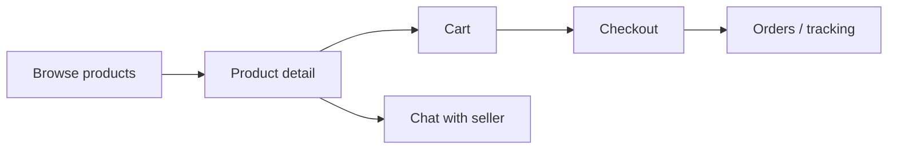

# FarmBondhu Marketplace — Developer Reference

> Single reference for how the marketplace works: product browse and checkout, seller shop management, and buyer↔seller chat (dual-role own-shop threads, Messenger-style receipts, per-message translation).

---

## Table of contents

1. [Overview](#1-overview)
2. [Roles and access](#2-roles-and-access)
3. [Buyer journey](#3-buyer-journey)
4. [Seller journey](#4-seller-journey)
5. [Chat system](#5-chat-system)
6. [Backend API reference](#6-backend-api-reference)
7. [Database tables](#7-database-tables)
8. [Key frontend files](#8-key-frontend-files)
9. [Environment and setup](#9-environment-and-setup)
10. [Manual test checklists](#10-manual-test-checklists)

---

## 1. Overview

The **marketplace** module lets farmers and buyers:

- **Browse and buy** farm supplies, pet supplies, MediBondhu (human pharmacy), VetBondhu (animal pharmacy), livestock & dairy, and farm machinery
- **Sell** via a personal shop (list products, fulfill orders)
- **Chat** with sellers from a product page (or reply as seller from the dashboard)

### Tech stack

| Layer | Location |
|-------|----------|
| Frontend | React + Vite (`frontend/src/pages/marketplace/`, `frontend/src/components/marketplace/`) |
| REST API | [`backend/src/routes/v1/marketplace.js`](../backend/src/routes/v1/marketplace.js) mounted at `/v1/marketplace` |
| Orders API | [`backend/src/routes/v1/orders.js`](../backend/src/routes/v1/orders.js) at `/v1/orders` |
| Compat bridge | [`backend/src/routes/v1/compatFrom.js`](../backend/src/routes/v1/compatFrom.js) — Supabase-style `api.from(...)` writes for conversations, messages, orders |
| Database | PostgreSQL via [`backend/src/db/ensureSchema.js`](../backend/src/db/ensureSchema.js) |
| Realtime (optional) | Supabase `postgres_changes` when `VITE_SUPABASE_URL` + anon key are set; otherwise polling |

Cart state lives in React context ([`CartContext`](../frontend/src/contexts/CartContext.tsx)); orders in [`OrderContext`](../frontend/src/contexts/OrderContext.tsx).

---

## 2. Roles and access

Capabilities are checked on routes in [`frontend/src/App.tsx`](../frontend/src/App.tsx) via `ProtectedRoute`.

| Capability | Meaning | Typical grant |
|------------|---------|---------------|
| `can_buy` | Browse marketplace, cart, checkout, orders, buyer inbox | Default buyer access |
| `can_sell` | Seller dashboard, product CRUD, seller messages | Shop / vendor approval |

**Buyer signup:** New accounts with role `buyer` receive **`can_buy` only** and land on `/marketplace` after registration or login. MediBondhu (`can_book_human`) is granted via **Access Center** admin approval — not by default.

**Wholesale pricing:** Any buyer with `can_buy` automatically receives a product’s wholesale unit price when their cart line meets the seller’s per-product rules (minimum quantity, minimum line value, or both). No separate wholesale buyer access request is required. Sellers configure thresholds on each listing (`wholesale_price`, `wholesale_rule`, `wholesale_min_qty`, `wholesale_min_order_bdt`).

Users can hold **both** capabilities (buy from others and sell from their shop).

### Buyer routes (`can_buy`)

| Route | Page |
|-------|------|
| `/marketplace` | Product browse — **Flash Sale** rail (admin-enabled deals) + **All Products** grid (full catalog by default; flash items appear in both) |
| `/marketplace/:id` | Product detail + **Chat Now** |
| `/marketplace/inbox` | Buyer conversation list |
| `/marketplace/chat/:conversationId` | Thread UI (`conversationId` may be `new` to start) |
| `/cart` | Cart |
| `/checkout` | Checkout |
| `/orders`, `/orders/:orderId` | Order history and tracking |
| `/orders/:orderId/return` | Return request |

### Seller routes (`can_sell`)

| Route | Page |
|-------|------|
| `/my-shop` | Shop profile and product management |
| `/seller/dashboard` | Products, orders, **Messages** tab |
| `/seller/dashboard?tab=messages` | [`SellerChatInbox`](../frontend/src/components/marketplace/SellerChatInbox.tsx) |
| `/seller/orders` | Seller order list ([`SellerOrders.tsx`](../frontend/src/pages/marketplace/SellerOrders.tsx)) |
| `/seller/orders/:orderId` | Seller order detail — vendor layout, fulfillment actions ([`SellerOrderDetail.tsx`](../frontend/src/pages/marketplace/SellerOrderDetail.tsx)) |
| `/orders/:orderId` | **Buyer** order tracking only ([`OrderTracking.tsx`](../frontend/src/pages/marketplace/OrderTracking.tsx)) — not used from vendor panel |
| `/seller/products`, `/seller/inventory`, … | Vendor tools |

`/my-shop` is reachable without `can_sell` on the route guard but the page checks capability internally.

### Admin

| Route | Component |
|-------|-----------|
| `/admin/marketplace` | [`AdminMarketplace`](../frontend/src/pages/admin/AdminMarketplace.tsx) — products, shops, banners |
| `/admin/marketplace/buyers` | [`AdminMarketplaceBuyers`](../frontend/src/pages/admin/AdminMarketplaceBuyers.tsx) — buyer list, avatars, moderation |
| `/admin/marketplace/sellers` | [`AdminMarketplaceSellers`](../frontend/src/pages/admin/AdminMarketplaceSellers.tsx) — seller shops, avatars, moderation |
| `/admin/marketplace/transactions` | [`AdminMarketplaceTransactions`](../frontend/src/pages/admin/AdminMarketplaceTransactions.tsx) — payment / fulfillment / refund ledger |
| `/admin/orders` | [`AdminOrders`](../frontend/src/pages/admin/AdminOrders.tsx) — filtered order list |
| `/admin/orders/:orderId` | [`AdminOrderDetail`](../frontend/src/pages/admin/AdminOrderDetail.tsx) — full order tracking (read-only) |
| `/admin/marketplace/messages` | [`AdminPlatformMessages`](../frontend/src/pages/admin/AdminPlatformMessages.tsx) — all marketplace threads; view-only until reported; admin replies labeled **Platform support from admin** |
| `/admin/marketplace/reports` | [`AdminMarketplaceReports`](../frontend/src/pages/admin/AdminMarketplaceReports.tsx) — marketplace chat reports only |
| `/admin/moderation-reports` | [`AdminModerationReports`](../frontend/src/pages/admin/AdminModerationReports.tsx) — **all** user reports (community + marketplace) |
| `/admin/farmbondhu-shop` | [`FarmBondhuShop`](../frontend/src/pages/admin/FarmBondhuShop.tsx) — official products + seller-style Messages tab (`SellerChatInbox` for canonical FarmBondhu seller) |
| Admin chat panel | [`AdminChatInbox`](../frontend/src/components/marketplace/AdminChatInbox.tsx) — platform support inbox UI (`scope="platform_support"` on Customer Support) |

### Admin moderation (buyers & sellers)

On **Buyers** and **Sellers** admin pages, each account can be moderated from the detail dialog. Every mutation requires typing **`greenbondhu`** in the confirm dialog (`confirmPhrase` in the API body).

| Action | Effect |
|--------|--------|
| **Suspend** | `profiles.status = suspended` — blocks sign-in |
| **Activate** | `profiles.status = active`; re-enables marketplace capabilities |
| **Block marketplace** | Buyer: `can_buy` disabled. Seller: `can_sell` disabled + `shops.status = blocked` |
| **Unblock marketplace** | Re-enable `can_buy` / `can_sell`; seller shop `status = approved` |
| **Remove marketplace access** | Disable marketplace capabilities only; account and order history remain |
| **Soft delete** | `profiles.status = deleted`, anonymize email/name; orders kept for audit |
| **Permanent delete** | Super Admin only; hard delete profile/shop/products **if no orders** (409 otherwise) |

List rows include `avatar_url` (buyers) or `logo_url` / `owner_avatar_url` (sellers) and a derived `marketplace_blocked` flag. Login rejects `suspended` and `deleted` profiles. Order create checks buyer `can_buy`; seller product writes check shop/capability block state.

---

## 3. Buyer journey



### Browse

[`Marketplace.tsx`](../frontend/src/pages/marketplace/Marketplace.tsx):

- **Page layout (top to bottom):** title → search/sort → **admin banner carousel (3:1)** → lane tabs → subcategory chips
- **Top-row lanes:** All / MediBondhu Pharmacy / VetBondhu Pharmacy / Farm Supplies / Pet Supplies / Livestock & Dairy / Farm Machinery (`?lane=all|medibondhu|vetbondhu|farm|pet|livestock_dairy|farm_machinery`; legacy `?lane=pharmacy` maps to `medibondhu`)
- **Second-row filters:** category chips for the active lane (plus **All**); chips wrap to multiple lines
- Search, sort (newest, price, rating), stock / free delivery / verified seller toggles
- Data: `GET /v1/marketplace/products` with query params (`lane`, `category`, `sort`, `in_stock`, etc.)

**Browse UI styling** ([`marketplaceCalloutStyles.ts`](../frontend/src/components/marketplace/marketplaceCalloutStyles.ts)):

| Row | Styling |
|-----|---------|
| Top lane tabs | Pink marketplace tray; inactive pink text; active solid `#E91E8C` pill with white text |
| Sub category tabs | Default gray `TabsList`; inactive **black** labels; active pink pill (same as top row active state) |

Category definitions, lane routing, and legacy DB aliases live in [`marketplaceCategories.ts`](../frontend/src/lib/marketplaceCategories.ts). Backend validation mirrors slugs in [`product.js`](../backend/src/validators/product.js); lane filters use `MEDIBONDHU_CATEGORIES`, `VETBONDHU_CATEGORIES`, `FARM_CATEGORIES`, `PET_CATEGORIES`, `LIVESTOCK_DAIRY_CATEGORIES`, and `FARM_MACHINERY_CATEGORIES` in [`marketplace.js`](../backend/src/routes/v1/marketplace.js).

#### Lanes and categories

| Lane | Tab label | Purpose |
|------|-----------|---------|
| `all` | All | Every category |
| `medibondhu` | MediBondhu Pharmacy | Human / MediBondhu health products |
| `vetbondhu` | VetBondhu Pharmacy | Animal medicine, vaccines, and vet equipment |
| `farm` | Farm Supplies | Feed, seeds, fertilizer, produce, packaging, organic |
| `pet` | Pet Supplies | Companion-animal products |
| `livestock_dairy` | Livestock & Dairy | Livestock, meat, milk, eggs, fish |
| `farm_machinery` | Farm Machinery | Machines, tools, irrigation |

**MediBondhu Pharmacy** (9 slugs): `medicine`, `vaccines`, `supplements`, `first_aid`, `health_care_items`, `medical_equipment`, `baby_care`, `diabetes_care`, `skin_personal_care`

**VetBondhu Pharmacy** (8 slugs): `animal_medicine`, `pet_medicine`, `animal_vaccine`, `animal_vitamins_supplements`, `dewormer`, `wound_care`, `animal_first_aid`, `vet_equipment`

**Farm Supplies** (9 slugs): `animal_feed`, `seeds_plants_nursery`, `fertilizer`, `pesticide`, `rice_grains_pulses`, `vegetables_fruits`, `bags_packaging_storage`, `organic_products`, `farm_accessories_grooming`

**Pet Supplies** (8 slugs): `pet_food`, `pet_medicine_health`, `pet_care_grooming`, `pet_accessories`, `pet_cage_carrier`, `pet_bowl_feeder`, `pet_toys`, `pet_litter_cleaning`

**Livestock & Dairy** (5 slugs): `livestock`, `meat`, `milk_dairy`, `eggs`, `fish_fishery`

**Farm Machinery** (3 slugs): `farm_machines`, `farm_tools_equipment`, `water_irrigation`


#### Browse banners (admin)

Admins manage wide **3:1** promotional banners (recommended **2172 × 724 px**) under **Admin → Marketplace → Banners**.

| Step | Detail |
|------|--------|
| Upload | `POST /v1/marketplace/admin/banners/upload-image` → Cloudinary folder **`marketplace/banners`** |
| Save | `POST /v1/marketplace/admin/banners` stores **`image_url`** (HTTPS Cloudinary URL only) plus optional `link_url`, `sort_order`, `is_active`, **`display_seconds`** (3–120, default 5), and optional schedule **`starts_at`** / **`ends_at`** |
| Display | `GET /v1/marketplace/banners` — active banners within schedule window only; carousel on browse page between search and lane tabs; each slide auto-advances after its **`display_seconds`** |
| Link | Preset internal pages (marketplace lanes, cart, categories) or custom URL |

Product listing images use a separate Cloudinary folder: **`marketplace/products`**.

**Note:** `pet_medicine` (VetBondhu) is distinct from `pet_medicine_health` (Pet Supplies lane).

**Legacy category values** (e.g. `feed`, `produce`, `pest_control`, `equipment`, `grooming`, `packaging`) still resolve via aliases in `marketplaceCategories.ts` and `normalizeCategory()` in `product.js` — no DB migration required. New listings should use the new slugs.

**Vendor product form** ([`ProductFormDialog.tsx`](../frontend/src/components/marketplace/ProductFormDialog.tsx)): category dropdown grouped as MediBondhu Pharmacy, VetBondhu Pharmacy, Farm Supplies, Pet Supplies, Livestock & Dairy, and Farm Machinery via [`getCategoryGroups()`](../frontend/src/lib/marketplaceProductForm.ts). Default new product category: `animal_feed`.

**Categories browse page** ([`Categories.tsx`](../frontend/src/pages/marketplace/Categories.tsx)): grid of all categories; MediBondhu, VetBondhu, and Pet Supplies cards show lane badges.

### Product cards

[`MarketplaceProductCard.tsx`](../frontend/src/components/marketplace/MarketplaceProductCard.tsx):

- Image area uses **`aspect-[4/3]`** full width with **`object-cover`** (no small centered thumbnail letterboxing)
- Discount, stock, and free-delivery badges overlay the image
- Used on browse grid, buyer home rails, and flash sale section

### Browse page layout (`/marketplace`)

[`Marketplace.tsx`](../frontend/src/pages/marketplace/Marketplace.tsx): search, sort, lane/category filters, then:

1. **Flash Sale** — [`FlashSaleSection`](../frontend/src/components/marketplace/FlashSaleSection.tsx): horizontal rail of active deals (`is_flash_sale`, MRP &gt; sale price, `flash_sale_end` not passed). Admin enables via **Admin → Marketplace → Flash Sale**.
2. **All Products** — full filtered catalog grid (default: all lanes, all categories). Flash deal SKUs remain in this grid as well (standard e-commerce pattern).

Buyer home also shows the flash rail above category shortcuts.

### Product detail and chat entry

[`ProductDetail.tsx`](../frontend/src/pages/marketplace/ProductDetail.tsx) + [`TalkToSellerButton.tsx`](../frontend/src/components/marketplace/TalkToSellerButton.tsx):

- **Talk with Seller** / **Chat Now** → `/marketplace/chat/new?seller={sellerId}&product={productId}`
- Own listing: button still shows **Chat Now** (no separate “Test Chat” flow)

Detail payload: `GET /v1/marketplace/products/:id/details` (product + shop).

### Cart, checkout, orders

| Step | File | Backend |
|------|------|---------|
| Cart | [`Cart.tsx`](../frontend/src/pages/marketplace/Cart.tsx), [`CartContext`](../frontend/src/contexts/CartContext.tsx) | Client-only until checkout |
| Checkout | [`Checkout.tsx`](../frontend/src/pages/marketplace/Checkout.tsx) | `POST /v1/orders` via `OrderContext.placeOrder` |
| Orders | [`Orders.tsx`](../frontend/src/pages/marketplace/Orders.tsx), [`OrderTracking.tsx`](../frontend/src/pages/marketplace/OrderTracking.tsx) | `GET /v1/orders`, `PATCH /v1/orders/:id` |

Order rows include `items` (jsonb), `status`, `timeline`, payment and delivery fields. `delivery_address` is stored as **jsonb** (structured Bangladesh address). `estimated_delivery_note` holds the human-readable ETA label (e.g. `"3-5 business days"`); `estimated_delivery` is an optional timestamptz for sorting.

Order creation validates address fields server-side in [`orders.js`](../backend/src/routes/v1/orders.js) via [`orderValidate.js`](../backend/src/lib/orderValidate.js). Failed inserts return a 400 error message surfaced in checkout.

#### Order notifications and email

When an order is created or its `status` changes, [`marketplaceOrderNotify.js`](../backend/src/services/marketplaceOrderNotify.js) runs from `POST /v1/orders` and `PATCH /v1/orders/:id` (fire-and-forget — order APIs still succeed if mail is unavailable).

| Event | Buyer (in-app + email) | Seller (in-app + email) |
|-------|------------------------|-------------------------|
| Order placed (`pending`) | Confirmation | New order alert |
| Confirmed | Yes | — |
| Packed | Yes | — |
| Shipped (+ tracking if set) | Yes | — |
| Out for delivery | Yes | — |
| Delivered | Yes | — |
| Cancelled | Yes | Yes |
| Return requested | Yes | Yes |
| Returned | Yes | — |
| Refunded | Yes | — |

In-app rows use `context: marketplace`, `type: order`, and link to `/orders/:id` (buyer) or `/seller/orders/:id` (seller). Emails use the same Brevo/SMTP config as OTP (`BREVO_API_KEY` + `MAIL_FROM`, or `SMTP_*` + `MAIL_FROM` in [`mailSmtp.js`](../backend/src/services/mailSmtp.js)). Set `FRONTEND_URL` in backend `.env` so order emails include a clickable **View order** link (defaults to first `CORS_ORIGIN` or `http://localhost:5173`). User email preference toggles in Settings are not persisted yet — order emails send when mail is configured.

**Privacy and copy:** Templates live in [`marketplaceOrderEmailTemplates.js`](../backend/src/services/marketplaceOrderEmailTemplates.js). Buyer emails show the **shop name** only (resolved from `shops.shop_name` at send time — never the personal `seller_name` stored on the order). Seller emails refer to the buyer as **Customer** (no buyer personal name). Buyer emails include district/division only for delivery — not full street address or phone in the email body. Each message uses a branded HTML layout with item table, order summary, status-specific intro, and plain-text fallback.

### Saved addresses and checkout shipping

Users manage **structured Bangladesh addresses** on [`ProfilePage`](../frontend/src/pages/profile/ProfilePage.tsx) (all roles) and [`VetProfilePage`](../frontend/src/pages/vet/VetProfilePage.tsx). Checkout loads saved addresses via `GET /v1/me/addresses` and lets the buyer pick one or enter a new address with the same cascading form.

**Cascade:** Country → Division → District → Upazila/Thana → Area/Union/Ward (dropdown when data exists, otherwise free text) → Full Address → Landmark.

| Component / lib | Purpose |
|-----------------|---------|
| [`bangladeshLocations.json`](../frontend/src/data/bangladeshLocations.json) | 8 divisions, 64 districts, full upazila/thana list (static, in-repo) |
| [`bangladeshLocations.ts`](../frontend/src/lib/bangladeshLocations.ts) | Cascade helpers, hierarchy validation, form ↔ API payload |
| [`bangladeshPhone.ts`](../frontend/src/lib/bangladeshPhone.ts) | Mobile validation (`01` + 9 digits) |
| [`UserAddressForm`](../frontend/src/components/address/UserAddressForm.tsx) | Shared address form |
| [`UserAddressesSection`](../frontend/src/components/address/UserAddressesSection.tsx) | Profile CRUD (list, add, edit, delete, set default) |
| [`userAddressesApi.ts`](../frontend/src/lib/userAddressesApi.ts) | `/v1/me/addresses` client |
| [`meAddresses.js`](../backend/src/routes/v1/meAddresses.js) | Address CRUD + default |

**Shipping zones** ([`computeShippingFee`](../frontend/src/lib/marketplaceTheme.ts)) — applied at checkout and when placing orders in [`OrderContext`](../frontend/src/contexts/OrderContext.tsx):

| Zone | Condition | Fee |
|------|-----------|-----|
| Free | Any cart line with `freeDelivery` | ৳0 |
| Dhaka metro | Division Dhaka + district Dhaka, Gazipur, Narayanganj, or Narsingdi | ৳60 |
| Other Bangladesh | All other divisions/districts | ৳100 |

Cart page shows an estimate before an address is chosen (defaults to ৳60). Checkout updates delivery fee live when the selected address changes.

Default saved address also syncs legacy `profiles.location` (`District, Division`) and `profiles.phone` when empty.

---

## 4. Seller journey

### My Shop

[`MyShop.tsx`](../frontend/src/pages/marketplace/MyShop.tsx):

- Edit shop metadata (`PATCH /v1/marketplace/shops/:userId`)
- Create/update/delete products (seller-only marketplace routes)
- Upload images: `POST /v1/marketplace/products/upload-image` (Cloudinary or inline fallback)

### Seller Dashboard

[`SellerDashboard.tsx`](../frontend/src/pages/marketplace/SellerDashboard.tsx):

| Tab | Content |
|-----|---------|
| My Products | Seller’s listings |
| Incoming Orders | Links to [`SellerOrders.tsx`](../frontend/src/pages/marketplace/SellerOrders.tsx) |
| Messages | [`SellerChatInbox`](../frontend/src/components/marketplace/SellerChatInbox.tsx) — inbox from `GET /v1/marketplace/chat/seller/:id/bootstrap` |

Shop lookup for buyers: `GET /v1/marketplace/shops/by-user/:userId`.

### Public seller storefront (buyer view)

[`SellerShopPage.tsx`](../frontend/src/pages/marketplace/SellerShopPage.tsx) + [`SellerStorefrontLayout.tsx`](../frontend/src/components/marketplace/storefront/SellerStorefrontLayout.tsx):

- Featured pinned products at the top (seller-configured, max 8); pinned items also remain in their lane section below (intentional duplicate)
- Shop search, then **lane sections** in marketplace order via [`SellerLaneSections.tsx`](../frontend/src/components/marketplace/storefront/SellerLaneSections.tsx): MediBondhu Pharmacy, VetBondhu Pharmacy, Farm Supplies, Pet Supplies, Livestock & Dairy, Farm Machinery (`groupProductsByLane` in [`storefrontUtils.ts`](../frontend/src/lib/storefrontUtils.ts), order from [`SELLER_ONBOARDING_LANES`](frontend/src/lib/marketplaceLaneLabels.ts))
- Lane tabs match browse styling (**All** plus all six lanes, same order as `/marketplace`); **All** shows stacked sections with an empty-state line per lane when needed; a single lane tab shows that lane’s grid only
- Unmapped categories (e.g. legacy values not in [`marketplaceCategories.ts`](../frontend/src/lib/marketplaceCategories.ts)) appear under **Other products** when present

---

## 5. Chat system

Chat is the largest subsystem. Marketplace buyer–seller threads are keyed by **`(buyer_id, seller_id)`** — one conversation per shop. Individual products appear as **`product_share`** bubbles in that thread (and when opening chat from a new listing, a share is added if not already present).

### 5.1 Data model

Defined in [`ensureSchema.js`](../backend/src/db/ensureSchema.js):

**`conversations`**

| Column | Purpose |
|--------|---------|
| `buyer_id`, `seller_id` | Thread identity (one per shop) |
| `product_id` | Latest / anchor product for inbox preview; anchor `product_share` on create |
| `conversation_kind` | `marketplace` (default) or `platform_support` (user help/complaint — excluded from marketplace inboxes) |
| `support_topic`, `support_status` | For `platform_support`: `help` \| `complaint`; `open` \| `resolved` |

A row counts as **platform support** only when all are true: `conversation_kind = platform_support`, `support_topic` is `help` or `complaint`, and `product_id` is the **Customer Support** anchor product (`products.name = 'Customer Support'`, `seller_name = 'FarmBondhu Support'`). On `npm run db:ensure`, [`ensureSchema.js`](../backend/src/db/ensureSchema.js) repairs misclassified rows back to `marketplace`. Legacy compat conversation inboxes (`participant_inbox`, `seller_inbox`, `find`) exclude `platform_support`.

**Shop labels vs support branding:** Platform support setup must **not** overwrite marketplace `shops.shop_name`. Support APIs/UI use the hardcoded label **FarmBondhu Support**. Marketplace Messages and product chat show **shop name only** to buyers (`shops.shop_name` + approved `shop_access` request name, fallback **Marketplace Seller**) — never `products.seller_name` or seller profile names. `db:ensure` restores shops wrongly renamed to FarmBondhu Support.

| `last_message`, `last_message_at` | Inbox preview |
| `last_sender_id`, `last_sender_role` | Preview + unread hints (`buyer` \| `seller`) |

**`chat_messages`**

| Column | Purpose |
|--------|---------|
| `sender_id` | User UUID |
| `sender_role` | `buyer`, `seller`, or `admin` (platform moderation reply after user report) |
| `message_type` | `text` or `product_share` |
| `text_body` | Plain text (translate target) |
| `shared_product_id` | Product card reference |
| `buyer_delivered_at`, `buyer_read_at`, `seller_delivered_at`, `seller_read_at` | Per-side receipt timestamps |
| `"read"` | Legacy boolean (prefer receipt columns) |

**`chat_message_translations`**

| Column | Purpose |
|--------|---------|
| `message_id`, `target_lang` | Primary key (`en` \| `bn`) |
| `translated_text`, `source_lang` | Cached OpenRouter output |

### 5.2 Starting a chat

1. User clicks **Chat Now** on product detail → `/marketplace/chat/new?seller=&product=`
2. [`ChatDetail.tsx`](../frontend/src/pages/marketplace/ChatDetail.tsx) calls `POST /v1/marketplace/chat/open` ([`marketplaceChatOpen.js`](../backend/src/services/marketplaceChatOpen.js)):
   - **One canonical thread per buyer + seller** — the row with latest `coalesce(last_message_at, created_at)` wins; legacy duplicate rows remain until buyer or seller deletes them (see below)
   - Reuses that canonical conversation or creates one; **every Chat Now** inserts a new `product_share` bubble for that product at the bottom of the thread (same product can be shared again on repeat opens)
   - Redirects to `/marketplace/chat/:id`
   - **Buyer inbox** — one row per shop: shop name (or **Your shop** for own-shop test threads), last-message preview, and a **Visit shop** button per row ([`BuyerInbox.tsx`](../frontend/src/pages/marketplace/BuyerInbox.tsx)) that opens the storefront without opening the thread
   - **Buyer thread header** — shop name in the title row; full-width **Visit shop** bar below the title for all buyer shop threads including own-shop ([`isBuyerShopThread`](../frontend/src/lib/marketplaceChatRoles.ts)); no product reference card at the top; products only as bubbles in chronological order ([`chronologicalThreadMessages`](../frontend/src/lib/marketplaceChatProduct.ts), [`isMarketplaceShopBuyerChat`](../frontend/src/lib/marketplaceChatRoles.ts) for non–self-shop threads)
   - **Seller inbox** — one row per buyer (includes duplicates with a **Duplicate** badge); avatars use buyer initial, not product thumbnails
   - **Seller thread header** ([`SellerChatInbox`](../frontend/src/components/marketplace/SellerChatInbox.tsx), seller on [`ChatDetail`](../frontend/src/pages/marketplace/ChatDetail.tsx)) — full-width **Visit my shop** bar ([`isSellerShopThread`](../frontend/src/lib/marketplaceChatRoles.ts)); no pinned product card at the top; products only as in-thread `product_share` bubbles
3. **Every reopen** (inbox or direct URL): `GET /v1/marketplace/chat/conversations/:id/bootstrap` ensures the anchor `product_share` exists if missing (idempotent; [`chatAnchorProduct.js`](../backend/src/services/chatAnchorProduct.js)). If the requested id is a **superseded duplicate**, the response is `{ redirect_conversation_id }` and the UI replaces the route with the canonical id. Own-shop / support threads are unchanged.
4. **Delete duplicate thread:** `DELETE /v1/marketplace/chat/conversations/:id` — caller must be **buyer or seller** on that conversation; thread must be a **non-canonical** marketplace duplicate; **blocked only while** a report has `status = 'pending'` (resolved reports no longer block delete). **Buyer UI:** trash on duplicate thread header, or **Older duplicate chats** on the active shop thread (bootstrap `superseded_duplicates`). **Seller UI:** trash on inbox rows marked **Duplicate**, or in thread header when open.
5. **After idle send (legacy product-header mode):** if buyer sends text after ≥30 minutes since the last real message on non–shop-only threads, the header card and anchor bubble are briefly highlighted (UI only). Shop-only buyer threads use chronological bubbles only (`CHAT_PRODUCT_RESURFACE_IDLE_MS` in [`marketplaceChatProduct.ts`](../frontend/src/lib/marketplaceChatProduct.ts)).

### 5.3 Dual-role own-shop chat

When `buyer_id === seller_id` (user messaging about their own listing):

- **Problem:** Same `sender_id` for both sides — alignment cannot use user id alone.
- **Fix:** Every message carries explicit **`sender_role`**.
  - Product chat sends with `senderRole: "buyer"` ([`marketplaceChatSend.ts`](../frontend/src/lib/marketplaceChatSend.ts))
  - Seller dashboard replies with `senderRole: "seller"`
  - Self-chat inserts **require** `sender_role` in [`compatFrom.js`](../backend/src/routes/v1/compatFrom.js) (400 if missing)

**Bubble alignment** ([`marketplaceChatRoles.ts`](../frontend/src/lib/marketplaceChatRoles.ts)):

| Surface | Right (outbound) | Left (inbound) |
|---------|------------------|----------------|
| Product chat (`ChatDetail`) | `sender_role === buyer` (no bubble label) | `sender_role === seller` (no bubble label) |
| Seller inbox | `sender_role === seller` (“You”) | `sender_role === buyer` (buyer name, or “Buyer”) |

Copy: **Your own shop** names the thread in the seller inbox list; per-message labels follow normal buyer/seller behavior above. **Chat Now** (not “Test Chat”).

### 5.3a Conversation reports and admin moderation

Buyers and sellers can **report** a marketplace thread (Flag icon in [`ChatDetail`](../frontend/src/pages/marketplace/ChatDetail.tsx) / [`SellerChatInbox`](../frontend/src/components/marketplace/SellerChatInbox.tsx)) or by typing **`@report`** in the chat composer (same `@` autocomplete as `@product`). Completing `@report` opens the report dialog and strips the token — it is never sent as a message. Own-shop chats hide `@report` (same as the Flag button). Submit via `POST /v1/marketplace/chat/conversations/:id/report`. After submit: toast + in-chat **Report under review** banner.

| Admin surface | Behavior |
|---------------|----------|
| **Platform → Moderation Reports** (`/admin/moderation-reports`) | All report types (community + marketplace) |
| **Marketplace → Chat Reports** (`/admin/marketplace/reports`) | Marketplace conversation reports only |
| **Platform Messages** (`/admin/marketplace/messages`) | Lists buyer + seller shop · name · phone (admin-only); **view-only** until a pending report exists; then admin may reply with `sender_role = admin` — users see **Platform support from admin** |

Table: `marketplace_conversation_reports` (`status`: `pending` \| `resolved`). Admin send guard in [`compatFrom.js`](../backend/src/routes/v1/compatFrom.js) blocks non-participant admin inserts on marketplace threads without a pending report.

### 5.4 Sending messages

[`sendMarketplaceMessage`](../frontend/src/lib/marketplaceChatSend.ts):

1. Optimistic local message (`local-*` id)
2. `POST /v1/compat/from` → insert `chat_messages` with `sender_role`
3. Update `conversations` last_message / last_sender_role / last_message_at
4. Merge server row, dedupe by id via `mergeMessages`

Supports `text` and `product_share` (seller can share catalog via `GET /v1/marketplace/chat/share-products`).

**Thread date sections:** messages are grouped under centered date dividers per local calendar day (`Today`, `Yesterday`, or full date) via [`groupMessagesByDate`](../frontend/src/lib/marketplaceChatDates.ts) and [`ChatThreadDateDivider`](../frontend/src/components/marketplace/ChatThreadDateDivider.tsx).

**`@` tags (extensible):** typing **`@`** shows an inline tag menu above the composer (prefix-filtered as you type; menu uses high z-index and is not clipped). Only **`@product`** is registered today; add more in [`MARKETPLACE_CHAT_MENTION_TAGS`](../frontend/src/lib/marketplaceChatMentions.ts). **Pick** a tag from the menu (or type the full `@product`) → inserts the token **and** opens the product attach picker. **Attach** (Package icon) opens the picker without typing `@`. Send with `@product` in text and no chips also opens the picker.

**`@product` attach flow:** tap products in the picker to attach preview chips above the composer — multiple products wrap to additional rows; remove any chip with **X**. Tap **Done** to close the picker. Press **Send** to deliver one text message (mention tags stripped) plus one `product_share` bubble per attached product in **send order at the bottom**; **bubble-only send** works with chips and no text. Only the **bootstrap anchor** product_share (earliest for the conversation product) stays pinned at the top of the thread; later shares appear chronologically. Shop catalog: `GET /v1/marketplace/chat/conversations/:id/shop-products`. Helpers: [`sendTextAndProductShares`](../frontend/src/lib/marketplaceChatSend.ts), [`ChatMentionComposerInput.tsx`](../frontend/src/components/marketplace/ChatMentionComposerInput.tsx), [`ChatProductMentionPicker.tsx`](../frontend/src/components/marketplace/ChatProductMentionPicker.tsx).

### 5.4.1 Contact guard (anti-scam)

Text messages are scanned **before send** (frontend UX) and again on **server insert** (enforcement). `product_share` bubbles are exempt. Platform **admin** senders bypass the guard and may write to any conversation (compat `chat_messages` / `conversations` update) with `sender_role = seller`.

**Blocked content:** Bangladesh mobile patterns (`01XXXXXXXXX`, `+8801…`, obfuscated/starred variants), 8+ extracted digits, hidden 5–7 digit contact tricks (digits separated by symbols/letters/dots), contact keywords combined with digits, **all external links/emails**, spelled-out digit phone attempts, Bangla digits.

**User warning:** “For your safety, sharing phone numbers, links, emails, or outside contact details is not allowed. Please continue inside GREENBondhu.” Shown inline via [`ChatContactBlockedBanner.tsx`](../frontend/src/components/marketplace/ChatContactBlockedBanner.tsx) (marketplace-muted styling; restriction countdown on a separate small line); clears when the user edits the message.

**Repeat attempts:** each blocked try logs to `chat_contact_violations`. **3 violations in 30 minutes** → **15-minute** send restriction (`chat_guard.restricted_until` on thread/seller bootstrap). Frontend records violations via `POST /v1/marketplace/chat/contact-violations`; backend also records on rejected inserts.

**Code:** [`marketplaceChatContactGuard.ts`](../frontend/src/lib/marketplaceChatContactGuard.ts), [`chatContactGuard.js`](../backend/src/services/chatContactGuard.js), gate in [`marketplaceChatSend.ts`](../frontend/src/lib/marketplaceChatSend.ts) and [`compatFrom.js`](../backend/src/routes/v1/compatFrom.js) `chat_messages` insert.

### 5.5 Read receipts (Sent → Delivered → Seen)

Shown on **outbound bubbles only** ([`ChatMessageReceipt.tsx`](../frontend/src/components/marketplace/ChatMessageReceipt.tsx)).

| Status | Meaning |
|--------|---------|
| Sending | Optimistic `local-*` id |
| Sent | Persisted; recipient has not acknowledged |
| Delivered | Opposite side’s `*_delivered_at` set |
| Seen | Opposite side’s `*_read_at` set |

Logic: [`marketplaceChatReceipts.ts`](../frontend/src/lib/marketplaceChatReceipts.ts) — outbound message uses **recipient’s** timestamp columns (buyer-sent → check `seller_*`; seller-sent → check `buyer_*`).

**API:** `POST /v1/marketplace/chat/conversations/:id/receipts`

```json
{ "level": "delivered" | "read", "viewer_role": "buyer" | "seller" }
```

Updates all messages from the **opposite** `sender_role` in that conversation. Hook: [`useConversationReceipts.ts`](../frontend/src/lib/useConversationReceipts.ts) marks delivered then read when thread is open.

### 5.6 Per-message translate

**Scope:** `text_body` of `message_type === text` only — not product cards, labels, timestamps, or receipts.

**UI:** Languages icon → pick **English** or **বাংলা** → [`ChatMessageTranslate.tsx`](../frontend/src/components/marketplace/ChatMessageTranslate.tsx). Tap again restores original.

**API:** `POST /v1/marketplace/chat/messages/:messageId/translate`

```json
{ "target_lang": "en" | "bn" }
```

**Backend:** [`chatMessageTranslate.js`](../backend/src/services/chatMessageTranslate.js) (OpenRouter) + cache in `chat_message_translations`. Returns 503 if `OPENROUTER_API_KEY` is unset.

Handles informal spelling, Romanized Bangla, and mixed-language input; output is target language only.

### 5.7 Realtime vs polling

[`marketplaceChatRealtime.ts`](../frontend/src/lib/marketplaceChatRealtime.ts):

| Mode | When | Behavior |
|------|------|----------|
| Supabase | `VITE_SUPABASE_URL` + `VITE_SUPABASE_ANON_KEY` set | `postgres_changes` on `chat_messages` / `conversations` in chat UIs |
| Polling | Supabase env missing | `useChatThreadPoll` refetches bootstrap every ~2s; inbox polls ~3.5s |

Thread bootstrap: `GET /v1/marketplace/chat/conversations/:id/bootstrap` (conversation + enriched messages).

**Global toasts / sounds** ([`useMarketplaceChatAlerts.ts`](../frontend/src/lib/useMarketplaceChatAlerts.ts)):

- New inbound messages only — not on page refresh, login, or for threads already read (`has_unread` from receipt columns on inbox/bootstrap).
- Inbox **poll fallback** (when Supabase realtime is off): first poll seeds state only (no alerts); later polls alert only when `has_unread` and `last_message_at` / sender role changed.
- **sessionStorage** ack map ([`marketplaceChatAlertAck.ts`](../frontend/src/lib/marketplaceChatAlertAck.ts)) records the last notified `last_message_at` per conversation; opening a thread updates ack so seen chats stay quiet.
- Realtime `INSERT` alerts skip `product_share` rows (Chat Now shares do not toast globally).
- Toast and sound are both suppressed while the matching thread is focused ([`MarketplaceChatFocusContext`](../frontend/src/contexts/MarketplaceChatFocusContext.tsx)); [`ChatDetail`](../frontend/src/pages/marketplace/ChatDetail.tsx) sets seller vs buyer focus from participant role.

### 5.8 Chat surfaces

| Surface | Route / location | Send role | Receipt `viewer_role` |
|---------|------------------|-----------|------------------------|
| Buyer product chat | `/marketplace/chat/:id` | `buyer` | `buyer` or `seller` when user is `seller_id` |
| Seller inbox | `/seller/dashboard?tab=messages` | `seller` | `seller` |
| Buyer inbox list | `/marketplace/inbox` | — (list only) | — |
| Platform Messages | `/admin/marketplace/messages` | marketplace threads only | cross-shop buyer↔seller view; `GET /chat/admin/bootstrap?scope=all` (excludes `platform_support`) |
| Customer Support (admin) | `/admin/customer-support` | `platform_support` only | help/complaint chats; `GET /chat/admin/bootstrap?scope=platform_support`; mark resolved via `PATCH /chat/support/:id/resolve` |
| User Help & Support | `/{workspace}/support` (contextual — e.g. `/vetbondhu/support`, `/dashboard/support`, `/buyer/support`) | `buyer` | help or complaint chat + phone **01887490789**; separate from marketplace inbox; legacy `/support` redirects |
| FarmBondhu shop messages | `/admin/farmbondhu-shop` → Messages tab | canonical FarmBondhu seller | [`SellerChatInbox`](../frontend/src/components/marketplace/SellerChatInbox.tsx) + `GET /chat/seller/:id/bootstrap` (admin allowed for official seller id) |

**FarmBondhu Shop vs Platform Messages:** The sidebar **Platform Messages** page lists marketplace buyer↔seller threads (`AdminChatInbox`, `GET /chat/admin/bootstrap`). **FarmBondhu Shop → Messages** is the official shop’s seller inbox. **Customer Support** (`/admin/customer-support`) and user **Help & Support** (`/{workspace}/support`) use `conversation_kind = platform_support` — same chat tables and send/receipt stack, but excluded from marketplace and seller inboxes. Each workspace sidebar links to its own support route so users stay in the current layout (VetBondhu, MediBondhu, Farm dashboard, etc.); [`getWorkspaceSupportBase`](../frontend/src/lib/workspaceAccent.ts) resolves paths from the current URL.

**Platform support channel:** [`platformSupport.js`](../backend/src/services/platformSupport.js) ensures a support seller, shop, and anchor product. Users open threads with `POST /chat/support/open` (`topic`: `help` | `complaint`). Phone helpline: **01887490789** (`tel:+8801887490789`).

---

## 6. Backend API reference

Base path: **`/v1/marketplace`** (plus **`/v1/orders`** for orders, **`/v1/compat/from`** for generic table ops).

### Chat

| Method | Path | Auth | Notes |
|--------|------|------|-------|
| GET | `/chat/inbox` | User | Buyer threads (one row per shop); excludes `platform_support`; 2s cache |
| POST | `/chat/open` | User | Body `{ seller_id, product_id }` → open or reuse shop conversation; adds `product_share` if needed |
| GET | `/chat/support/inbox` | User | Current user’s `platform_support` threads (`support_topic` must be `help` or `complaint`) |
| GET | `/chat/support/conversations/:id/bootstrap` | User (buyer) or admin | Support thread bootstrap only; 404 if not a valid platform support conversation |
| POST | `/chat/support/open` | User | Body `{ topic: help\|complaint, message? }` → `{ conversation_id }` |
| PATCH | `/chat/support/:id/resolve` | Admin | Mark support thread resolved |
| GET | `/admin/platform-support/meta` | Admin | `{ seller_id, shop_name, support_product_id }` |
| GET | `/chat/seller/:sellerId/bootstrap` | User (seller) or admin (official FarmBondhu seller id) | Seller inbox rows + `is_self_chat` |
| GET | `/chat/conversations/:id/bootstrap` | Participant | Full thread + shared product enrichment |
| POST | `/chat/conversations/:id/receipts` | Participant or admin | `{ level, viewer_role }` |
| POST | `/chat/messages/:messageId/translate` | Participant or admin | `{ target_lang: en\|bn }` |
| GET | `/chat/share-products` | User | Seller’s products for in-chat share; `?q=` search |
| GET | `/chat/conversations/:id/shop-products` | Buyer, seller, or admin participant | All products from conversation seller’s shop; used by `@product` mention picker |
| POST | `/chat/contact-violations` | Participant | Log blocked contact attempt; returns `chat_guard` restriction state |
| GET | `/chat/admin/bootstrap` | Admin | Marketplace threads (`scope=all`), FarmBondhu (`scope=farmbondhu`), or customer support (`scope=platform_support`) |
| GET | `/admin/farmbondhu-shop/meta` | Admin | `{ seller_id, shop_name }` — canonical official shop seller; ensures approved `shops` row |

Receipt updates call `invalidateMarketplaceChatCache(buyerId, sellerId)`.

### Products and shops

| Method | Path | Auth | Notes |
|--------|------|------|-------|
| GET | `/banners` | Public | Active in-schedule browse banners (cached ~15s); includes `display_seconds` |
| GET | `/admin/banners` | Admin | All banners |
| POST | `/admin/banners/upload-image` | Admin | Cloudinary upload to `marketplace/banners` |
| POST | `/admin/banners` | Admin | Create banner (body includes `image_url` from upload) |
| PATCH | `/admin/banners/:id` | Admin | Update banner |
| DELETE | `/admin/banners/:id` | Admin | Delete banner |
| GET | `/admin/buyers` | Admin | Marketplace buyers (`search`, paginate) with `avatar_url`, `marketplace_blocked`, order aggregates |
| GET | `/admin/buyers/:id` | Admin | Buyer profile + recent orders |
| PATCH | `/admin/buyers/:id/moderate` | Admin | Body: `{ action, confirmPhrase: "greenbondhu" }` — suspend, activate, block, unblock, remove_marketplace_access, soft_delete, permanent_delete |
| GET | `/admin/sellers` | Admin | Seller shops + owner details (`search`, `verified`, paginate) with `logo_url`, `owner_avatar_url`, `marketplace_blocked` |
| GET | `/admin/sellers/:userId` | Admin | Seller shop detail + products + orders |
| PATCH | `/admin/sellers/:userId/moderate` | Admin | Same moderation actions as buyers (role inferred as seller) |
| GET | `/admin/orders` | Admin | Filtered order list (`status`, `payment_status`, `search`) |
| GET | `/admin/orders/:id` | Admin | Single order for admin tracking view |
| GET | `/admin/transactions` | Admin | Derived ledger: `order_payment`, `fulfillment` (timeline), `refund` |
| GET | `/products` | Public | Filters: `lane` (`medibondhu` \| `vetbondhu` \| `farm` \| `pet` \| `livestock_dairy` \| `farm_machinery`; legacy `pharmacy` → medibondhu), `category`, `seller_id`, `seller_name`, `in_stock`, `sort`, `limit` |
| GET | `/products/featured` | Public | Top 4 by rating |
| GET | `/products/:id` | Public | Single product |
| GET | `/products/:id/details` | Public | Product + shop (approval fallback) |
| POST | `/products/upload-image` | Seller | Cloudinary or inline data URL; blocked sellers rejected |
| POST | `/products` | Seller | Create listing; blocked sellers rejected |
| PATCH | `/products/:id` | Owner | Update listing; blocked sellers rejected |
| DELETE | `/products/:id` | Owner | Delete listing |
| GET | `/shops/by-user/:userId` | Public | Shop row |
| PATCH | `/shops/:userId` | Owner | Update shop |
| PATCH | `/admin/products/verify-seller` | Admin | Toggle verified seller flag |

Public product lists use in-memory cache (~15–20s); seller product mutations invalidate per-user and anon product caches.

### Orders (`/v1/orders`)

| Method | Path | Auth | Notes |
|--------|------|------|-------|
| GET | `/` | User | Buyer/seller orders; admin sees all |
| POST | `/` | User | Place order (`buyer_id` from token); rejects blocked/suspended buyers |
| PATCH | `/:id` | Buyer, seller, or admin | Status, timeline, tracking, returns |
| GET | `/admin/all` | Admin | Full list |

### Compat bridge (chat writes)

`POST /v1/compat/from` with `{ action, table, ... }`:

- `conversations` — find, insert, update, inbox selects
- `chat_messages` — insert (enforces `sender_role` on self-chat), list by conversation

Frontend [`api/client.ts`](../frontend/src/api/client.ts) wraps this for Supabase-compatible calls.

---

## 7. Database tables

| Table | Role |
|-------|------|
| `products` | Listings (`seller_id`, price, stock, category, image, …) |
| `shops` | One row per seller (`user_id` PK, `shop_name`, branding) |
| `orders` | Checkout records (`buyer_id`, `seller_id`, `items` jsonb, `status`, `timeline`, `delivery_address` jsonb) |
| `user_addresses` | Saved profile/checkout addresses per user (`division`, `district`, `upazila`, `is_default`, …) |
| `conversations` | Chat threads tied to a product |
| `chat_messages` | Messages + receipt timestamps + `sender_role` |
| `chat_contact_violations` | Logged blocked contact-sharing attempts for throttling |
| `chat_message_translations` | Cached EN/BN translations |

Run migrations after schema changes:

```bash
cd backend && npm run db:ensure
```

---

## 8. Key frontend files

### Pages

| File | Purpose |
|------|---------|
| `frontend/src/pages/marketplace/Marketplace.tsx` | Browse |
| `frontend/src/pages/marketplace/ProductDetail.tsx` | Detail + chat entry |
| `frontend/src/pages/marketplace/Cart.tsx` | Cart |
| `frontend/src/pages/marketplace/Checkout.tsx` | Checkout |
| `frontend/src/pages/marketplace/Orders.tsx` | Buyer orders |
| `frontend/src/pages/marketplace/OrderTracking.tsx` | Tracking |
| `frontend/src/pages/marketplace/BuyerInbox.tsx` | Buyer inbox |
| `frontend/src/pages/marketplace/ChatDetail.tsx` | Buyer-side thread |
| `frontend/src/pages/marketplace/MyShop.tsx` | Seller shop |
| `frontend/src/pages/marketplace/SellerDashboard.tsx` | Seller hub |
| `frontend/src/pages/marketplace/SellerOrders.tsx` | Seller orders |
| `frontend/src/pages/marketplace/SellerOrderDetail.tsx` | Seller order detail (vendor layout) |
| `frontend/src/pages/marketplace/BuyerHome.tsx` | Buyer home + category shortcuts |
| `frontend/src/pages/marketplace/Categories.tsx` | Full category grid |
| `frontend/src/pages/admin/AdminMarketplace.tsx` | Admin marketplace |
| `frontend/src/pages/admin/AdminMarketplaceBuyers.tsx` | Admin buyers + moderation |
| `frontend/src/pages/admin/AdminMarketplaceSellers.tsx` | Admin sellers + moderation |
| `frontend/src/pages/admin/AdminMarketplaceTransactions.tsx` | Admin transaction ledger |
| `frontend/src/pages/admin/AdminOrders.tsx` | Admin orders list |
| `frontend/src/pages/admin/AdminOrderDetail.tsx` | Admin order tracking |

### Components

| File | Purpose |
|------|---------|
| `TalkToSellerButton.tsx` | Start chat from product |
| `SellerChatInbox.tsx` | Seller message UI (also used on FarmBondhu Shop Messages tab) |
| `AdminChatInbox.tsx` | Platform support inbox (all marketplace threads) |
| `AdminPlatformMessages.tsx` | Admin platform messages page |
| `AdminGreenbondhuConfirmDialog.tsx` | Type `greenbondhu` to confirm destructive admin actions |
| `AdminUserAvatar.tsx` | Profile/shop avatar with initials fallback |
| `AdminMarketplaceModerationActions.tsx` | Buyer/seller moderation toolbar |
| `ChatMessageReceipt.tsx` | Sent / Delivered / Seen |
| `ChatMessageTranslate.tsx` | EN / BN toggle |
| `ChatProductReferenceCard.tsx` | Pinned conversation product reference |
| `ChatContactBlockedBanner.tsx` | Contact-guard warning (marketplace-muted styling) |
| `MarketplaceProductCard.tsx` | Product card (4:3 cover image, lane badges) |
| `ProductFormDialog.tsx` | Seller product form (6 lane category groups) |

### Libraries

| File | Purpose |
|------|---------|
| `frontend/src/lib/marketplaceChatSend.ts` | Send + optimistic merge |
| `frontend/src/lib/marketplaceChatRoles.ts` | Dual-role alignment + legacy anchor helper |
| `backend/src/services/chatAnchorProduct.js` | Idempotent anchor `product_share` ensure on bootstrap |
| `frontend/src/lib/marketplaceChatProduct.ts` | Product reference types + idle resurface constant |
| `frontend/src/lib/marketplaceChatReceipts.ts` | Receipt status + API |
| `frontend/src/lib/marketplaceChatTranslate.ts` | Translate API client |
| `frontend/src/lib/marketplaceChatRealtime.ts` | Polling helpers |
| `frontend/src/lib/useConversationReceipts.ts` | Auto mark read on open |
| `frontend/src/lib/marketplaceCategories.ts` | Lanes, categories, aliases, lane filters |
| `frontend/src/components/marketplace/marketplaceCalloutStyles.ts` | Browse lane/category tab styling; category tile accents |
| `frontend/src/contexts/CartContext.tsx` | Cart state |
| `frontend/src/contexts/OrderContext.tsx` | Orders CRUD |

Tests: `marketplaceChatRoles.test.ts`, `marketplaceChatReceipts.test.ts`, `marketplaceChatTranslate.test.ts`.

---

## 9. Environment and setup

### Backend (`.env`)

| Variable | Required | Purpose |
|----------|----------|---------|
| `DATABASE_URL` | Yes | PostgreSQL |
| `CORS_ORIGIN` | Production | Allowed frontend origins (comma-separated) |
| `API_PUBLIC_URL` | Recommended | Public API URL (OpenRouter referer header) |
| `OPENROUTER_API_KEY` | For translate | Per-message chat translation |
| `OPENROUTER_MODEL` / chat models | Optional | Model selection (see `backend/.env.example`) |
| `CLOUDINARY_*` | Optional | Product image uploads |

```bash
cd backend
npm install
npm run db:ensure
npm run dev
```

### Frontend (`.env`)

| Variable | Required | Purpose |
|----------|----------|---------|
| `VITE_API_BASE` | Yes | Backend URL (e.g. `http://localhost:3001`) |
| `VITE_SUPABASE_URL` | Optional | Realtime subscriptions |
| `VITE_SUPABASE_ANON_KEY` | Optional | Realtime subscriptions |

Without Supabase env, chat uses HTTP polling (see §5.7).

### Buyer / marketplace layout (sidebar)

Buyer and marketplace routes use [`BuyerLayout.tsx`](../frontend/src/components/layout/BuyerLayout.tsx) / [`MarketplaceLayout.tsx`](../frontend/src/components/layout/MarketplaceLayout.tsx) with [`BuyerSidebar.tsx`](../frontend/src/components/layout/BuyerSidebar.tsx) / [`MarketplaceSidebar.tsx`](../frontend/src/components/layout/MarketplaceSidebar.tsx).

**Sidebar scroll (2026-05):** [`SidebarContent`](../frontend/src/components/ui/sidebar.tsx) uses vertical-only scroll (`overflow-y-auto overflow-x-hidden`). [`WorkspaceButtons.tsx`](../frontend/src/components/layout/WorkspaceButtons.tsx) and sidebar menu wrappers use `min-w-0` so Workspaces and bottom nav stay fully visible without a horizontal scrollbar.

---

## 10. Manual test checklists

### Buy flow

- [ ] Browse lanes (All / MediBondhu / VetBondhu / Farm Supplies / Pet Supplies / Livestock & Dairy / Farm Machinery); category chips wrap; filter and sort work
- [ ] Admin uploads 3:1 banner to Cloudinary `marketplace/banners`; carousel shows on browse below search; click navigates to preset or custom link
- [ ] Banner `display_seconds` controls per-slide carousel dwell time; optional `starts_at` / `ends_at` hide banners outside schedule on public browse
- [ ] MediBondhu lane shows 9 category filters; VetBondhu shows 8; Farm shows 9; Pet shows 8; Livestock & Dairy shows 5; Farm Machinery shows 3
- [ ] Legacy `?lane=pharmacy` opens MediBondhu lane; legacy product categories (e.g. `feed`, `eggs`) still appear under correct lane via aliases
- [ ] Product cards show full-width 4:3 images without large letterboxing
- [ ] Open product detail; add to cart
- [ ] Profile: add saved address with division → district → upazila cascade; set default
- [ ] Checkout: pick saved address; shipping fee shows ৳60 (Dhaka metro) or ৳100 (other)
- [ ] Checkout creates order visible under `/orders` with structured delivery address
- [ ] Order tracking and status updates (seller can advance status)

### Seller flow

- [ ] `/my-shop` — create/edit product, upload image; category dropdown includes all 6 lane groups
- [ ] `/seller/dashboard` — see products and incoming orders
- [ ] `/seller/orders/:orderId` — vendor order detail (not buyer pink layout)
- [ ] Seller can update order status from seller orders view

### Normal chat (two users)

- [ ] Buyer: **Chat Now** on product → thread opens with product card
- [ ] Buyer sends text; seller sees it in **Messages** tab
- [ ] Seller replies; buyer sees reply on left in product chat
- [ ] Outbound bubbles show Sent → Delivered → Seen as the other party opens the thread

### Own-shop dual-role (same user)

- [ ] Open own listing → **Chat Now** (not hidden unless `hideWhenOwnListing`)
- [ ] Send as buyer from product chat (right); seller reply on left — no special shop bubble labels (same as normal buyer↔seller chat)
- [ ] Reply as seller from dashboard (right as “You”, labeled); buyer-side messages on left labeled with **buyer name**
- [ ] Receipts still advance on the correct outbound side per role

### Translate

- [ ] Languages icon appears on **text** messages only
- [ ] English and বাংলা both return sensible translations; second tap shows original
- [ ] With `OPENROUTER_API_KEY` removed, UI handles 503 gracefully

### Realtime / polling

- [ ] With Supabase configured: new messages appear without full page reload
- [ ] Without Supabase: messages still arrive within ~2s via bootstrap poll

---

## Related files (backend)

| File | Purpose |
|------|---------|
| [`backend/src/routes/v1/marketplace.js`](../backend/src/routes/v1/marketplace.js) | Marketplace + chat REST |
| [`backend/src/routes/v1/orders.js`](../backend/src/routes/v1/orders.js) | Orders REST |
| [`backend/src/routes/v1/compatFrom.js`](../backend/src/routes/v1/compatFrom.js) | Table compat + chat insert rules |
| [`backend/src/services/chatMessageTranslate.js`](../backend/src/services/chatMessageTranslate.js) | OpenRouter translate + DB cache |
| [`backend/src/db/ensureSchema.js`](../backend/src/db/ensureSchema.js) | Schema DDL and migrations |
