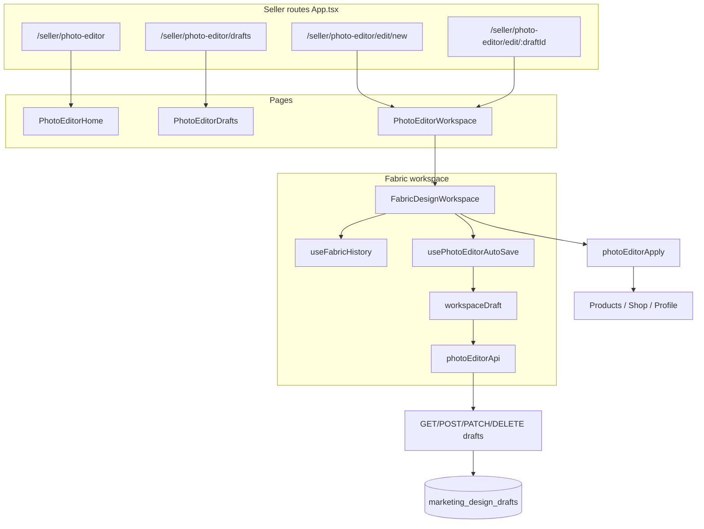
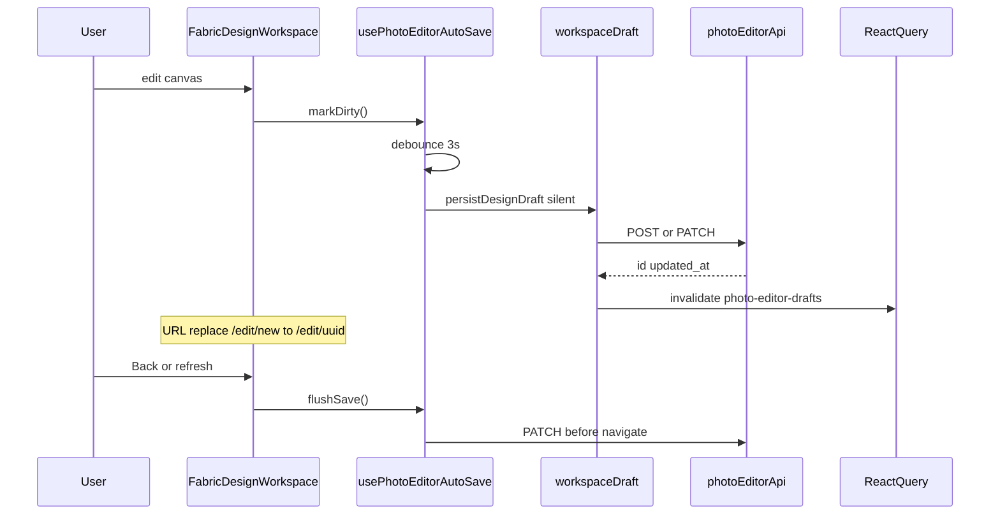

# Seller Photo Editor — A–Z Technical Reference

> **Living reference** for the FarmBondhu seller Photo Editor (Canva-style design tool for marketplace sellers).  
> Update this file at the **start** and **end** of every photo-editor task so future agents and developers can onboard without re-exploring the codebase.

---

## Status

| Field | Value |
|-------|-------|
| **Active engine** | Fabric.js 7 (`fabric@^7.4.0`) |
| **Active workspace** | `FabricDesignWorkspace.tsx` |
| **Legacy engines** | Toast UI (unrouted), Konva (types + dead components only) |
| **Auth required** | `can_sell` capability |
| **Last updated** | 2026-05-24 |

---

## Changelog

| Date | Summary |
|------|---------|
| 2026-05-24 | Offline draft banner: clear "Saved offline on this device" copy, list with Open, auto-clear localStorage after cloud sync |
| 2026-05-24 | Initial A–Z doc created |
| 2026-05-24 | Live crop via native `cropX`/`cropY` (`fabricImageCrop.ts`); removed clipPath approach |
| 2026-05-24 | Canva-style auto-save: 3s debounce, flush on back/apply/unload, draft list invalidation |
| 2026-05-24 | Draft load flicker fix: loading overlay + `waitForFabricCanvas` + draftId-only effect |
| 2026-05-24 | Text: click-to-place, auto-fit, partial selection styling, font picker, color picker |
| 2026-05-24 | Background image cover-fit (`fabricImageFit.ts`) |
| 2026-05-18 | Fabric engine shipped; Toast/Konva deprecated for new sessions |

---

## A. Architecture overview

The Photo Editor is a **fullscreen seller tool** for creating marketing images (product photos, shop banners, logos, profile avatars, promo banners). The canvas is **Fabric.js**; React owns chrome, tools, and draft persistence.



**Important:** `usesFabricEngine()` always returns `true`. `PhotoEditorWorkspace` lazy-loads **only** `FabricDesignWorkspace`. Toast and Konva code remains for legacy draft import and dead-code cleanup candidates — do not route new users to them.

---

## B. Tech stack

| Layer | Technology |
|-------|------------|
| Canvas | `fabric@^7.4.0` |
| UI | React 18, TypeScript, shadcn/ui, Tailwind CSS |
| Routing | React Router v6 |
| Server state | TanStack React Query (`["photo-editor-drafts"]`) |
| Toasts | Sonner |
| i18n | `useLanguage()` → `seller.photoEditor.*` keys (EN + BN) |
| Backend | Express marketplace router + PostgreSQL JSONB |
| Image upload (export) | Cloudinary via `uploadProductImage`, `uploadShopAsset` |
| Legacy (npm, unrouted) | `@toast-ui/react-image-editor`, Konva types in `types.ts` |

**State model:** Fabric canvas is the source of truth for design content. React state holds UI chrome (active tool, selection id, title, crop slider values synced from selected image). Undo/redo is a Fabric JSON snapshot stack, not React state.

---

## C. Routes and navigation

All routes require `ProtectedRoute` with `requiredCapability="can_sell"`.

| Path | Component | Layout |
|------|-----------|--------|
| `/seller/photo-editor` | `PhotoEditorHome` | `VendorLayout` (with sidebar) |
| `/seller/photo-editor/drafts` | `PhotoEditorDrafts` | `VendorLayout` |
| `/seller/photo-editor/edit/new` | `PhotoEditorWorkspace` → `FabricDesignWorkspace` | `PhotoEditorLayout` (fullscreen) |
| `/seller/photo-editor/edit/:draftId` | same | `PhotoEditorLayout` |

**Layout files:**
- `frontend/src/components/layout/PhotoEditorLayout.tsx` — fullscreen shell, no vendor sidebar
- `frontend/src/components/layout/VendorSidebar.tsx` — "Photo Editor" nav link

**Query params** (preserved across navigation via `searchParams`):

| Param | Purpose |
|-------|---------|
| `preset` | Canvas preset key (`product_photo`, `shop_cover`, …) |
| `target` | Export target override; if preset omitted, maps to preset via `resolvePresetFromParams` |
| `returnTo` | Post-apply navigation URL |

**Preset resolution** (`lib/presets.ts`):
1. If `preset` present → `migratePresetKey(preset)` (handles legacy names)
2. Else if `target` present → map `product` → `product_photo`, etc.
3. Else default → `product_photo`

**Edit URL builder** (home): `/seller/photo-editor/edit/new?preset=…&target=…&returnTo=…`

After first auto-save on `/new`, URL replaces to `/seller/photo-editor/edit/:uuid?…` without losing query params.

---

## D. Directory map

Base: `frontend/src/features/photoEditor/`

### pages/

| File | Role |
|------|------|
| `PhotoEditorHome.tsx` | Hub: preset cards, 9 recent drafts, unsynced local draft warning |
| `PhotoEditorDrafts.tsx` | Full draft grid, delete, relative timestamps |
| `PhotoEditorWorkspace.tsx` | Lazy-loads `FabricDesignWorkspace` with `key={draftId}` |

### components/ (active — Fabric era)

| File | Role |
|------|------|
| `PhotoEditorTopBar.tsx` | Back, title, auto-save status, undo/redo, save/download/apply |
| `PhotoEditorToolSidebar.tsx` | Left tool icons from `PHOTO_EDITOR_TOOLS` |
| `PhotoEditorActionBar.tsx` | Mobile bottom bar (save, download, apply) |
| `FabricToolPanel.tsx` | Right-rail tool options (crop sliders, shapes, text defaults, …) |
| `FabricObjectPropertiesPanel.tsx` | Selection properties (position, colors, text styling) |
| `FabricLayersPanel.tsx` | Layer list: reorder, visibility, lock, delete |
| `FabricUploadPanel.tsx` | Image layer picker + file upload |
| `FabricColorPicker.tsx` | Solid / gradient / RGB color picker |
| `FabricFontPicker.tsx` | Font family picker |
| `photoEditorTools.ts` | `PHOTO_EDITOR_TOOLS` definitions + icons |

### components/ (legacy — not used by Fabric route)

| File | Notes |
|------|-------|
| `PhotoEditorLayerList.tsx` | Konva-era layer list |
| `PhotoEditorCanvas.tsx` | Konva canvas wrapper |
| `PhotoEditorPropertiesPanel.tsx` | Konva properties panel |

### hooks/

| File | Role |
|------|------|
| `usePhotoEditorAutoSave.ts` | 3s debounced save, flush, pagehide keepalive, save status |
| `usePhotoEditorProfileSessionExport.ts` | Apply profile avatar from sessionStorage on ProfilePage |
| `usePhotoEditorShopSessionExports.ts` | Apply shop banner/logo from sessionStorage on My Shop |
| `usePhotoEditorStore.ts` | **Legacy** Konva document store |
| `usePhotoEditorHistory.ts` | **Legacy** Konva undo stack |
| `usePhotoEditorExport.ts` | **Legacy** export helper |

### api/

| File | Role |
|------|------|
| `photoEditorApi.ts` | Draft CRUD + keepalive PATCH/POST for page unload |

### lib/

| File | Role |
|------|------|
| `types.ts` | Core types (re-exported from feature root `types.ts`) |
| `presets.ts` | `PHOTO_EDITOR_PRESETS`, preset/target resolution |
| `engineRouting.ts` | `isFabricCanvas`, `isToastCanvas`, `isLegacyKonvaCanvas` |
| `workspaceDraft.ts` | `loadDesignDraft`, `persistDesignDraft`, local fallback |
| `photoEditorApply.ts` | Export PNG to product/shop/profile targets |
| `photoEditorTheme.ts` | Seller/vendor sky blue gradient tokens (`VENDOR_THEME`) |
| `photoEditorFonts.ts` | Font catalog + `DEFAULT_PHOTO_EDITOR_FONT` |
| `photoEditorColorPalette.ts` | Solid defaults + gradient presets |
| `photoEditorShapes.ts` | Shape kind definitions |
| `stickers.ts` | Emoji sticker presets |
| `draftRelativeTime.ts` | Sort drafts + relative "Updated …" labels |
| `localDraftKeys.ts` | Count unsynced localStorage drafts |
| `canvasDocument.ts` | **Legacy** Konva document helpers |
| `prepareDraftCanvas.ts` | **Legacy** Konva — uploads data URLs before save |
| `filters.ts` | **Legacy** Konva filter props |

### engines/fabric/ (active)

| File | Role |
|------|------|
| `FabricDesignWorkspace.tsx` | **Main editor** (~1100 lines): canvas, tools, draft load/save |
| `FabricPosterWorkspace.tsx` | Deprecated re-export alias |
| `useFabricHistory.ts` | Undo/redo stack (max 40, 350ms debounce) |
| `fabricSerialization.ts` | Custom Fabric props for save/undo |
| `fabricViewport.ts` | Display fit + full-res export viewport |
| `fabricExport.ts` | `exportFabricPng`, `exportFabricThumbnail` |
| `fabricCanvasHelpers.ts` | Layer ops, selection, `waitForFabricCanvas` |
| `fabricTextHelpers.ts` | Text placement, auto-fit, wrap width |
| `fabricTextSelection.ts` | Partial text selection styling |
| `fabricFillColor.ts` | Solid/gradient fill types |
| `fabricImageCrop.ts` | Live crop via `cropX`/`cropY` |
| `fabricImageAdjust.ts` | Brightness/contrast/saturation/blur filters |
| `fabricImageFit.ts` | `coverImageToDocument` for background |
| `importLegacyDraft.ts` | Import Toast drafts as Fabric image layer |
| `fabricEditor.css` | Workspace layout styles |
| `fabricImageCrop.test.ts` | Unit tests for crop math |

### engines/toast/ (legacy, unrouted)

| File | Role |
|------|------|
| `ToastImageWorkspace.tsx` | Full Toast UI editor — **not imported by App.tsx** |
| `toastExport.ts` | Toast PNG export |
| `toastTheme.ts` | Toast UI theme overrides |
| `createBlankCanvas.ts` | Blank canvas for Toast init |
| `toastEditor.css` | Toast styles |

### Root feature files

| File | Role |
|------|------|
| `types.ts` | `PresetKey`, `ExportTarget`, `DesignDraft`, canvas JSON types, storage key constants |

---

## E. Presets and export targets

Defined in `lib/presets.ts` as `PHOTO_EDITOR_PRESETS`.

| Preset key | Size (px) | Aspect | Export target | Default returnTo |
|------------|-----------|--------|---------------|------------------|
| `product_photo` | 1200×900 | 4:3 | `product` | `/seller/products` |
| `shop_cover` | 1500×500 | 3:1 | `shop_banner` | `/seller/my-shop` |
| `shop_logo` | 512×512 | 1:1 | `shop_logo` | `/seller/my-shop` |
| `profile_photo` | 400×400 | 1:1 | `profile` | `/seller/profile` |
| `promo_banner` | 1200×400 | 3:1 | `download_only` | — |
| `custom` | 1080×1080 (editable) | — | `download_only` | — |

**Canvas size lock:** All presets except `custom` lock document dimensions (`presetLocked = presetParam !== "custom"`).

**Legacy preset migration** (`migratePresetKey`):

| Old key | Maps to |
|---------|---------|
| `facebook_post` | `promo_banner` |
| `instagram_post` | `shop_logo` |
| `website_banner` | `shop_cover` |
| `product_poster` | `product_photo` |

**Export targets** (`types.ts` → `ExportTarget`):

| Target | Apply button i18n | Behavior |
|--------|-------------------|----------|
| `product` | `applyToProduct` | Upload PNG → sessionStorage → product form |
| `shop_banner` | `applyToShopCover` | Upload banner → shop API or sessionStorage |
| `shop_logo` | `applyToShopLogo` | Upload logo → shop API or sessionStorage |
| `profile` | `applyToProfile` | Upload avatar → profiles API or sessionStorage |
| `download_only` | — | Download button only; no Apply |

---

## F. Editor UI layout

```
┌─────────────────────────────────────────────────────────────────┐
│ PhotoEditorTopBar: ← title [Saving…] undo redo | save dl apply  │
├─────────────────────────────────────────────────────────────────┤
│ preset strip: badge (preset · aspect · W×H)                     │
├────────┬──────────────────────────────────────┬─────────────────┤
│ Tool   │                                      │ Layers panel    │
│ sidebar│   Canvas artboard (CSS-scaled)       │ ─────────────── │
│ (icons)│   fabric-editor-artboard-area        │ Tool panel      │
│        │                                      │ (active tool)   │
│        │                                      │ ─────────────── │
│        │                                      │ Selection props │
│        │                                      │ (when selected) │
├────────┴──────────────────────────────────────┴─────────────────┤
│ PhotoEditorActionBar (mobile only): save | download | apply      │
└─────────────────────────────────────────────────────────────────┘
```

**Right rail order** (top → bottom):
1. `FabricLayersPanel` — always visible
2. `FabricToolPanel` — options for active tool
3. `FabricObjectPropertiesPanel` — shown when `selectedId` set

**Mobile:** Tool sidebar opens bottom `Sheet`; primary actions in `PhotoEditorActionBar`.

**Loading:** `.fabric-editor-loading-overlay` during draft fetch — canvas stays mounted (do not unmount on load).

---

## G. Tools reference

Tools defined in `components/photoEditorTools.ts` → `PHOTO_EDITOR_TOOLS`.

| Tool ID | User-facing behavior | Implementation |
|---------|---------------------|----------------|
| `preset` | View/change canvas size (custom only) | `FabricToolPanel` + `setDocSize` |
| `upload` | Add images, pick layer | `FabricUploadPanel`, `addImageFromFile`, `addImagesFromFiles` |
| `crop` | Live % inset sliders (left/top/right/bottom 0–40) | `fabricImageCrop.ts`, debounced history |
| `adjust` | Brightness/contrast/saturation/blur on selected image | `fabricImageAdjust.ts`, Fabric filters |
| `text` | Click canvas to place textbox; crosshair cursor | `fabricTextHelpers.ts`, `createTextAtPoint` |
| `shapes` | Add rect/circle/line/triangle/ellipse | `addShape` in workspace |
| `stickers` | Add emoji sticker | `addSticker`, `STICKER_OPTIONS` |
| `background` | Solid bg color + optional cover-fit bg image | `setBackgroundImageFromFile`, `fabricImageFit.ts` |
| `layers` | Same as layers panel (tool opens panel focus) | `FabricLayersPanel` |

### Upload vs background image

| | Upload tool | Background tool |
|---|-------------|-----------------|
| Layer | Regular selectable image (`objectType: "image"`) | `dataId: "bg-image"`, not selectable |
| Fit | Fit inside 92% of document | Cover-fill entire document |
| In layers list | Yes | Hidden from user layers (filtered in `syncLayers`) |

### Text tool details

- **Placement:** `mouse:down` when `activeTool === "text"`; skips if target is existing text
- **Auto-fit:** `fitTextToContent`, `bindTextAutoFit` — box grows/shrinks with content
- **Partial styling:** When editing with selection, `fabricTextSelection.ts` applies bold/italic/color to selection only via `setSelectionStyles`
- **Defaults:** `defaultTextFont`, `defaultTextFill` from tool panel apply to new text
- **Fabric 7:** Use `opt.scenePoint` / `canvas.getScenePoint(e)` — **not** deprecated `getPointer`

### Crop tool details

- Uses Fabric native **`cropX` / `cropY`** + `width` / `height` (not `clipPath`)
- **`fbNaturalWidth` / `fbNaturalHeight`** stored on image for stable re-crops
- Sliders update **live**; history snapshot debounced ~350ms
- **Reset crop** restores full natural dimensions
- Sliders sync on selection change and undo/redo

### Selection properties panel

Shown for any selected object: position, rotation, opacity, fill/stroke, text-specific controls (font, size, alignment, partial selection hints).

---

## H. Fabric canvas internals

### Canvas initialization

```ts
new Canvas(canvasEl, {
  width: docSize.width,
  height: docSize.height,
  backgroundColor: bgColor,
  preserveObjectStacking: true,
});
```

- `registerFabricCustomProperties()` called before first use
- Selection events → `selectedId` state
- `history.bindCanvas(canvas)` wires undo snapshots

### Custom properties (`fabricSerialization.ts`)

Registered on `FabricObject.customProperties` — **must register before** `toJSON` / `loadFromJSON`:

| Property | Purpose |
|----------|---------|
| `dataId` | Stable layer id (e.g. `img-123`, `bg-image`) |
| `name` | Display name in layers panel |
| `objectType` | `image`, `text`, `shape`, `sticker` |
| `fbSrc` | Original image data URL or hosted URL |
| `fbNaturalWidth` | Original pixel width (crop math) |
| `fbNaturalHeight` | Original pixel height (crop math) |
| `fbBrightness` | Filter value (-100..100) |
| `fbContrast` | Filter value |
| `fbSaturation` | Filter value |
| `fbBlur` | Filter value |
| `fbManualWrapWidth` | User-set text wrap width |

**Adding a new custom prop checklist:**
1. Add to `FABRIC_CUSTOM_PROPS` in `fabricSerialization.ts`
2. Set on object in workspace when created/modified
3. Restore in `loadFabricJson` if special handling needed
4. Verify undo/redo and draft save/load

### History (`useFabricHistory.ts`)

| Setting | Value |
|---------|-------|
| Max snapshots | 40 |
| Debounce on modify | 350ms |
| Immediate snapshot | `object:added`, `object:removed` |
| Restore | `canvas.loadFromJSON` + `applyObjectChrome` + `applyTextControls` |
| Bulk ops | `runWithoutHistory()` — used for draft load, multi-upload |
| Reset | `resetFromCanvas()` after initial load |

### Viewport (`fabricViewport.ts`)

| Mode | Function | Behavior |
|------|----------|----------|
| Display | `fitCanvasToContainer` | CSS scale canvas to fit artboard frame (max scale 1) |
| Export | `withExportViewport` | Temporarily reset transform for full document `toDataURL` |

### Export (`fabricExport.ts`)

- `exportFabricPng(canvas)` — full document PNG at 1× multiplier
- `exportFabricThumbnail(canvas, maxSide=320)` — scaled thumbnail for draft list

---

## I. Canvas JSON formats (draft payload)

Stored in `marketing_design_drafts.canvas_json` (JSONB). Detected by `lib/engineRouting.ts`.

### Current — Fabric

```ts
type FabricCanvasJson = {
  engine: "fabric";
  presetKey: PresetKey;
  width: number;
  height: number;
  backgroundColor: string;
  fabricJson?: Record<string, unknown>; // canvas.toJSON()
};
```

Built by `buildCanvasJson()` in `FabricDesignWorkspace`.

### Legacy — Toast

```ts
type ToastCanvasJson = {
  engine: "toast";
  presetKey: PresetKey;
  width: number;
  height: number;
  backgroundColor?: string;
  imageDataUrl?: string;
};
```

On load: `importToastDraftImage()` converts to a single Fabric image layer.

### Legacy — Konva

```ts
type EditorDocument = {
  width: number;
  height: number;
  presetKey: PresetKey;
  backgroundColor: string;
  backgroundImage?: string;
  elements: EditorElement[];
  // no engine field
};
```

Detected by `isLegacyKonvaCanvas` → toast message; not fully restored in Fabric.

### Draft load sequence (`FabricDesignWorkspace` draft effect)

1. Depends **only** on `draftId` (not history callbacks — avoids re-fetch loops)
2. `loadDesignDraft(draftId)` → API or localStorage fallback
3. `waitForFabricCanvas(fabricRef)` — canvas must stay mounted
4. Branch on `canvas_json` format:
   - Fabric + `fabricJson` → `loadFabricJson`
   - Toast importable → `importToastDraftImage`
   - Legacy Konva → warning toast only
5. `normalizeLoadedImage()` on each image — backfill natural size, clear old clipPath
6. `setLoading(false)` in `finally`

---

## J. Draft system (auto-save + manual save)

### Unique draft names (`lib/draftTitleUtils.ts`)

| Behavior | Detail |
|----------|--------|
| New project (`/edit/new`) | `PhotoEditorProjectNameDialog` blocks editing until seller confirms a **unique** name (suggested `Untitled 1`, `Untitled 2`, … from cloud + local drafts) |
| Auto-save / manual save | If title is still generic (`Untitled`, `Untitled design`, `Untitled N`), assigns next free `Untitled {n}` via `resolveTitleForSave()` |
| Top bar rename | `onTitleBlur` rejects duplicates (case-insensitive); shows inline error + toast |
| Scope | Client-side only (cloud drafts + `localStorage` backups); no DB unique constraint |



### Auto-save (`hooks/usePhotoEditorAutoSave.ts`)

| Behavior | Detail |
|----------|--------|
| Trigger | `markDirty()` after canvas history change, title/bg/docSize change |
| Debounce | 3000ms |
| Skip | Empty canvas (`hasDesignContent()` false) |
| First save | POST draft → `navigate(/edit/:id, { replace: true })` |
| Silent | No toast on auto-save |
| Flush | Back, Apply, unmount, debounced timer clear |
| Unload | `pagehide` → keepalive PATCH/POST via `photoEditorApi` |
| Failure | localStorage under `photoEditorLocalDraft:{id}` + error status in top bar |
| Home offline banner | Lists local backups with **Open**; title "Saved offline on this device"; cleared after successful cloud persist |
| Status | `idle` / `pending` / `saving` / `saved` / `error` in `PhotoEditorTopBar` |

### Manual save

Top bar / action bar **Save** → `flushSave({ silent: false, force: true })` → success toast with "View drafts" action.

### Persistence layer (`lib/workspaceDraft.ts`)

| Function | Role |
|----------|------|
| `loadDesignDraft(id)` | API fetch; fallback to localStorage |
| `persistDesignDraft(opts)` | Create or PATCH; optional silent, query invalidation |
| `saveDraftLocally(key, …)` | Offline fallback |
| `buildHubBackUrl(searchParams)` | Back navigation URL |
| `showDraftSavedToast()` | Manual save success toast |

### React Query

- Key: `["photo-editor-drafts"]`
- Invalidated after every successful save
- `PhotoEditorDrafts` uses `refetchOnMount: "always"`
- Home shows 9 most recent, sorted by `updated_at` desc

### Thumbnail

`exportFabricThumbnail(canvas, 320)` → stored in `thumbnail_data` (server caps at ~500KB).

---

## K. Backend API + database

**Router:** `backend/src/routes/v1/marketplace.js`  
**Middleware:** `sellerWriteChain` (authenticated seller)  
**Base path:** `/v1/marketplace/seller/photo-editor/drafts`

| Method | Path | Behavior |
|--------|------|----------|
| `GET` | `/seller/photo-editor/drafts` | List up to **200** drafts, `updated_at DESC` |
| `POST` | `/seller/photo-editor/drafts` | Create; requires `width`, `height` ≥ 1 |
| `GET` | `/seller/photo-editor/drafts/:id` | Single draft (UUID); 404 if not owner |
| `PATCH` | `/seller/photo-editor/drafts/:id` | Partial update |
| `DELETE` | `/seller/photo-editor/drafts/:id` | Delete; 204 |

**Frontend client:** `api/photoEditorApi.ts` → `${API_BASE}/v1/marketplace/seller/photo-editor/drafts`

### Database schema

**Table:** `public.marketing_design_drafts`  
**Defined in:** `backend/src/db/ensureSchema.js`

```sql
CREATE TABLE IF NOT EXISTS public.marketing_design_drafts (
  id uuid PRIMARY KEY DEFAULT gen_random_uuid(),
  user_id uuid NOT NULL,
  title text NOT NULL DEFAULT 'Untitled',
  preset_key text,
  width integer NOT NULL,
  height integer NOT NULL,
  canvas_json jsonb NOT NULL DEFAULT '{}'::jsonb,
  thumbnail_data text,
  created_at timestamptz NOT NULL DEFAULT now(),
  updated_at timestamptz NOT NULL DEFAULT now()
);
```

**Index:** `idx_marketing_design_drafts_user ON (user_id, updated_at DESC)`

**TypeScript mirror:** `DesignDraft` in `types.ts`

---

## L. Export / apply flow

**File:** `lib/photoEditorApply.ts` → `applyPhotoEditorExport(target, dataUrl, options)`

| Target | Upload | Persist | SessionStorage key |
|--------|--------|---------|-------------------|
| `product` | `uploadProductImage` | — | `photoEditorExportUrl` |
| `shop_banner` | `uploadShopAsset("banner")` | `updateMyShop` if userId | `photoEditorShopBannerUrl` |
| `shop_logo` | `uploadShopAsset("logo")` | `updateMyShop` if userId | `photoEditorShopLogoUrl` |
| `profile` | `uploadProductImage` | `profiles.update avatar_url` if userId | `photoEditorProfileUrl` |

**Product flow:**
1. User clicks Apply → `flushSave` → `exportFabricPng` → `applyPhotoEditorExport("product", …)`
2. Sets `sessionStorage photoEditorOpenForm = "1"`
3. Navigates to `returnTo` or `/seller/products`
4. `Products.tsx` opens product form; `ProductFormDialog` reads `photoEditorExportUrl` into image field

**Session export hooks:**
- `usePhotoEditorShopSessionExports` — on My Shop page load
- `usePhotoEditorProfileSessionExport` — on Profile page load

Constants in `types.ts`:
- `PHOTO_EDITOR_EXPORT_URL_KEY`
- `PHOTO_EDITOR_SHOP_BANNER_URL_KEY`
- `PHOTO_EDITOR_SHOP_LOGO_URL_KEY`
- `PHOTO_EDITOR_PROFILE_URL_KEY`
- `PHOTO_EDITOR_LOCAL_DRAFT_PREFIX` (`photoEditorLocalDraft:`)

---

## M. i18n

- **Namespace:** `seller.photoEditor.*`
- **File:** `frontend/src/i18n/translations.ts` (approx. lines 1261–1516)
- **Languages:** `en` and `bn` on every key
- **Usage:** `const { t } = useLanguage()` → `t("seller.photoEditor.saveDraft")`

**Patterns:**
- Preset labels: `labelKey` / `usedForKey` in `presets.ts`
- Tool labels: `labelKey` in `PHOTO_EDITOR_TOOLS`
- Interpolation: manual replace, e.g. `draftUpdated` uses `{time}`

**Key categories:**
- Hub / presets / drafts
- Auto-save status (`autoSaving`, `autoSaved`, `autoSaveFailed`)
- Tools, layers, crop, adjust, text, colors
- Export / errors / legacy toast strings

---

## N. Integration entry points

| Location | How it links to editor |
|----------|------------------------|
| `VendorSidebar.tsx` | Nav → `/seller/photo-editor` |
| `SellerDashboard.tsx` | "Open Photo Editor" button |
| `ProductFormDialog.tsx` | "Create with Photo Editor" → `preset=product_photo&target=product` |
| `Products.tsx` | Reads `photoEditorOpenForm`, `photoEditorExportUrl` |
| `SellerStorefrontHero.tsx` | Edit cover/logo → shop presets |
| `SellerShopEditor.tsx` | `usePhotoEditorShopSessionExports` |
| `ProfilePage.tsx` | "Edit in Photo Editor" + `usePhotoEditorProfileSessionExport` |

---

## O. Styling and theme

| File | Role |
|------|------|
| `lib/photoEditorTheme.ts` | Primary `#0EA5E9` (vendor), gradient, button styles |
| `engines/fabric/fabricEditor.css` | `.fabric-editor-root`, artboard, rails, loading overlay |

Selection chrome color matches theme via `applyObjectChrome()` in `fabricCanvasHelpers.ts`.

---

## P. Legacy / cleanup notes

| Item | Status |
|------|--------|
| `ToastImageWorkspace.tsx` | Complete alternate editor; **not routed** — keep for reference until removal task |
| Konva hooks (`usePhotoEditorStore`, `usePhotoEditorHistory`) | Dead for Fabric path |
| Konva components (`PhotoEditorCanvas`, etc.) | Dead for Fabric path |
| `@toast-ui/react-image-editor` in package.json | Legacy dep — do not remove without audit |
| Toast i18n keys (`toastUploadPhoto`, etc.) | Still in translations for legacy strings |

**Do not delete legacy code without an explicit cleanup task** — some old drafts may still reference Toast/Konva formats.

---

## Q. Common tasks cheat sheet

### Add a new preset

1. Add key to `PresetKey` in `types.ts`
2. Add entry to `PHOTO_EDITOR_PRESETS` in `presets.ts`
3. Add i18n keys: `preset{Name}`, `usedFor{Name}`
4. Add icon in `PhotoEditorHome.tsx` `PRESET_ICONS` if needed

### Add a new tool

1. Add to `PhotoEditorTool` union in `types.ts`
2. Add to `PHOTO_EDITOR_TOOLS` in `photoEditorTools.ts`
3. Add panel section in `FabricToolPanel.tsx`
4. Wire handlers in `FabricDesignWorkspace.tsx` `toolPanelProps`
5. Add i18n `tool{Name}` key

### Add a custom Fabric property

1. `fabricSerialization.ts` → `FABRIC_CUSTOM_PROPS`
2. Set on object at creation/edit time
3. Test: undo, redo, save draft, reload draft

### Debug draft load flicker

- Canvas must **stay mounted** during load (overlay, not early return)
- Draft effect deps: **`draftId` only**
- Use `waitForFabricCanvas(fabricRef)` before `loadFromJSON`
- Memoize `useFabricHistory` return to avoid effect re-runs

### Debug crop

- Use **`cropX`/`cropY`** via `fabricImageCrop.ts` — **not** `clipPath`
- Ensure `fbNaturalWidth`/`fbNaturalHeight` set on image add
- Sliders call `applyCropInsets` live; check `readCropInsets` on selection change

### Add i18n keys

Add both `en` and `bn` in `translations.ts` under `seller.photoEditor.{key}`.

---

## R. Tests

| File | Covers |
|------|--------|
| `engines/fabric/fabricImageCrop.test.ts` | Inset ↔ pixel conversion, round-trip |

**Run:**
```bash
cd frontend
npx vitest run src/features/photoEditor/engines/fabric/
```

---

## S. Dependencies (npm)

| Package | Version | Role |
|---------|---------|------|
| `fabric` | ^7.4.0 | Active canvas engine |
| `@toast-ui/react-image-editor` | ^3.15.2 | Legacy (unrouted) |
| `tui-image-editor` | ^3.15.3 | Legacy peer |

---

## T. Known limitations / edge cases

| Case | Behavior |
|------|----------|
| Empty canvas | Auto-save skipped until at least one non-bg object exists |
| Background image | Not selectable; excluded from crop/adjust target |
| Thumbnail size | Server truncates `thumbnail_data` to ~500KB |
| Concurrent tabs | Last-write-wins on same draft id |
| `/edit/new` without edits | No orphan draft created |
| Offline save failure | localStorage fallback; home banner lists draft with Open; banner clears after cloud sync |
| Legacy Konva drafts | Warning toast; not fully restored in Fabric |
| Component remount on first auto-save | `PhotoEditorWorkspace` uses `key={draftId}` — URL change from `new` → uuid remounts workspace (by design; draft reloads from API) |

---

## Quick file index (most edited)

| Task | Start here |
|------|------------|
| New feature in editor | `engines/fabric/FabricDesignWorkspace.tsx` |
| Tool UI | `components/FabricToolPanel.tsx` |
| Draft save/load | `lib/workspaceDraft.ts`, `hooks/usePhotoEditorAutoSave.ts` |
| API | `api/photoEditorApi.ts`, `backend/src/routes/v1/marketplace.js` |
| Export to product/shop | `lib/photoEditorApply.ts` |
| Types | `types.ts` |
| Presets | `lib/presets.ts` |
