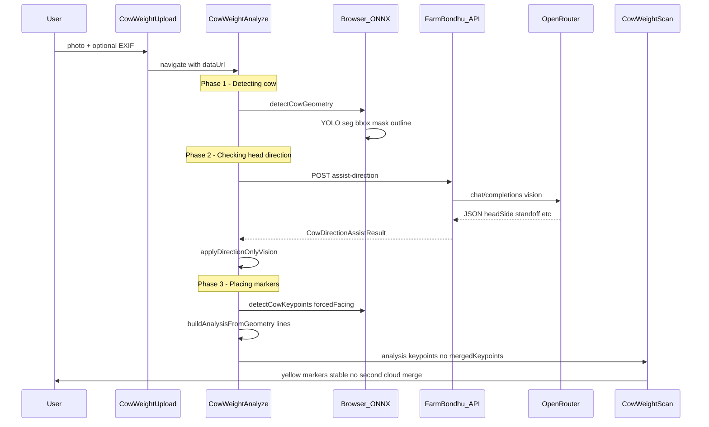
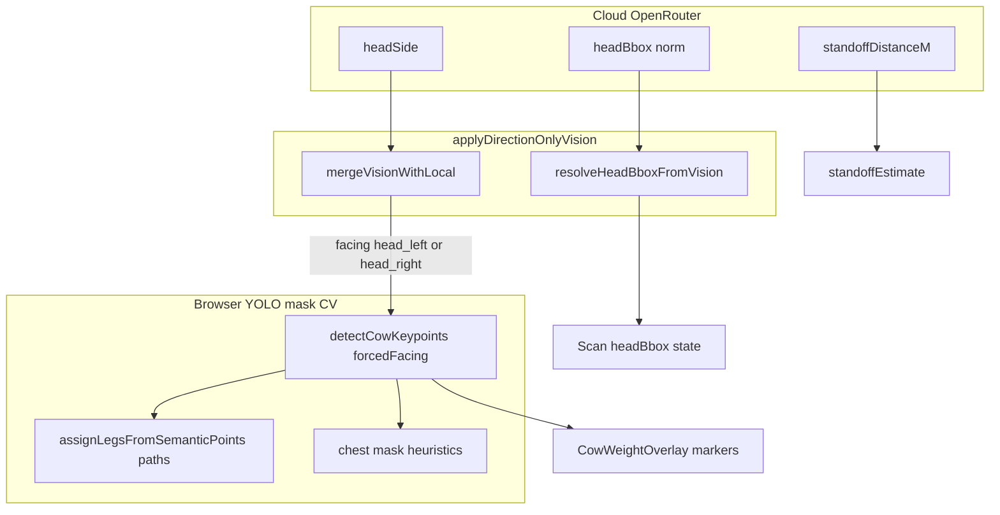

# Cloud AI (OpenRouter) — Cow weight scan

This document describes how **cloud vision AI** is wired in FarmBondhu for the **cow weight estimator** (Plan B scan). The provider is **[OpenRouter](https://openrouter.ai)**. The browser never calls OpenRouter directly; only the **Node backend** does, using `OPENROUTER_API_KEY`.

Related docs: [`strictweight.md`](strictweight.md) (Live estimate / lines), [`cowweight.md`](cowweight.md) (full module map).

---

## What cloud AI does today (2026-05)

| Cloud provides | Used in production pipeline? |
|----------------|----------------------------|
| **Head side** (`left` / `right` → `head_left` / `head_right`) | **Yes** — before YOLO keypoints run |
| **Head bounding box** (normalized 0–1) | **Yes** — orange “Head” overlay |
| **Camera standoff** (`standoffDistanceM`, `distanceConfidence`) | **Yes** — blended with pinhole/EXIF in `standoffEstimate.ts` |
| **frontLeg / hindLeg / topChest / lowerChest** | Returned by API but **not** applied to markers (avoids flicker) |

**YOLO + mask CV** (browser, ONNX) still places **Front, Hind, C1, C2, L1, L2**. Cloud does **not** overwrite chest/legs after detection.

**Live estimate weight (kg)** uses canonical `analysis.lines`, not cloud keypoints. See [`strictweight.md`](strictweight.md).

---

## OpenRouter API used for cow photos

| Item | Value |
|------|--------|
| **Upstream URL** | `POST https://openrouter.ai/api/v1/chat/completions` |
| **Auth** | `Authorization: Bearer ${OPENROUTER_API_KEY}` |
| **FarmBondhu wrapper** | `POST /v1/cow-estimations/assist-direction` |
| **Route file** | [`backend/src/routes/v1/cowDirectionAssist.js`](../../../backend/src/routes/v1/cowDirectionAssist.js) |
| **Mounted under** | [`backend/src/routes/v1/index.js`](../../../backend/src/routes/v1/index.js) → `router.use("/cow-estimations", cowDirectionAssistRoutes)` |

### Model selection (env)

Resolved in this order:

1. `OPENROUTER_VISION_MODEL` — intended for cow photo assist (must support **vision** / image input)
2. `OPENROUTER_MODEL` — fallback if vision var unset
3. Default hardcoded: `google/gemini-2.0-flash-001`

Example from [`backend/.env.example`](../../../backend/.env.example):

```env
OPENROUTER_API_KEY=sk-or-...
OPENROUTER_VISION_MODEL=google/gemini-2.0-flash-001
COW_DIRECTION_ASSIST_ENABLED=true
```

| Env var | Purpose |
|---------|---------|
| `OPENROUTER_API_KEY` | Required for assist; if missing → HTTP **503** |
| `OPENROUTER_VISION_MODEL` | Vision-capable model id for cow assist |
| `OPENROUTER_MODEL` | Fallback model id |
| `COW_DIRECTION_ASSIST_ENABLED` | Set `false` to disable assist route only (503) |
| `API_PUBLIC_URL` | Sent as OpenRouter `HTTP-Referer` header |

**Note:** Farm **text chat** (`POST /v1/ai/...`) uses the same OpenRouter completions API but a **different route** ([`backend/src/routes/v1/aiFarmChat.js`](../../../backend/src/routes/v1/aiFarmChat.js)) and model allowlist (`OPENROUTER_CHAT_MODELS`). Cow assist does **not** use the chat model picker.

### OpenRouter request shape (backend → OpenRouter)

- **System message:** fixed JSON schema prompt (head side, bbox, legs, chest, standoff).
- **User message:** multimodal — text + `image_url` (JPEG data URL from client).
- **Parameters:** `temperature: 0.1`, `max_tokens: 512`.
- **Headers:** `Authorization`, `Content-Type`, `HTTP-Referer`, `X-Title: FarmBondhu Cow Vision Assist`.

Image size limit on FarmBondhu route: **2_800_000** characters for `image_data` string.

---

## End-to-end workflow



### Step-by-step (files)

| Step | UI | Code |
|------|-----|------|
| 1. Upload | [`CowWeightUpload.tsx`](../../pages/dashboard/cowWeight/CowWeightUpload.tsx) | `fileToDataUrl`, `parseExifFromFile` |
| 2. YOLO geometry | Analyze spinner “Detecting cow…” | [`detectCowGeometry`](analyzeCow.ts) → [`detectCowInImage`](yoloDetect.ts) |
| 3. Cloud direction | “Checking head direction…” | [`fetchCloudDirectionAssist`](runVisionAssist.ts) → [`assistCowDirection`](api.ts) → backend → OpenRouter |
| 4. Direction merge | (no UI) | [`applyDirectionOnlyVision`](keypointMerge.ts) — head only |
| 5. YOLO keypoints | “Placing chest and leg markers…” | [`detectCowKeypoints`](cowKeypoints.ts) with `{ forcedFacing }` |
| 6. Lines + result | Navigate to scan | [`buildAnalysisFromGeometry`](analyzeCow.ts), [`canonicalScanLines`](canonicalScanLines.ts) |
| 7. Scan | Overlay + Live estimate | [`CowWeightScan.tsx`](../../pages/dashboard/cowWeight/CowWeightScan.tsx) — **no** second cloud call on first load |

**Re-analyze** on Scan runs [`analyzeCowImageWithCloudDirection`](analyzeCow.ts) (same pipeline as Analyze).

---

## Frontend ↔ backend contract

### Client call

[`frontend/src/lib/cowWeight/api.ts`](api.ts):

```ts
assistCowDirection({
  image_data: string,  // data URL or base64; often compressed via compressDataUrl
  local_hints?: {
    predicted_head_side?: string | null,
    directionIssueKey?: string | null,
    bbox?: BBox,
    l1?: Point | null,
    l2?: Point | null,
  },
})
```

During Analyze, hints are minimal (`bbox` only; `l1`/`l2` null) because keypoints are not computed until **after** cloud returns.

### Response (`data` object)

| Field | Type | Used after direction-only policy |
|-------|------|----------------------------------|
| `headSide` | `"left"` \| `"right"` \| `"unknown"` | **Yes** → `forcedFacing` |
| `confidence` | 0–1 | **Yes** — need ≥ **0.5** for vision source ([`directionMerge.ts`](directionMerge.ts) `VISION_MIN_CONFIDENCE`) |
| `headBbox` | normalized `{x,y,width,height}` | **Yes** → [`resolveHeadBboxFromVision`](headBbox.ts) |
| `standoffDistanceM` | number \| null | **Yes** → [`estimateCameraStandoff`](standoffEstimate.ts) |
| `distanceConfidence` | 0–1 | **Yes** (blend when ≥ 0.5) |
| `frontLeg`, `hindLeg`, `topChest`, `lowerChest` | normalized points | **No** (ignored in `applyDirectionOnlyVision`) |
| `reason` | string | UI/debug |
| `model` | string | Saved in feedback as `openrouter-vision` |

Requires logged-in user: `requireUser` middleware + `Authorization` from session ([`apiJson`](../../api/client.ts)).

---

## How cloud result connects to local detection



- **`mergeVisionWithLocal`:** If `headSide` is left/right and `confidence ≥ 0.5`, source = `"vision"` and facing = `head_left` / `head_right`.
- **`detectCowKeypoints(..., { forcedFacing, directionSource: "vision" })`:** Runs existing left/right leg and length ordering **once** with cloud facing; does not re-run local `resolveBodyHeadDirection` for facing when forced.
- **Failure:** API error or low confidence → `forcedFacing` null → keypoints use **local-only** direction (same as before cloud assist).

---

## Legacy: full vision merge (not used on main path)

[`applyFullVisionAssist`](keypointMerge.ts) still exists for tests/reference. It could move **Front/Hind** and **C1/C2** from cloud coordinates and caused **marker flicker** when run after YOLO.

Production path uses **`applyDirectionOnlyVision`** only ([`runVisionAssist.ts`](runVisionAssist.ts)).

---

## Scan UI indicators

| UI | Meaning |
|----|---------|
| Amber badge “Head left” / “Head right” | [`photoOrientationI18nKey`](cowKeypoints.ts) from `scanKeypoints.detected.facing` |
| “Cloud verified” | `verifySource === "vision"` ([`CowWeightScan.tsx`](../../pages/dashboard/cowWeight/CowWeightScan.tsx)) |
| “Local only” | Cloud failed or not confident; local/mask direction |
| `assistLoading` | True during Re-analyze while pipeline runs |
| Orange head rectangle | `headBbox` from cloud + clamp heuristics |

---

## Errors and fallbacks

| Condition | Behavior |
|-----------|----------|
| No `OPENROUTER_API_KEY` | 503; frontend catch → local standoff, no `forcedFacing` |
| `COW_DIRECTION_ASSIST_ENABLED=false` | 503; same fallback |
| OpenRouter HTTP error | 502/4xx propagated; catch in `fetchCloudDirectionAssist` |
| Unparseable JSON from model | 502 “Could not parse AI response” |
| `headSide: unknown` or confidence &lt; 0.5 | `verifySource` not vision; YOLO picks facing locally |
| Image too large | 400 |

Connectivity health check: [`backend/src/services/connectivity.js`](../../../backend/src/services/connectivity.js) probes `https://openrouter.ai/api/v1/models` (listed in server meta as `openrouter: connected`).

---

## File map (cow weight + cloud)

| Layer | File | Role |
|-------|------|------|
| Backend route | `backend/src/routes/v1/cowDirectionAssist.js` | OpenRouter call + JSON normalize |
| Backend mount | `backend/src/routes/v1/index.js` | `/v1/cow-estimations/*` |
| Frontend API | `frontend/src/lib/cowWeight/api.ts` | `assistCowDirection` |
| Cloud orchestration | `frontend/src/lib/cowWeight/runVisionAssist.ts` | `fetchCloudDirectionAssist` |
| Direction-only merge | `frontend/src/lib/cowWeight/keypointMerge.ts` | `applyDirectionOnlyVision` |
| Policy | `frontend/src/lib/cowWeight/directionMerge.ts` | `mergeVisionWithLocal`, min confidence 0.5 |
| Staged analyze | `frontend/src/lib/cowWeight/analyzeCow.ts` | geometry → cloud → keypoints |
| Analyze page | `frontend/src/pages/dashboard/cowWeight/CowWeightAnalyze.tsx` | 3-phase loading UI |
| Scan page | `frontend/src/pages/dashboard/cowWeight/CowWeightScan.tsx` | Display; Re-analyze reruns pipeline |
| Head box | `frontend/src/lib/cowWeight/headBbox.ts` | `resolveHeadBboxFromVision` |
| Distance | `frontend/src/lib/cowWeight/standoffEstimate.ts` | Vision + pinhole + EXIF blend |
| Tests | `runVisionAssist.test.ts`, `keypointMerge.directionOnly.test.ts` | Direction-only behavior |

---

## Other OpenRouter usage in FarmBondhu

| Feature | Route | Model config |
|---------|-------|----------------|
| **Cow photo assist** | `POST /v1/cow-estimations/assist-direction` | `OPENROUTER_VISION_MODEL` |
| **Farm AI chat** | `POST /v1/ai/...` (see `aiFarmChat.js`) | `OPENROUTER_MODEL`, `OPENROUTER_CHAT_MODELS` |

Same API key; different prompts and endpoints. Do not confuse chat model picker with cow vision model.

---

## Quick reference: one request path

```
Browser (JPEG data URL, ~1280px compress)
  → POST /api/v1/cow-estimations/assist-direction  (JWT)
    → POST https://openrouter.ai/api/v1/chat/completions
      model: OPENROUTER_VISION_MODEL || OPENROUTER_MODEL || google/gemini-2.0-flash-001
  ← { data: { headSide, confidence, headBbox, standoff..., model } }
  → applyDirectionOnlyVision (facing + headBbox only)
  → detectCowKeypoints(forcedFacing)
  → Scan overlay (stable markers)
```

---

*Last aligned with codebase: cloud direction before YOLO keypoints; direction-only merge; no `mergedKeypoints` on first Scan load.*
