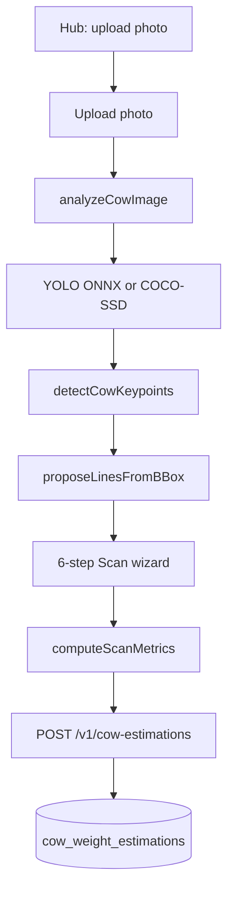
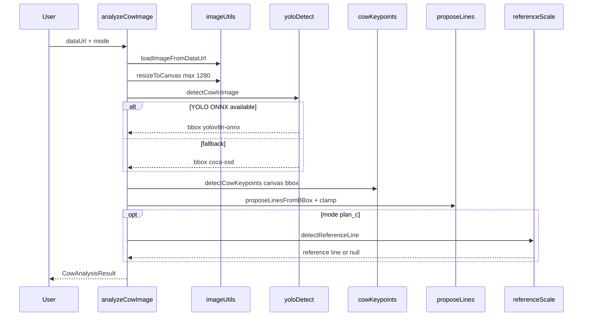
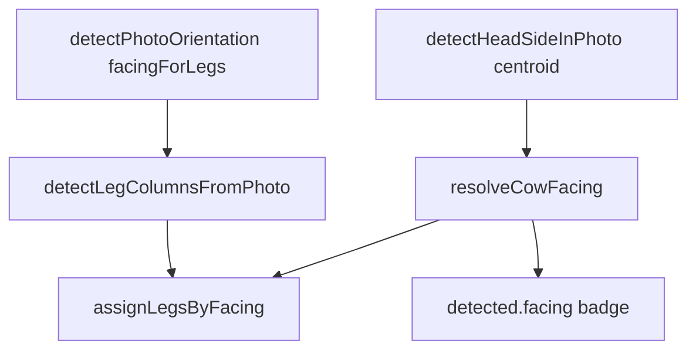
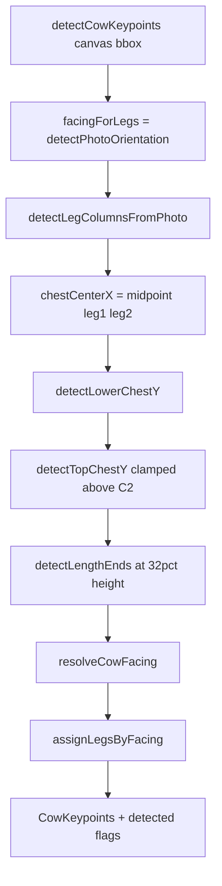
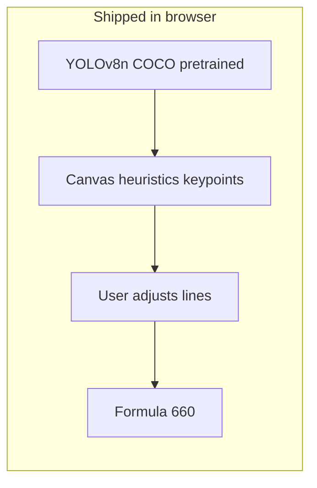
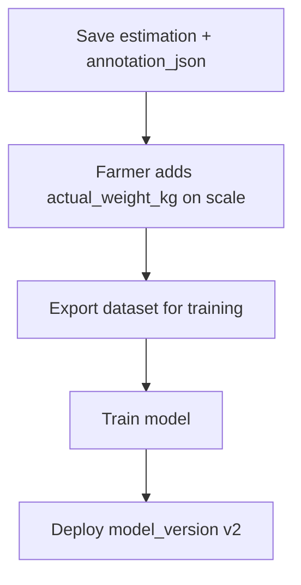
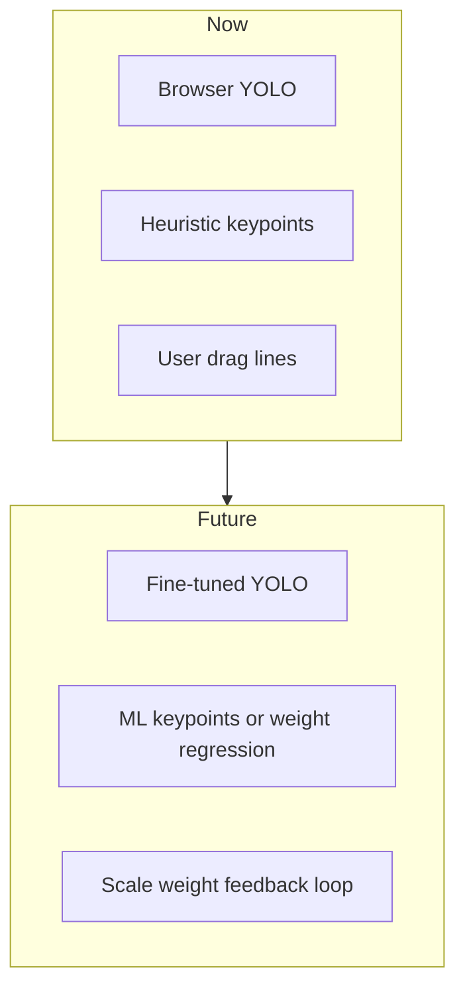

# Cow Weight — Technical Guide

> **Developer encyclopedia** for the FarmBondhu cow weight and meat estimation feature.  
> For status, changelog, and phased checklist, see [`docs/ai/cow_weight_detection.md`](../../../../docs/ai/cow_weight_detection.md).

---

## Table of contents

1. [Introduction](#1-introduction)
2. [End-to-end architecture](#2-end-to-end-architecture)
3. [User flow and routes](#3-user-flow-and-routes)
4. [Detection pipeline (browser)](#4-detection-pipeline-browser)
5. [Keypoints and heuristics](#5-keypoints-and-heuristics)
6. [Scaling and measurements](#6-scaling-and-measurements)
7. [Weight formula](#7-weight-formula)
8. [UI layer](#8-ui-layer)
9. [Backend and persistence](#9-backend-and-persistence)
10. [Module file map](#10-module-file-map)
11. [Environment and deployment](#11-environment-and-deployment)
12. [Training, export, and fine-tuning](#12-training-export-and-fine-tuning)
13. [Capture guidelines for farmers](#13-capture-guidelines-for-farmers)
14. [Troubleshooting](#14-troubleshooting)
15. [Related documentation](#15-related-documentation)

---

## 1. Introduction

### What it does

FarmBondhu **Cow Weight** estimates **live weight (kg)** and **edible meat (kg)** from a **side-view cow photo** by measuring:

- **Chest width** — vertical line between top chest (C1) and lower chest (C2)
- **Body length** — horizontal line between length endpoints (L1, L2)

Those dimensions are converted to centimeters, then passed through a **Qurbani-style formula** (chest² × length / divisor).

### Disclaimer

Results are **estimates only**. They are not a substitute for a physical scale or professional assessment, and are not legal/market certification for Qurbani or livestock sale pricing. Farmers and buyers should verify weight on a scale before financial decisions.

### Scale (single flow, `plan_b`)

| Scale | When | Source |
|-------|------|--------|
| **Default** | No 1m stick in photo | Bbox assumed height ~150 cm + standoff hint |
| **Reference** | Stick auto-detected or user taps R1/R2 on Step 4 | `100 cm / reference_line_px` |

New saves use `detection_mode: plan_b` only. Legacy DB rows may still show `plan_c`.

---

## 2. End-to-end architecture



### Data types (core)

Defined in [`types.ts`](types.ts):

| Type | Purpose |
|------|---------|
| `BBox` | Cow bounding box in **analysis canvas pixels** (`x`, `y`, `width`, `height`, `confidence`) |
| `CowLines` | `chest`, `length`, optional `reference` line segments |
| `CowKeypoints` | Leg1, Leg2, C1, C2, L1, L2, `chestCenterX`, `detected.*` flags |
| `CowAnalysisResult` | Full analyze output: bbox, lines, keypoints, `displayImageUrl`, `model`, `cmPerPixel` |
| `ScanMetrics` | Live preview: px, cm, weight, `scaleMethod`, confidence |

**Important:** `displayImageUrl` is a JPEG of the **same canvas** used for bbox and keypoints. Overlay coordinates must use that image, not the original upload, so lines align with the cow.

---

## 3. User flow and routes

Router: [`CowWeightEstimator.tsx`](../../pages/dashboard/cowWeight/CowWeightEstimator.tsx) under `/dashboard/cow-weight/*`.

| Route | Component | Role |
|-------|-----------|------|
| `/dashboard/cow-weight` | `CowWeightHub` | Start estimate (single flow) |
| `upload` | `CowWeightUpload` | Select image file |
| `analyze` | `CowWeightAnalyze` | Run `analyzeCowFromFile`, navigate to scan |
| `scan` | `CowWeightScan` | **6-step wizard** (main UX) |
| `confirm` | `CowWeightConfirm` | Alternate confirm path |
| `result` | `CowWeightResult` | Show saved estimation |

Navigation state types: [`navigation.ts`](navigation.ts) (`CowWeightScanState`, `CowWeightResultState`).

### 6-step scan wizard

Implemented in [`CowWeightScan.tsx`](../../pages/dashboard/cowWeight/CowWeightScan.tsx).

| Step | Short name | User action |
|------|------------|-------------|
| 1 | Detect | Review green bbox, Leg1/Leg2, C1/C2 (shoulder→body end), L1/L2, facing badge; C2 rear = tail-side back edge, Hind = leg2 |
| 2 | Chest | Drag C1 (top chest) and C2 (lower chest); vertical chest width line |
| 3 | Length | Drag L1 and L2; horizontal body length line |
| 4 | Scale | Bbox/standoff default; optional 1m stick (auto or tap R1/R2) |
| 5 | Measure | Review px, cm, estimated weight and meat |
| 6 | Review | Confirm; POST to API; navigate to result |

On step 1 → 2, chest lines are re-proposed from keypoints via `proposeLinesFromBBox`.

---

## 4. Detection pipeline (browser)

### Entry point

[`analyzeCow.ts`](analyzeCow.ts) — `analyzeCowImage(dataUrl)` (always tries optional reference detect):

```typescript
// Simplified flow
const img = await loadImageFromDataUrl(dataUrl);
const { bbox, model, displayCanvas } = await detectCowInImage(img);
const keypoints = detectCowKeypoints(displayCanvas, bbox);
const lines = clampLinesToBBox(proposeLinesFromBBox(bbox, keypoints), bbox);
// Plan C: detectReferenceLine → lines.reference, cmPerPixel
return { bbox, lines, keypoints, displayImageUrl, model, confidence, cmPerPixel, ... };
```

### Sequence diagram



### Step 1: Load and resize

[`imageUtils.ts`](imageUtils.ts):

- `loadImageFromDataUrl` — decode upload
- `resizeToCanvas(img, maxSide)` — longest side ≤ **1280 px** (used in `detectCowInImage`)
- `lineLengthPx` — Euclidean distance for chest/length/reference
- `compressDataUrl` — JPEG compress before API upload (default max side 1280, quality 0.85)

### Step 2: Cow bounding box

[`yoloDetect.ts`](yoloDetect.ts):

| Setting | Value |
|---------|--------|
| Primary model | YOLOv8n ONNX via `onnxruntime-web` (WASM) |
| Model URL | `VITE_COW_YOLO_MODEL_URL` or `/models/yolov8n.onnx` |
| Input size | 640×640 letterbox (gray pad `#808080`) |
| Cow class (COCO) | ID **19** |
| Confidence threshold | **0.35** |
| Fallback | TensorFlow.js COCO-SSD `lite_mobilenet_v2`, class `"cow"` |
| Output | `normalizeBBox` — clamp inside image bounds |

If neither model finds a cow: `throw new Error("No cow detected...")`.

`preloadCowModels()` warms ONNX + COCO sessions (call from hub/analyze if desired).

### Step 3: Keypoints

See [Section 5](#5-keypoints-and-heuristics). Runs on `displayCanvas` pixel grid.

### Step 4: Measurement lines

[`proposeLines.ts`](proposeLines.ts):

- `proposeLinesFromBBox` / `proposeLinesFromKeypoints` — chest vertical through `chestCenterX`, length horizontal at ~32% bbox height
- `clampLinesToBBox` — keep handles inside green box (pad 4 px)
- Fallback fractions when keypoints missing: C1 @ 14%, C2 @ 58%, length @ 14%–86% width

### Step 5: Reference scale (Plan C only)

[`referenceScale.ts`](referenceScale.ts):

- `REFERENCE_CM = 100` (1 m stick)
- `detectReferenceLine` — search vertical edge bands **left and right** of cow bbox (±35% bbox width), pick strongest vertical edge
- `cmPerPixelFromReference` — `100 / reference_pixels`
- Manual fallback: user taps top and bottom of stick (R1, R2) on step 4

---

## 5. Keypoints and heuristics

All logic in [`cowKeypoints.ts`](cowKeypoints.ts) unless noted.

### Marker reference

| Overlay label | Meaning | How it is found |
|---------------|---------|----------------|
| **Leg1** | Left leg column (image X) | `pickLeftLegColumn` + silhouette ground score |
| **Leg2** | Right leg column | `pickRightLegColumn` (facing-specific X band) |
| **C1** | Top chest / withers (dorsal) | `detectTopChestY` — scan Y **6%–32%** of bbox, fallback **14%** |
| **C2** | Lower chest / brisket | `detectLowerChestY` — scan **48%–58%**, cap **58%**, body-width gate ≥ **22%**, leg ceiling |
| **L1** | Left length endpoint | Leftmost edge peak at `LENGTH_Y_FRAC` (**32%**) |
| **L2** | Right length endpoint | Rightmost peak, min separation ~25% bbox width |
| **Facing badge** | Head toward image left/right | `resolveCowFacing` → `detected.facing` |

### Head detection + facing + Leg1/Leg2



| Item | Rule |
|------|------|
| **Head left** | Badge: Cow faces left; Leg1 = left (front), Leg2 = right (hind) |
| **Head right** | Badge: Cow faces right; Leg1 = right (front), Leg2 = left (hind) |
| **Leg zones** | Still use `detectPhotoOrientation` (`facingForLegs`) for column search |
| **Resolved facing** | 1) `detectHeadSideInPhoto` if confident 2) else `detectDisplayFacing` (length + head ROI stack, kept) |

**Kept functions:** `detectPhotoOrientation`, `detectHeadFacingFromHead`, `detectHeadFacingFromLegGround`, `detectDisplayFacing`, `facingFromLengthAndLegs`.

### Keypoint pipeline inside `detectCowKeypoints`



### Leg detection constants (selected)

| Constant | Value | Role |
|----------|-------|------|
| `ZONE_LEFT_LEG_START/END` | 0.06 – 0.40 | Hind-side column search (cow facing right) |
| `ZONE_RIGHT_LEG_START/END` | 0.42 – 0.88 | Front-side column search |
| `SIL_ROI_Y_START` | 0.45 | Lower body for silhouette scan |
| `SIL_SCAN_UP_FRAC` | 0.45 | Scan upward from hoof for column score |
| `MIN_LEG_SEP_FRAC` | 0.12 | Min horizontal separation between legs |
| `LEG2_BAND_HEAD_RIGHT` | 0.48 – 0.82 | Leg2 X band when head right |
| `LEG2_BAND_HEAD_LEFT` | 0.42 – 0.68 | Leg2 X band when head left |

### Lower chest (C2) safeguards

- Reject narrow centered edges (penis/udder false positives) via `MIN_BODY_WIDTH_FRAC` (22%)
- Hard cap Y at `LOWER_CHEST_MAX_FRAC` (58%)
- `legCeiling` — C2 not below leg midline + margin

---

## 6. Scaling and measurements

### Pixel to centimeter

| Mode | Function | Formula |
|------|----------|---------|
| Plan B | `estimateCmPerPixelFromBBox` | `cm_per_pixel = 150 / bbox_height_px` |
| Plan C (auto) | `cmPerPixelFromReference` | `cm_per_pixel = 100 / reference_line_px` |
| Plan C (tap) | Same, user-drawn reference | R1–R2 vertical line |

Dimensions from lines ([`pixelsToCm.ts`](pixelsToCm.ts)):

```text
chest_width_cm  = lineLengthPx(chest)  × cm_per_pixel
body_length_cm  = lineLengthPx(length) × cm_per_pixel
```

### Live preview metrics

[`scanMetrics.ts`](scanMetrics.ts) — `computeScanMetrics(mode, lines, analysis)`:

- Pixel lengths for chest, length, reference
- `scaleMethod`: `bbox_assumed_150cm` or `reference_100cm`
- `previewWeightKg` using divisor **660**
- Plan B without reference: confidence `min(analysis.confidence, 0.55)`

Unusual measurement warnings (step 5+): chest &lt; 35 or &gt; 85 cm, length &lt; 70 or &gt; 200 cm.

---

## 7. Weight formula

Backend: [`cowEstimationFormula.js`](../../../../backend/src/services/cowEstimationFormula.js)  
Frontend preview: [`scanMetrics.ts`](scanMetrics.ts) (`FORMULA_DIVISOR = 660`)

```text
live_weight_kg = (chest_width_cm × chest_width_cm × body_length_cm) / DIVISOR
edible_meat_kg   = live_weight_kg × 0.55
```

**Default divisor:** `660` (override via backend `COW_WEIGHT_FORMULA_DIVISOR`).

**Example:** chest 55 cm, length 65 cm → `(55 × 55 × 65) / 660 ≈ 297.92` kg live; edible ≈ `163.86` kg.

### Meat breakdown (% of live weight)

| Part | % of live weight |
|------|------------------|
| Solid meat | 30% |
| Bone | 15% |
| Fat | 5% |
| Head meat | 3% |
| Liver and heart | 2% |
| **Total edible** | **55%** |

---

## 8. UI layer

| File | Role |
|------|------|
| [`CowWeightOverlay.tsx`](../../components/cowWeight/CowWeightOverlay.tsx) | SVG `viewBox` in image pixels; bbox, lines, draggable C1/C2/L1/L2/R1/R2; step visibility; facing badge step 1 |
| [`ScanStepper.tsx`](../../components/cowWeight/ScanStepper.tsx) | Step indicator 1–6 |
| [`ScanDetailPanel.tsx`](../../components/cowWeight/ScanDetailPanel.tsx) | Instructions, metrics, mistakes panel |
| [`translations.ts`](../../i18n/translations.ts) | `cowWeight.*` keys (EN/BN) |

Overlay pointer mapping uses SVG coordinates for accurate drag on scaled display.

---

## 9. Backend and persistence

### API

Router: [`cowEstimation.js`](../../../../backend/src/routes/v1/cowEstimation.js)  
Base: `/api/v1/cow-estimations`  
Auth: `requireUser` (farmer session)

| Method | Path | Notes |
|--------|------|-------|
| `GET` | `/` | List current user estimations (limit 100) |
| `GET` | `/:id` | Detail; 404 if not owner |
| `POST` | `/` | Create estimation |

**POST body (from wizard):** `chest_width_cm`, `body_length_cm`, `detection_mode`, `confidence`, `annotation_json`, optional `file_data` (data URL), `farm_id`, `animal_id`.

**Client** ([`api.ts`](api.ts)):

- `input_method: "ai_assisted"`
- `model_version: "browser-v1"`
- `annotation_json`: `{ bbox, lines, model, imageWidth, imageHeight, scanWizard: true }`

### Database

Table `cow_weight_estimations` in [`ensureSchema.js`](../../../../backend/src/db/ensureSchema.js):

| Column | Type | Notes |
|--------|------|-------|
| `id` | uuid | PK |
| `user_id` | uuid | Owner |
| `farm_id`, `animal_id` | uuid nullable | Optional links |
| `image_url` | text | Cloudinary `cow-estimation` folder |
| `chest_width_cm`, `body_length_cm` | numeric | Input dimensions |
| `estimated_live_weight_kg`, `edible_meat_kg` | numeric | Formula output |
| `breakdown` | jsonb | Part kg map |
| `detection_mode` | text | `plan_b` \| `plan_c` |
| `input_method` | text | `ai_assisted`, etc. |
| `annotation_json` | jsonb | Lines, bbox, wizard metadata |
| `confidence` | numeric | |
| `actual_weight_kg` | numeric nullable | Phase 4 ground truth (planned) |
| `model_version` | text nullable | |
| `created_at` | timestamptz | |

Index: `(user_id, created_at DESC)`.

### Image upload

Cloudinary via `uploadToCloudinary(fileData, "cow-estimation", ...)`. If Cloudinary is not configured, image is skipped (warning logged); estimation still saves.

---

## 10. Module file map

All under `frontend/src/lib/cowWeight/`:

| File | Responsibility |
|------|----------------|
| [`analyzeCow.ts`](analyzeCow.ts) | Orchestrate analyze: detect → keypoints → lines → reference |
| [`yoloDetect.ts`](yoloDetect.ts) | YOLO ONNX + COCO-SSD cow bbox |
| [`cowKeypoints.ts`](cowKeypoints.ts) | Legs, chest Y, length ends, facing, line proposal helpers |
| [`proposeLines.ts`](proposeLines.ts) | Default chest/length lines, bbox clamping |
| [`legDetect.ts`](legDetect.ts) | Thin wrapper around leg centers from keypoints |
| [`referenceScale.ts`](referenceScale.ts) | Plan C 1 m stick detect and cm/pixel |
| [`pixelsToCm.ts`](pixelsToCm.ts) | cm/pixel and dimension conversion |
| [`scanMetrics.ts`](scanMetrics.ts) | Wizard preview metrics and formula |
| [`imageUtils.ts`](imageUtils.ts) | Load, resize, line length, compress |
| [`api.ts`](api.ts) | POST/GET cow-estimations |
| [`types.ts`](types.ts) | Shared TypeScript types |
| [`navigation.ts`](navigation.ts) | React Router state types |

**Pages:** `frontend/src/pages/dashboard/cowWeight/*`  
**Components:** `frontend/src/components/cowWeight/*`

---

## 11. Environment and deployment

### Frontend

| Variable | Default | Purpose |
|----------|---------|---------|
| `VITE_COW_YOLO_MODEL_URL` | `/models/yolov8n.onnx` | URL to YOLOv8n ONNX file |

Place model file: [`frontend/public/models/yolov8n.onnx`](../../public/models/) (see [`public/models/README.md`](../../public/models/README.md)).

ONNX Runtime WASM loads from jsDelivr CDN (`onnxruntime-web@1.21.0`).

### Backend

| Variable | Default | Purpose |
|----------|---------|---------|
| `COW_WEIGHT_FORMULA_DIVISOR` | `660` | Live weight formula divisor |
| `COW_CV_SERVICE_URL` | (none) | **Planned** optional Python CV service |

### DB setup

```bash
cd backend && npm run db:ensure
```

---

## 12. Training, export, and fine-tuning

### What exists today (shipped)



- **No training scripts** in this repository.
- Cow **bbox**: pretrained YOLOv8n (COCO class 19) or COCO-SSD fallback.
- **Keypoints**: classical image processing (edges, silhouette, zones) — not a neural network.
- **Weight**: deterministic formula from cm measurements.

### 12a. YOLO — export and deploy

**Export ONNX (local):**

```bash
pip install ultralytics
yolo export model=yolov8n.pt format=onnx
# Copy yolov8n.onnx to frontend/public/models/
```

**Deploy:** set `VITE_COW_YOLO_MODEL_URL` if hosting elsewhere.

**Fine-tune on your own cow photos (recommended for Bangladesh side-view conditions):**

1. **Collect** 200+ side-view cow images (varied breeds, lighting, barn backgrounds).
2. **Label** bounding boxes (Roboflow, CVAT, or LabelImg) — YOLO format: one class `cow`.
3. **Train:**

   ```bash
   yolo train model=yolov8n.pt data=cow.yaml epochs=100 imgsz=640
   ```

4. **Validate** mAP on a held-out set; inspect failure cases (partial body, occlusion).
5. **Export** to ONNX and replace `public/models/yolov8n.onnx`.
6. **Code change if single-class model:** update `YOLO_COW_CLASS_ID` in `yoloDetect.ts` (often `0` for custom models, not `19`).

### 12b. Keypoints and weight ML (Phase 4 — planned)

Not implemented yet. Intended loop:



**Dataset fields:** `annotation_json` (bbox, lines, keypoints), `chest_width_cm`, `body_length_cm`, `actual_weight_kg`, `image_url`.

**Approaches (pick one or combine):**

| Approach | Input | Output |
|----------|-------|--------|
| Regression | C1/C2/L1/L2 + cm scale | `actual_weight_kg` |
| Keypoint network | Image + bbox | C1, C2, L1, L2 heatmaps |
| End-to-end | Image | Weight (needs large labeled set) |

**Do not** use general vision LLMs (`aiFarmChat`) for numeric weight — use formula + measured cm or a dedicated CV/ML model.

**Planned API:** `PATCH /api/v1/cow-estimations/:id` with `actual_weight_kg`.

### 12c. Optional Python CV service (Phase 3)

If browser inference is too slow or large models are needed:

- Run a small FastAPI service with PyTorch/ONNX detect + keypoints.
- Set `COW_CV_SERVICE_URL` on backend; frontend or backend calls `POST /detect`.
- Keep formula on server for consistency.

### Future vs current



---

## 13. Capture guidelines for farmers

1. **Side profile** — full body visible (head to tail), cow standing still.
2. **Camera** ~90° to the cow; avoid extreme wide-angle distortion.
3. **Lighting** — even; minimal ropes/objects blocking chest and back.
4. **Plan C** — place a **1 m stick** (or known 100 cm reference) at **body height**, same depth as the cow, visible left or right of the animal.
5. **Chest width** — widest part of chest (consistent definition each time).
6. **Body length** — shoulder area to rear (pin bone / rump), along the back line.
7. **Re-analyze** after app updates if detection labels or points look stale (cached session state).

---

## 14. Troubleshooting

| Symptom | Likely cause | What to do |
|---------|--------------|------------|
| "No cow detected" | Missing ONNX file or poor photo | Add `yolov8n.onnx` under `public/models/`; use clear side view |
| Wrong facing badge | Old cached `analysis.keypoints` | Retake photo or run analyze again |
| Leg/C2 on wrong body part | Occlusion, non-side view | Retake; adjust points manually in steps 2–3 |
| Plan C: no cm scale | Stick not visible | Tap R1/R2 on stick top/bottom in step 4 |
| Save 503 | DB table missing | `cd backend && npm run db:ensure` |
| Save without image | Cloudinary not configured | Configure Cloudinary env vars or save without image |
| Weight seems wrong (Plan B) | Bbox height scale assumption | Use Plan C with 1 m reference |
| Live weight jumps at Step 2 | Old bug: Next overwrote `lines` from keypoints | Fixed — see [`strictweight.md`](strictweight.md) |
| Detect kg ≠ yellow C1–C2 | Weight uses `lines`, markers use keypoints | Adjust green C1/C2 on Chest step |
| Session expired on save | Auth token | Sign in again |

### Developer checks

- Confirm `displayImageUrl` is passed to overlay (not raw upload) for alignment.
- Log `analysis.model` — `yolov8n-onnx` vs `coco-ssd`.
- Inspect `annotation_json` on saved rows for debugging user adjustments.

---

## 15. Related documentation

| Document | Purpose |
|----------|---------|
| [`strictweight.md`](strictweight.md) | Detect canonical live weight; why Chest jumped; use `lines` for all steps |
| [`cloudai.md`](cloudai.md) | OpenRouter cloud assist: API, workflow, what touches head vs YOLO markers |
| [`docs/ai/cow_weight_detection.md`](../../../../docs/ai/cow_weight_detection.md) | Living tracker: status, changelog, phases, API checklist |
| [`aboutproject.md`](../../../../aboutproject.md) | FarmBondhu project overview |
| [`frontend/public/models/README.md`](../../public/models/README.md) | ONNX model install |
| **This file** | Full technical how-it-works guide |

---

*Last aligned with codebase: 2026-05-18. Update this file when changing detection logic, wizard steps, or formula.*
