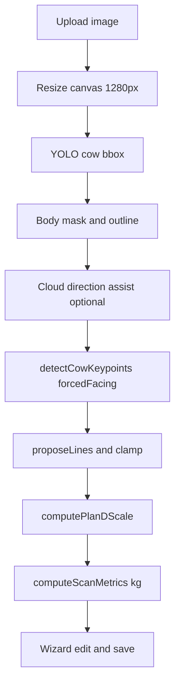
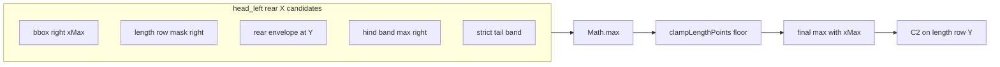
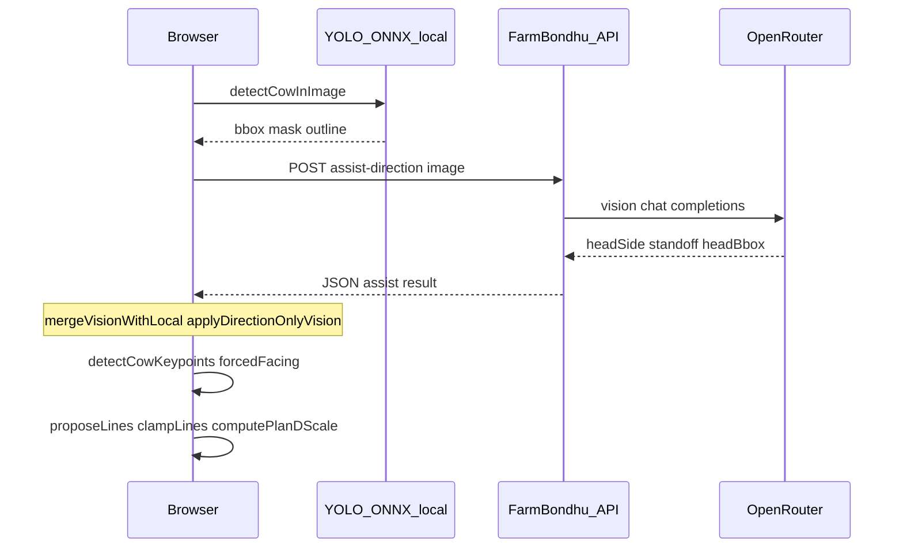
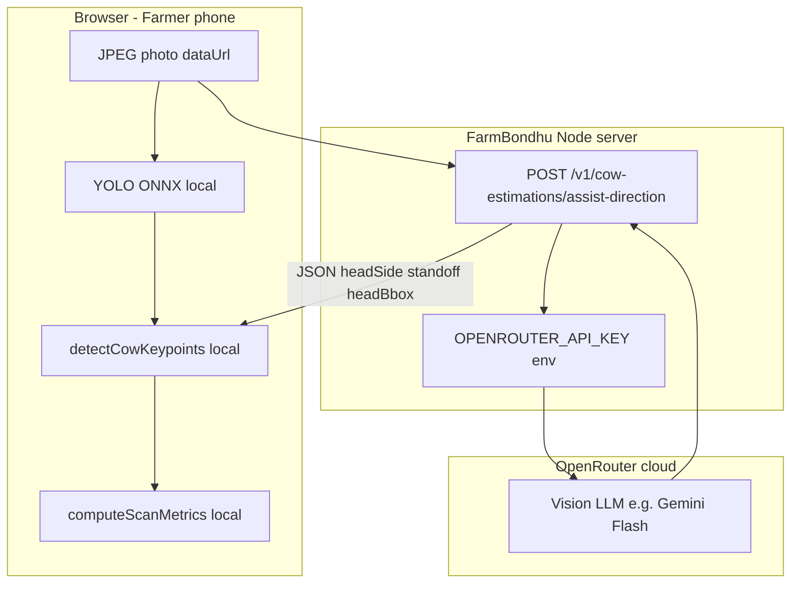
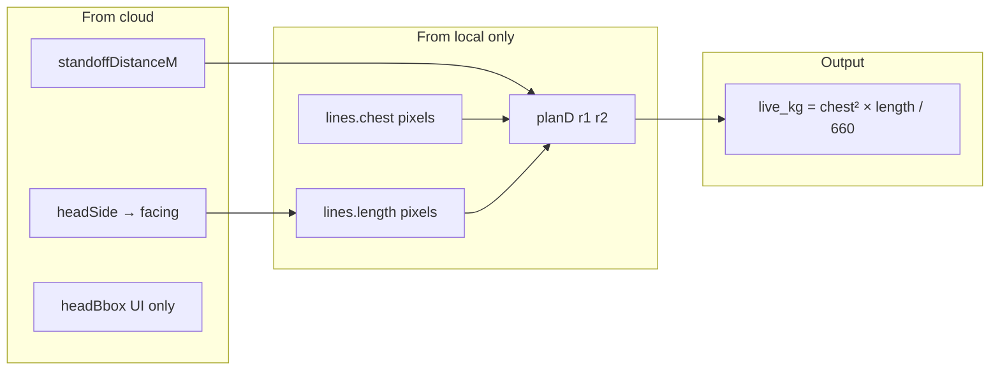

# FarmBondhu: Browser-Based Photogrammetric Live Weight Estimation for Side-View Dairy Cattle

**Document purpose:** This file is a complete technical manuscript scaffold for writing an **IEEE-format research paper**. It describes the FarmBondhu cow weight system as implemented in this repository (frontend + backend). Use it section-by-section when drafting your IEEE article. **No code changes are required** to use this document.

**Suggested IEEE title (edit as needed):**  
*Photogrammetric Live Weight Estimation from a Single Side-View Smartphone Image Using On-Device Detection, Semantic Segmentation, and Pinhole Camera Scaling*

**Keywords (IEEE):** livestock weight estimation, computer vision, YOLO, semantic segmentation, pinhole camera model, photogrammetry, precision agriculture, Qurbani cattle

---

## How to use this document for IEEE

| IEEE section | Read from this doc |
|--------------|-------------------|
| Abstract | [§1 Abstract](#1-abstract-draft) |
| I. Introduction | [§2](#2-introduction), [§3](#3-problem-statement-and-motivation) |
| II. Related Work | [§4](#4-related-work-literature-placeholders) — you add citations |
| III. System Overview | [§5](#5-system-architecture) |
| IV. Methodology | [§6](#6-methodology-pipeline-a-to-z) through [§8](#8-mathematical-formulation) |
| V. Implementation | [§9](#9-software-implementation) |
| VI. Experimental Setup | [§10](#10-experimental-setup-and-protocol) |
| VII. Results | [§11](#11-evaluation-metrics-and-results-template) — fill with your data |
| VIII. Discussion | [§12](#12-limitations), [§13](#13-future-work) |
| IX. Conclusion | [§14](#14-conclusion-draft) |
| References | [§15](#15-suggested-references-starter-list) |
| Appendix | [§16](#16-constants-and-configuration-tables) |
| **Full calculations + code map** | [§20](#20-ui-pages-routes-and-components), [§21](#21-master-calculation-index-every-formula-in-order), [§22](#22-local-vs-cloud-how-both-work-together), [§23](#23-complete-code-reference-by-module), [§24](#24-wizard-audit-trail-calculationbreakdown) |
| **How cloud AI works (full guide)** | [§27](#27-how-cloud-ai-works-complete-guide) |

---

## 1. Abstract (draft)

Accurate live weight of dairy cattle is essential for health management, feed planning, and livestock trade, yet smallholder farmers often lack access to scales. We present a **browser-based system** that estimates **live body mass (kg)** and **edible meat yield** from a **single side-view photograph** captured with a commodity smartphone. The pipeline combines: (1) **on-device object detection** (YOLOv8n ONNX) for cow localization; (2) **instance/semantic segmentation** or heuristic masking for a body silhouette; (3) **multi-cue head-direction resolution** (local mask geometry plus optional cloud vision assist); (4) **anatomically constrained keypoints** for chest width and body length; (5) **Plan D pinhole camera scaling** with discrete camera-distance selection (150–250 cm) and optional 1 m reference stick calibration; and (6) a **regional Qurbani-style volumetric formula** linking chest girth, body length, and live weight. A six-step guided wizard lets users verify and adjust measurement lines before saving. We describe the full algorithm—including direction-native length endpoints (C1 shoulder, C2 rear body end) and left-head-specific rear placement aligned to the detection bounding box—and provide reproducibility details (constants, thresholds, module map). Field validation and comparison against ground-truth scales remain the author’s responsibility to report in the Results section.

---

## 2. Introduction

### 2.1 Context

In South Asian and similar smallholder dairy contexts, **visual or formula-based weight proxies** are common when physical scales are unavailable, expensive, or impractical at the farm gate. Side-view imaging is attractive because it requires only a phone camera and a standardized pose (cow standing parallel to the camera, minimal occlusion).

### 2.2 Contribution summary (what this system does)

1. **End-to-end client-side analysis** after photo upload: detect cow → infer facing → place keypoints → propose measurement lines → estimate cm → compute kg.
2. **Hybrid direction sensing:** local body-mask geometry (primary) + optional **OpenRouter vision API** (head side, head box, standoff prior) without overwriting unstable chest/leg markers.
3. **Strict separation** between **guidance keypoints** (Step 1 overlay) and **canonical weight lines** (`lines.chest`, `lines.length`) to prevent inflated weight from automatic reproposal.
4. **Plan D scaling:** joint selection of camera distance on a discrete grid using pinhole geometry, bbox occupancy, and optional cloud standoff.
5. **Farmer-facing wizard** with frozen Detect preview, manual correction on Steps 2–3, optional metric stick on Step 4.

### 2.3 Scope and disclaimer (state clearly in paper)

- Output is an **estimate**, not a certified weigh-scale reading.
- Intended for **adult dairy side-view**; extreme poses, occlusion, or non-dairy breeds may violate priors.
- Formula divisor (660) reflects a **regional/livestock practice** proxy; cite local agricultural sources where possible.

---

## 3. Problem Statement and Motivation

### 3.1 Formal problem

Given a single RGB image \( I \) showing a cow in **side view**, estimate:

- **Chest width** \( W_c \) (cm) — vertical extent of the thorax (withers to brisket).
- **Body length** \( L_b \) (cm) — horizontal extent from **shoulder (withers region)** to **rear body end (rump/tail-side silhouette)**.
- **Live weight** \( M \) (kg) via a known empirical mapping \( f(W_c, L_b) = M \).

### 3.2 Challenges

| Challenge | Why it matters |
|-----------|----------------|
| Unknown camera distance | Pixel lengths are not metric without scale. |
| Variable phone EXIF | Focal length missing or wrong on many devices. |
| Segmentation errors | Mask may end before true rump; length row narrower than hindquarters. |
| Head direction ambiguity | Left vs right in image determines which side is tail vs shoulder. |
| Anatomical false positives | Belly, udder, or legs mistaken for chest lower point (C2). |
| User trust | Farmers need visible markers and stable first estimate. |

### 3.3 Design goals

1. **Accuracy** relative to scale (target: plausible adult dairy 250–750 kg when lines are correct).
2. **Robustness** to coat color and lighting via mask + cloud assist.
3. **Explainability** — show bbox, outline, C1/C2, Ch1/Ch2, formula breakdown.
4. **Low infrastructure** — browser WASM ONNX, optional cloud only for direction/standoff.

---

## 4. Related Work (literature placeholders)

*You should replace bullets with proper IEEE citations.*

- **Livestock weight from images / 3D:** depth cameras, multi-view reconstruction, Kinect-based cattle weighing.
- **Morphometric weight formulas:** chest girth × body length regressions; Shaeffer-type equations; Qurbani market practices.
- **Object detection for animals:** YOLO family on COCO class “cow”; farm-specific fine-tuning.
- **Pose estimation / keypoints:** animal keypoint networks vs heuristic geometry (this work is largely **heuristic + mask**).
- **Single-image metrology:** pinhole model, reference object scaling (1 m stick).
- **Mobile agriculture CV:** edge deployment, farmer UX for AI tools.

**Gap statement (suggested):** Few systems combine **browser-only ONNX detection**, **direction-native morphometric lines**, **frozen canonical weight paths**, and **joint pinhole distance grids** in one farmer wizard for dairy side-view.

---

## 5. System Architecture

### 5.1 High-level architecture

```
Farmer (browser)
    → Upload side-view JPEG/PNG (+ optional EXIF)
    → Analyze page (progressive: YOLO → cloud direction → keypoints → lines)
    → 6-step Scan wizard (overlay edit, metrics, save)
    → POST /api/v1/cow-estimations
Backend (Node.js)
    → Validate dimensions
    → estimateFromDimensions (formula 660)
    → PostgreSQL + optional Cloudinary image
Optional: OpenRouter vision (assist-direction only)
```

### 5.2 Major software modules (repository map)

| Layer | Path | Role |
|-------|------|------|
| Pages | `frontend/src/pages/dashboard/cowWeight/` | Hub, upload, analyze, scan, result |
| Overlay UI | `frontend/src/components/cowWeight/` | SVG lines, stepper, live summary |
| Analysis core | `frontend/src/lib/cowWeight/` | All CV + geometry + metrics |
| Backend API | `backend/src/routes/v1/cowEstimation.js` | CRUD estimations |
| Formula | `backend/src/services/cowEstimationFormula.js` | kg from cm |
| Vision assist | `backend/src/routes/v1/cowDirectionAssist.js` | OpenRouter proxy |

### 5.3 Data types (logical model)

- **BBox:** axis-aligned cow detection in analysis canvas pixels.
- **CowBodyMask:** binary mask grid aligned to canvas.
- **CowKeypoints:** leg columns, chest Y levels, length endpoints, `detected.facing`.
- **CowLines:** `chest` segment (Ch1–Ch2), `length` segment (C1 shoulder → C2 rear), optional `reference` (1 m stick).
- **CowAnalysisResult:** persisted analyze output including frozen `planD` snapshot.
- **ScanMetrics:** pixel/cm/kg preview for UI.

---

## 6. Methodology: Pipeline A to Z

This section is the **core of your IEEE Methodology**. Each subsection maps to one processing stage in order.

### Step A — Image acquisition and constraints

**Protocol for farmers (capture guidelines):**

1. **Side view:** cow parallel to camera; four legs visible if possible.
2. **Distance:** stand ~3–4.5 m from cow (system optimizes 150–250 cm equivalent optical distance via Plan D).
3. **Framing:** full body inside frame; green detection box should tightly bound cow.
4. **Optional:** 1 m measuring stick vertical at cow height for scale calibration (Step 4).
5. **Avoid:** extreme foreshortening, rear-only or head-only crops, heavy occlusion.

**EXIF used when present:** focal length (mm), 35 mm equivalent — fed into `focalLengthPx()` for pinhole scaling.

---

### Step B — Preprocessing

1. Load image from data URL (`loadImageFromDataUrl`).
2. Resize to analysis canvas: **longest side ≤ 1280 px** (`resizeToCanvas`) for consistent ONNX inference and overlay coordinates.
3. Export `displayImageUrl` (JPEG) — **all geometry is in this canvas space**, not the original upload resolution.

**IEEE note:** State image dimensions \( W_{img}, H_{img} \) after resize explicitly in experiments.

---

### Step C — Cow detection (bounding box)

**Primary:** YOLOv8n ONNX via `onnxruntime-web` (WASM).

| Parameter | Value |
|-----------|--------|
| Input | 640×640 letterbox, gray pad #808080 |
| Class | COCO id 19 (cow) |
| Confidence threshold | 0.35 |
| Fallback | TensorFlow.js COCO-SSD `lite_mobilenet_v2` |

**Output:** `BBox` = \( (x, y, w, h, confidence) \) clamped to image bounds.

**Failure mode:** throw “No cow detected” — user must retake photo.

The **green dashed rectangle** in the UI is this bbox (`BBOX_COLOR = #22c55e`).

---

### Step D — Body mask and silhouette outline

**Priority order:**

1. YOLO-seg mask if `yolov8n-seg.onnx` available → `buildSegBodyOutline`.
2. Else heuristic mask from canvas color/statistics inside bbox (`heuristicMaskFromCanvas`).
3. Body outline: per-row left/right envelope (`outlineRibbonFromMask`) — green/red overlay paths on Step 1.

**Uses:**

- Leg column search along lower body silhouette.
- Hind-band / tail-band tail-side X extremes for length C2.
- Head direction from mask mass thirds (`tailSideFromMaskHindThirds`, torso bands).

---

### Step E — Head direction (facing) resolution

**Facing enum:** `head_left` | `head_right` (cow’s head toward left or right **of the image**).

**Pipeline (analyze):**

1. `detectCowGeometry` — local bbox + mask (no keypoints yet).
2. `fetchCloudDirectionAssist` → OpenRouter vision JSON: `headSide`, `headBbox`, `standoffDistanceM`, confidence.
3. `applyDirectionOnlyVision` — merges **direction + head bbox + standoff** only (does **not** overwrite chest/leg pixels from cloud).
4. `detectCowKeypoints(..., { forcedFacing })` — **direction-native** single pass (no post-hoc swap).

**Local cues (when cloud weak):**

- Tail side from hind-band mask thirds vs head side = opposite(tail).
- Length-end mass, head ROI, leg ground columns.

**Farmer override:** Step 1 toggle Head left / Head right if unknown.

**IEEE figure suggestion:** Diagram showing head_left → tail on image right → C2 on right body end.

---

### Step F — Leg keypoints (Front / Hind)

**Semantic assignment after geometric leg columns:**

| Facing | Leg1 (Front) | Leg2 (Hind) |
|--------|--------------|-------------|
| `head_left` | left column (smaller x) | right column |
| `head_right` | right column | left column |

**Detection method:**

- `detectLegColumnsFromPhoto` — search X bands (`ZONE_LEFT_LEG`, `ZONE_RIGHT_LEG`, facing-specific `LEG2_BAND_*`).
- Silhouette upward scan from hoof region (`SIL_ROI_Y_START`, `SIL_SCAN_UP_FRAC`).
- Minimum separation `MIN_LEG_SEP_FRAC` ≈ 12% bbox width.

**Role:** Legs guide chest center X and facing; **weight length does not use hoof-to-hoof span** for kg (uses shoulder–rear line).

---

### Step G — Chest keypoints (Ch1, Ch2) and chest line

**Vertical chest line** through `chestCenterX` ≈ midpoint of leg columns (mask-refined).

| Marker | Name | Detection |
|--------|------|-----------|
| Ch1 / C1 chest top | Top chest / withers | `detectTopChestY`: scan Y ∈ [6%, 32%] bbox height; fallback 14% |
| Ch2 / C2 chest lower | Brisket | `detectLowerChestY`: scan [48%, 58%], max Y cap 58%, min body width 22% bbox, leg ceiling |

**Safeguards:** Reject narrow centered edges (udder false positives); keep Ch2 above leg midline + margin.

**Weight uses:** `lines.chest` from Ch1→Ch2 pixel length × vertical scale \( r_1 \).

---

### Step H — Body length keypoints (C1 shoulder, C2 rear)

**Critical for paper:** Length for weight is **shoulder to rear body end**, same horizontal row Y.

| Point | Label in UI | Meaning |
|-------|-------------|---------|
| `lines.length.a` | C1 shoulder | Withers-side end; nudged 20% toward head along span |
| `lines.length.b` | C2 rear | Tail-side **body silhouette end** at length row Y |

**Length row Y:** `LENGTH_Y_FRAC = 0.32` × bbox height from top.

#### H.1 Shoulder X (C1) — `headSideShoulderX`

- Prefer mask withers center if available.
- Else constrain leg1 X with mask row at Y and head-side margin (6% width from midline).

#### H.2 Rear X (C2) — `tailEndX` / `lengthShoulderRearPoints`

**Direction-native** (no runtime left/right swap).

**For `head_right` (unchanged in recent work):**

- Hind-band max left X, or row at Y, or leg2-guided fallback inward from hind leg.

**For `head_left` (tail on image right):**

1. `headLeftRearBodyEndX(mask, bbox, y)` — **maximum** of:
   - Bbox right guide: \( x_{max} = bbox.x + bbox.width - PAD \) (aligns with **right edge of green detection box**)
   - Mask row right at length Y
   - `maskRearEnvelopeXAtY` (nearby rows ±12% bbox height)
   - `maskHindBandTailEndX` (hind band 68–92% height)
   - `maskStrictTailBoundaryX` (rear band 55–95%, robust extremity)
2. `enforceRearTailBoundary` — floor rear X to mask+bbox composite.
3. After body clamps: **`rearX = max(rearX, xMax)`** so C2 cannot sit left of green bbox right guide.
4. `clampLinesToBBox(..., facing)` — for `head_left`, **do not cap** `length.b.x` at xMax (allows mask past bbox if valid); only floor at xMin.

**Shoulder nudge:** `SHOULDER_HEAD_NUDGE_FRAC = 0.2` moves C1 toward head along length chord.

**IEEE rationale paragraph (copy/adapt):**  
*Segmentation masks often underestimate rump extent at the belly-level length row. For left-facing animals, we therefore enforce a lower bound on rear endpoint x-coordinate at the inner right edge of the detection bounding box, which visually coincides with the right vertical guide of the green overlay box, while still allowing mask-derived endpoints beyond the box when the hind contour extends past the detector rectangle.*

---

### Step I — Line proposal and canonical weight path

**Functions:** `proposeLinesFromKeypoints` → `clampLinesToBBox`.

**Strict weight policy** (`strictweight.md`):

- **Live kg on all steps** uses the same `lines` object created at analyze time.
- Step 1 keypoint drags update **guidance** only; they do **not** replace `lines` until user edits Steps 2–3.
- **Never** call `proposeLinesFromBBox(keypoints)` on Step 1→2 transition (prevents chest line inflation).

**Re-analyze:** `canonicalLinesFromAnalysis` rebuilds from `analysis.lines`, not full keypoint repropose.

---

### Step J — Camera distance and Plan D scaling

**Goal:** Estimate metric scale \( r_1, r_2 \) (cm/pixel) without a depth sensor.

**Plan D (`geometry3d.ts`, `distanceScale.ts`):**

1. Compute focal length in pixels \( f_{px} \) from EXIF or defaults (sensor width 6.17 mm, default f 4.5 mm).
2. Pinhole standoff prior:  
   \( Z_{pinhole} \approx h_{withers} \times H_{img} / h_{bbox} \)  
   (withers ≈ 145 cm research prior).
3. Optional cloud prior \( Z_{cloud} \) from vision assist standoff meters.
4. **Grid search** camera distance \( Z \in \{150, 160, \ldots, 250\} \) cm.
5. Score each Z by deviation from priors + penalty if implied body height/length outside [150–250] cm height, [100–220] cm length.
6. Pick best Z; compute \( r_1 = r_2 = (Z / f_{px}) \times calibrationFactor \).
7. `groundDistanceDetected` flag if cloud or high geometry confidence; else fallback average 180 cm.

**Frozen at Detect:** `analysis.planD` snapshot keeps Step 1 kg stable when standoff UI updates later.

---

### Step K — Pixel to centimeter conversion

**Without physical stick:**

\[
W_c = pixel(Ch1, Ch2) \times r_1,\quad L_b = pixel(C1, C2) \times r_2
\]

**With 1 m reference stick** (`lines.reference`, 100 cm):

- Detect vertical stick in side bands of image or user tap R1–R2.
- \( cm/pixel = 100 / pixel_{ref} \) (may use dynamic body height as reference cm via Plan D).

**Functions:** `measureSegments.ts`, `pixelsToCm.ts`, `scanMetrics.ts`.

---

### Step L — Live weight and edible meat formula

**Empirical formula (implemented identically frontend preview + backend save):**

\[
M_{live} = \frac{W_c^2 \cdot L_b}{D}
\]

| Symbol | Default | Meaning |
|--------|---------|---------|
| \( W_c \) | measured | Chest width (cm) |
| \( L_b \) | measured | Body length shoulder–rear (cm) |
| \( D \) | 660 | Divisor (`COW_WEIGHT_FORMULA_DIVISOR` env on server) |

**Edible meat:**

\[
M_{edible} = 0.55 \times M_{live}
\]

**Breakdown (backend):** solid 30%, bone 15%, fat 5%, head 3%, liver/heart 2% of live weight.

**Example:** \( W_c=55 \) cm, \( L_b=65 \) cm → \( M = 55^2 \times 65 / 660 \approx 297.9 \) kg.

**Plausibility band (UI hints):** 250–750 kg adult dairy (`cowWeightResearch.ts`).

---

### Step M — Six-step wizard (human in the loop)

| Step | Name | Purpose |
|------|------|---------|
| 1 | Detect | Review bbox, outline, markers, facing; **frozen** live kg preview |
| 2 | Chest | Drag **lines.chest** (Ch1/Ch2) — updates kg |
| 3 | Length | Drag **lines.length** (C1/C2) — updates kg |
| 4 | Scale | Optional 1 m stick; standoff display |
| 5 | Measure | Review cm, kg, meat, formula audit |
| 6 | Review | Save to API |

**Components:** `CowWeightScan.tsx`, `CowWeightOverlay.tsx`, `ScanLiveSummary.tsx`, `ScanCalculationBreakdown.tsx`.

---

### Step N — Persistence and API

**POST** `/api/v1/cow-estimations` with `chest_width_cm`, `body_length_cm`, `confidence`, `annotation_json` (bbox, lines, planD, standoff, wizard metadata), optional `file_data`.

**Database table:** `cow_weight_estimations` (user_id, dimensions, kg, breakdown jsonb, image_url).

---

## 7. Algorithm flowcharts (for IEEE figures)

### 7.1 End-to-end pipeline



### 7.2 Left-head C2 placement (detail)



---

## 8. Mathematical formulation (compact)

### 8.1 Pinhole cm per pixel

\[
r(Z) = \frac{Z \cdot k_{cal}}{f_{px}}
\]

where \( Z \) is camera distance (cm), \( f_{px} \) focal length in pixels, \( k_{cal} \) optional calibration factor (`VITE_COW_SCALE_CALIBRATION_FACTOR`).

### 8.2 Joint distance selection

\[
Z^* = \arg\min_{Z \in \mathcal{G}} \; \sum_i w_i \cdot |Z - z_i| + \lambda_h \cdot \phi(h(Z)) + \lambda_l \cdot \psi(\ell(Z))
\]

with grid \( \mathcal{G} = \{150,\ldots,250\} \), priors \( z_i \in \{Z_{pinhole}, Z_{cloud}, Z_{local}, Z_{pos}\} \), penalties \( \phi,\psi \) for implausible implied height/length.

### 8.3 Weight mapping

\[
M = \frac{W_c^2 L_b}{D}
\]

This is **not** a standard allometric power law; treat \( D \) as **calibrated cultural/regional divisor** and discuss limitations.

---

## 9. Software implementation

### 9.1 Client technologies

- React + TypeScript (Vite)
- `onnxruntime-web` WASM for YOLO
- TensorFlow.js fallback
- SVG overlay in image pixel coordinates
- Vitest unit tests for geometry (`cowKeypoints.lengthShoulderRear.test.ts`, `proposeLines.clampFacing.test.ts`, etc.)

### 9.2 Server technologies

- Node.js Express API
- PostgreSQL
- Cloudinary (optional image storage)
- OpenRouter proxy for vision (API key server-side only)

### 9.3 Environment variables (reproducibility table)

| Variable | Purpose |
|----------|---------|
| `VITE_COW_YOLO_MODEL_URL` | ONNX model path |
| `VITE_COW_SCALE_CALIBRATION_FACTOR` | Global scale tweak |
| `OPENROUTER_API_KEY` | Vision assist |
| `OPENROUTER_VISION_MODEL` | e.g. gemini-2.0-flash |
| `COW_DIRECTION_ASSIST_ENABLED` | Disable cloud |
| `COW_WEIGHT_FORMULA_DIVISOR` | Backend D |

---

## 10. Experimental setup and protocol

*Template — fill with your study.*

### 10.1 Dataset

- Number of animals N = ?
- Breeds (e.g. Holstein, local crossbred)
- Capture conditions: indoor/outdoor, lighting
- Ground truth: platform scale weight within Δt hours of photo
- Phone models and EXIF availability rate

### 10.2 Baselines (suggested comparisons)

1. **BBox-only scaling** (150 cm / bbox height) without Plan D.
2. **Nose-to-tail length** instead of shoulder–rear.
3. **No cloud direction** (local mask only).
4. **Professional tape measure** chest girth + length (manual morphometry).

### 10.3 Metrics

| Metric | Formula / note |
|--------|----------------|
| MAE (kg) | \( \frac{1}{N}\sum |M_{est} - M_{gt}| \) |
| MAPE (%) | mean absolute percentage error |
| RMSE (kg) | root mean square error |
| Bias (kg) | mean signed error |
| % within 10% | fraction with \|error\| < 10% of \( M_{gt} \) |
| Plausibility rate | % estimates in [250, 750] kg |

### 10.4 Ablation studies (recommended)

- With vs without OpenRouter direction.
- With vs without 1 m stick.
- Left-head only: with vs without bbox-right C2 snap.
- Frozen lines vs repropose-from-keypoints (demonstrate old bug magnitude).

---

## 11. Evaluation metrics and results (template)

### Table I — Overall weight estimation (fill in)

| Method | MAE (kg) | RMSE (kg) | MAPE (%) | Notes |
|--------|----------|-----------|----------|-------|
| FarmBondhu Plan D | | | | full system |
| Bbox 150 cm | | | | ablation |
| Manual lines + Plan D | | | | upper bound human correction |

### Table II — Direction accuracy (fill in)

| Source | Accuracy % | Notes |
|--------|------------|-------|
| Local mask only | | |
| Cloud assist | | |
| Farmer toggle corrected | | |

### Figure suggestions

1. Sample side-view with bbox, outline, C1–C2, Ch1–Ch2 overlays.
2. Error vs standoff distance.
3. Bland–Altman plot (estimated vs scale weight).
4. Left-head failure case before/after bbox-right snap.

---

## 12. Limitations

1. **Single 2D view** — no depth; pinhole + priors approximate true 3D size.
2. **Formula calibration** — divisor 660 may not transfer across breeds/regions without recalibration.
3. **Segmentation dependency** — poor mask → poor C2; bbox snap helps left-head but not all poses.
4. **Cloud reliance optional** — direction may fail on uniform coats without farmer toggle.
5. **Browser compute** — large images + WASM may be slow on low-end phones.
6. **Not a legal certification** for trade or religious slaughter weight certification.

---

## 13. Future work

- Fine-tuned YOLO-seg on local dairy dataset; export updated ONNX.
- Learned rear/shoulder keypoints (HRNet) replacing heuristics.
- Automatic ground-truth collection loop (`actual_weight_kg` column exists).
- Multi-animal detection and instance selection.
- On-device TFLite fully offline direction model (remove cloud).
- Breed-specific divisors or learned \( f(W_c, L_b) \) regression.
- Cross-validation with veterinary tape chest girth.

---

## 14. Conclusion (draft)

We described a complete browser-based pipeline for estimating dairy cattle live weight from a single side-view smartphone image, combining on-device YOLO detection, mask-driven morphometric keypoints, direction-native shoulder–rear length, Plan D pinhole distance selection, and a Qurbani-style volumetric weight formula. A strict canonical-line policy and six-step wizard balance automation with farmer verification. A left-facing-specific rear endpoint rule aligns the tail marker with the detection bounding box’s right edge when segmentation underestimates rump extent. Future work should quantify error against platform scales across breeds and environments, and calibrate the formula divisor on local ground truth.

---

## 15. Suggested references (starter list)

*Format these in IEEE style; verify before submission.*

1. YOLO / Ultralytics YOLOv8 documentation and paper lineage (You Only Look Once series).
2. COCO dataset — Lin et al., Microsoft COCO.
3. Pinhole camera model / photogrammetry textbooks (multiple view geometry — Hartley & Zisserman).
4. Livestock weight estimation via chest girth measurements — regional agricultural extension literature.
5. ONNX Runtime — Microsoft, for edge inference.
6. OpenRouter / multimodal LLM vision APIs (if citing cloud assist).
7. Allometric scaling in mammals (reference for discussing formula limitations).

---

## 16. Constants and configuration tables

### 16.1 Detection and geometry

| Constant | Value | Module |
|----------|-------|--------|
| Canvas max side | 1280 px | `imageUtils` |
| YOLO input | 640×640 | `yoloDetect` |
| YOLO conf threshold | 0.35 | `yoloDetect` |
| COCO cow class | 19 | `yoloDetect` |
| Bbox pad | 4 px | `proposeLines`, `cowKeypoints` |
| LENGTH_Y_FRAC | 0.32 | `cowKeypoints` |
| SHOULDER_HEAD_NUDGE_FRAC | 0.2 | `cowKeypoints` |
| TAIL_FALLBACK_FROM_HIND_FRAC | 0.12 | `cowKeypoints` |
| MIN_LEG_SEP_FRAC | 0.12 | `cowKeypoints` |
| LOWER_CHEST_MAX_FRAC | 0.58 | `cowKeypoints` |
| MIN_BODY_WIDTH_FRAC | 0.22 | `cowKeypoints` |

### 16.2 Mask bands (tail / hind)

| Band | Y fraction (bbox) | Function |
|------|-------------------|----------|
| Hind tail | 0.68 – 0.92 | `maskHindBandTailEndX` |
| Strict tail | 0.55 – 0.95 | `maskStrictTailBoundaryX` |
| Rear envelope half-band | ±12% bbox height | `maskRearEnvelopeXAtY` |

### 16.3 Plan D and research priors

| Constant | Value | Module |
|----------|-------|--------|
| Formula divisor D | 660 | `scanMetrics`, backend |
| Edible fraction | 0.55 | backend |
| Camera distance grid | 150–250 cm step 10 | `geometry3d` |
| Default distance fallback | 180 cm | `geometry3d` |
| Assumed withers height | 145 cm | `cowWeightResearch` |
| Assumed bbox height (legacy B) | 150 cm | `pixelsToCm` |
| Optimal standoff band | 3.0–4.5 m | `cowWeightResearch` |
| Plausible live kg | 250–750 | `cowWeightResearch` |
| BODY_HEIGHT_PRIOR | 180 cm | `geometry3d` |
| VISION_MIN_CONFIDENCE | 0.5 | `directionMerge` |

### 16.4 UI measurement bands (overlay guides)

| Guide | X fraction | Note |
|-------|------------|------|
| bandX1 | 4% bbox width | Yellow chest band left |
| bandX2 | 96% bbox width | Yellow chest band right |
| Green bbox right | 100% bbox edge | Detection rectangle stroke |

---

## 17. Glossary

| Term | Definition |
|------|------------|
| **head_left** | Cow’s head appears on the left side of the image; tail on the right. |
| **C1** | Shoulder / withers end of length line (`lines.length.a`). |
| **C2** | Rear body end of length line (`lines.length.b`). |
| **Ch1 / Ch2** | Top and lower chest (vertical chest width line). |
| **Plan D** | Pinhole joint camera-distance scaling (current default). |
| **Canonical lines** | `analysis.lines` used for kg until user edits Steps 2–3. |
| **xMax** | `bbox.x + bbox.width - PAD`; right inner edge of green detection box. |

---

## 18. Internal documentation cross-links (for authors, not IEEE)

- Developer guide: `frontend/src/lib/cowWeight/cowweight.md`
- Strict weight policy: `frontend/src/lib/cowWeight/strictweight.md`
- Cloud assist: `frontend/src/lib/cowWeight/cloudai.md`
- Project tracker: `docs/ai/cow_weight_detection.md`

---

## 19. IEEE author checklist (before submission)

- [ ] Abstract ≤ 250 words (adjust draft in §1).
- [ ] Define all symbols in Nomenclature or at first use.
- [ ] Include ethics / animal welfare statement if required by venue.
- [ ] State data availability (images, annotations, code repository link if public).
- [ ] Report hardware: test phones, WASM timing optional.
- [ ] Acknowledge OpenRouter / cloud API costs and privacy (images sent to third party when assist enabled).
- [ ] Conflict of interest and funding statements.
- [ ] All figures 300 dpi; use vector for diagrams where possible.
- [ ] Number equations (§8) in final LaTeX.

---

## 20. UI pages, routes, and components

All farmer-facing UI lives under **`/dashboard/cow-weight/*`**. Router: `frontend/src/pages/dashboard/cowWeight/CowWeightEstimator.tsx`.

| Route | File path | What runs / what user sees |
|-------|-----------|----------------------------|
| `/dashboard/cow-weight` | `CowWeightHub.tsx` | Entry; `preloadCowModels()` warms YOLO |
| `/dashboard/cow-weight/upload` | `CowWeightUpload.tsx` | Pick image; `parseExifFromFile()`; navigate to analyze |
| `/dashboard/cow-weight/analyze` | `CowWeightAnalyze.tsx` | **3 phases:** detect → direction (cloud) → markers; then redirect to scan |
| `/dashboard/cow-weight/scan` | `CowWeightScan.tsx` | **6-step wizard**; overlay; live kg; save API |
| `/dashboard/cow-weight/confirm` | `CowWeightConfirm.tsx` | Alternate confirm path (legacy) |
| `/dashboard/cow-weight/result` | `CowWeightResult.tsx` | Saved kg + meat breakdown |

### Scan wizard steps vs code

| Step | `ScanStepId` | UI component | Lines used for **weight** | Draggable |
|------|--------------|--------------|---------------------------|-----------|
| 1 | Detect | `CowWeightOverlay` step 1 | **Frozen** snapshot of `lines` (see `detectPreviewMetrics`) | Keypoints only (guidance); chest/length lines visible |
| 2 | Chest | overlay step 2 | **`lines.chest`** (Ch1–Ch2) | Yes → `setLinesClamped` |
| 3 | Length | overlay step 3 | **`lines.length`** (C1–C2) | Yes |
| 4 | Scale | overlay + `CameraDistanceBar` | Optional `lines.reference` (1 m stick) | Reference tap R1/R2 |
| 5 | Measure | `ScanLiveSummary`, `ScanCalculationBreakdown` | Same `lines` + `computeScanMetrics` | No |
| 6 | Review | save button | POST API with final cm/kg | No |

### Key UI components (calculation-related)

| Component | Path | Role |
|-----------|------|------|
| `CowWeightOverlay.tsx` | `frontend/src/components/cowWeight/` | SVG bbox, outline, lines, C1/C2/Ch1/Ch2, drag handlers |
| `ScanLiveSummary.tsx` | same | Live kg, chest/length cm, formula text |
| `ScanCalculationBreakdown.tsx` | same | Step-by-step audit table (`buildCalculationBreakdown`) |
| `ScanDetailPanel.tsx` | same | Instructions per step |
| `CameraDistanceBar.tsx` | same | Ground distance 150–250 cm display |
| `ScaleFormulaBlock.tsx` | same | Shows \(r_1\), \(r_2\), divisor |

### Navigation state types

| Type | File | Fields |
|------|------|--------|
| `CowWeightScanState` | `navigation.ts` | `dataUrl`, `analysis`, `exif`, `mode` |
| `CowAnalysisResult` | `types.ts` | `bbox`, `lines`, `keypoints`, `planD`, `headBbox`, `standoffMeters`, … |

---

## 21. Master calculation index (every formula in order)

Use this as the **numbered calculation chain** for your IEEE Methodology. Each row has: inputs → formula → output → **code file + function**.

### Phase 0 — Image ingest

| # | Calculation | Formula / rule | Code |
|---|-------------|----------------|------|
| 0.1 | Load image | decode file → `HTMLImageElement` | `imageUtils.ts` → `loadImageFromDataUrl` |
| 0.2 | Resize canvas | `scale = min(1280/max(w,h), …)`; draw to canvas | `imageUtils.ts` → `resizeToCanvas` |
| 0.3 | EXIF focal length | read `focalLengthMm`, `focalLength35mm` if present | `imageExif.ts` → `parseExifFromFile` |
| 0.4 | Display URL | `canvas.toDataURL('image/jpeg', 0.92)` | `analyzeCow.ts` → `detectCowGeometry` |

**Outputs:** `imageWidth`, `imageHeight`, `displayImageUrl`, optional EXIF.

---

### Phase 1 — Local detection (browser only, no cloud)

| # | Calculation | Formula / rule | Code |
|---|-------------|----------------|------|
| 1.1 | YOLO letterbox | image → 640×640, pad gray 128 | `yoloDetect.ts` → `detectCowInImage` |
| 1.2 | Cow bbox | class 19, conf ≥ 0.35 → `(x,y,w,h)` normalized to canvas | `yoloDetect.ts` → `normalizeBBox` |
| 1.3 | Body mask | seg ONNX mask OR `heuristicMaskFromCanvas` | `cowMask.ts`, `analyzeCow.ts` → `resolveBodyMaskAndOutline` |
| 1.4 | Outline polygon | per-row `ext.left`, `ext.right` → ribbon | `cowMask.ts` → `outlineRibbonFromMask` |
| 1.5 | Bbox corners | `x1=x`, `y1=y`, `x2=x+w`, `y2=y+h` (ground at bottom) | `geometry2d.ts` → `bboxCorners`, `groundLineY` |

**Outputs:** `CowGeometry { bbox, bodyMask, bodyOutline, displayCanvas }`.

---

### Phase 2 — Cloud direction assist (optional server)

| # | Calculation | Formula / rule | Code |
|---|-------------|----------------|------|
| 2.1 | Compress image | JPEG compress for API payload | `imageUtils.ts` → `compressDataUrl` |
| 2.2 | HTTP POST | `POST /api/v1/cow-estimations/assist-direction` | `api.ts` → `assistCowDirection` |
| 2.3 | OpenRouter vision | multimodal JSON: `headSide`, `headBbox`, `standoffDistanceM`, confidence | `backend/.../cowDirectionAssist.js` |
| 2.4 | Merge policy | if `vision.confidence ≥ 0.5` → use cloud head side; else local | `directionMerge.ts` → `mergeVisionWithLocal` |
| 2.5 | Facing enum | `headSide left` → `head_left`, `right` → `head_right` | `cowDirection.ts` → `facingFromHeadSide` |
| 2.6 | Head bbox pixels | normalized 0–1 → pixel rect | `headBbox.ts` → `resolveHeadBboxFromVision` |
| 2.7 | Standoff blend | `m = 0.4×pinhole + 0.6×vision` (when vision OK) | `standoffEstimate.ts` → `estimateCameraStandoff` |

**Outputs:** `forcedFacing`, `headBbox`, `standoffMeters`, `verifySource`, `assistApplied`.

**Important:** Cloud does **NOT** set chest/leg marker pixels in production (`applyDirectionOnlyVision` in `keypointMerge.ts`).

---

### Phase 3 — Local keypoints + lines (browser, uses `forcedFacing`)

| # | Calculation | Formula / rule | Code |
|---|-------------|----------------|------|
| 3.1 | Leg columns | search X bands on silhouette; score upward scan | `cowKeypoints.ts` → `detectLegColumnsFromPhoto` |
| 3.2 | Assign Front/Hind | `head_left`: leg1=left, leg2=right | `cowKeypoints.ts` → `assignLegsByFacing` |
| 3.3 | Chest center X | `(leg1.x + leg2.x) / 2` (mask refine) | `detectCowKeypoints` |
| 3.4 | Top chest Y (Ch1) | scan rows Y ∈ [6%,32%]×bbox.h for widest dorsal row | `detectTopChestY` |
| 3.5 | Lower chest Y (Ch2) | scan [48%,58%], cap 58%, width ≥ 22% bbox.w | `detectLowerChestY` |
| 3.6 | Length row Y | `y = bbox.y + 0.32 × bbox.h` | `LENGTH_Y_FRAC` in `cowKeypoints.ts` |
| 3.7 | C1 shoulder X | withers center OR mask row + leg1 constraint | `headSideShoulderX` |
| 3.8 | C2 rear X (`head_left`) | `max(bboxRight, rowRight, envelope, hind, strict)` then `max(rear, xMax)` | `headLeftRearBodyEndX`, `lengthShoulderRearPoints` |
| 3.8b | C2 rear X (`head_right`) | hind-band min left OR row left at Y | `tailEndX` (right branch) |
| 3.9 | Shoulder nudge | `C1' = C1 - 0.2×(C2-C1)` (head_left) | `nudgeShoulderTowardHead` |
| 3.10 | Propose lines | `chest: (cx, topY)-(cx, lowY)`; `length: shoulder→rear` | `proposeLinesFromKeypoints` |
| 3.11 | Clamp lines | chest inside bbox; length.b for head_left: `x ≥ xMin` only | `proposeLines.ts` → `clampLinesToBBox` |

**Outputs:** `CowKeypoints`, `CowLines { chest, length }`.

---

### Phase 4 — Plan D scale (camera distance + cm/pixel)

| # | Calculation | Formula / rule | Code |
|---|-------------|----------------|------|
| 4.1 | Focal px | \(f_{px} = W_{img} \cdot f_{mm} / 6.17\) | `geometry3d.ts` → `focalLengthPx` |
| 4.2 | Pinhole standoff | \(Z_m \approx 1.45 \times H_{img} / h_{bbox}\) | `cowWeightResearch.ts` → `pinholeStandoffMeters` |
| 4.3 | Cloud prior cm | `standoffMeters × 100` snapped to grid | `geometry3d.ts` → `jointSelectCameraDistance` |
| 4.4 | Grid search | for each `Z ∈ {150,160,…,250}` minimize score | `jointSelectCameraDistance` |
| 4.5 | cm per pixel | \(r = Z / f_{px} \times k_{cal}\) | `geometry3d.ts` → `cmPerPxAtZ` |
| 4.6 | Body height est. | `bodyHeightCm = bbox.height × r1` | `distanceScale.ts` → `computePlanDScale` |
| 4.7 | Freeze planD | stored on `analysis.planD` at first analyze | `analyzeCow.ts` → `buildAnalysisFromGeometry` |

**Outputs:** `planD { cameraDistanceCm, r1, r2, bodyHeightCm, geometryConfidence, distanceSource }`.

---

### Phase 5 — Pixel lengths → centimeters

| # | Calculation | Formula / rule | Code |
|---|-------------|----------------|------|
| 5.1 | Chest pixels | \(p_{ch} = \sqrt{(Ch2.x-Ch1.x)^2 + (Ch2.y-Ch1.y)^2}\) | `imageUtils.ts` → `lineLengthPx` |
| 5.2 | Length pixels | \(p_{len} = \sqrt{(C2.x-C1.x)^2 + (C2.y-C1.y)^2}\) | same |
| 5.3 | Chest cm | \(W_c = p_{ch} \times r_1\) (vertical-dominant) | `measureSegments.ts` → `measureSegmentCm` |
| 5.4 | Length cm | \(L_b = p_{len} \times r_2\) (horizontal-dominant) | same |
| 5.5 | Reference path | if `lines.reference`: \(cm/px = 100 / p_{ref}\) | `referenceScale.ts`, `scanMetrics.ts` |

**Code entry:** `scanMetrics.ts` → `computeScanMetrics` → calls `dimensionsFromLinesPlanD` or `dimensionsFromLines`.

---

### Phase 6 — Live weight and meat

| # | Calculation | Formula / rule | Code |
|---|-------------|----------------|------|
| 6.1 | Live weight | \(M = W_c^2 \cdot L_b / 660\) | `scanMetrics.ts` → `previewWeightKg` |
| 6.2 | Edible meat | \(M_{edible} = 0.55 \times M\) | `scanMetrics.ts` → `computeScanMetrics` |
| 6.3 | Server save | same formula on POST | `backend/.../cowEstimationFormula.js` → `estimateFromDimensions` |
| 6.4 | Meat breakdown | 30% solid, 15% bone, 5% fat, 3% head, 2% liver | `cowEstimationFormula.js` |

---

### Phase 7 — Wizard display rules (not new math, policy)

| # | Rule | Code |
|---|------|------|
| 7.1 | Step 1 kg **frozen** | `detectPreviewMetrics = computeScanMetrics(..., standoff=null)` once | `CowWeightScan.tsx` |
| 7.2 | Step 2+ kg **live** | `liveMetrics = computeScanMetrics(..., standoff.meters)` | `CowWeightScan.tsx` |
| 7.3 | No repropose on Next 1→2 | do NOT call `proposeLinesFromBBox` on step change | `CowWeightScan.tsx` + `strictweight.md` |
| 7.4 | Re-analyze | `canonicalLinesFromAnalysis(analysis)` | `canonicalScanLines.ts` |

---

## 22. Local vs cloud — how both work together

> **Full cloud guide:** For step-by-step OpenRouter flow, API JSON, merge policy, standoff blend, errors, and IEEE paragraph, see **[§27 How Cloud AI Works](#27-how-cloud-ai-works-complete-guide)**.

### 22.1 Design principle

| Layer | Runs where | Responsibility |
|-------|------------|----------------|
| **Local (browser)** | Farmer’s phone/PC | Cow bbox, mask, outline, all marker positions, all measurement lines, all kg math |
| **Cloud (server→OpenRouter)** | FarmBondhu API | Head side (left/right), head box hint, standoff distance prior **only** |

Cloud is **assist**, not replacement. This avoids marker flicker and wrong chest placement from vision JSON.

### 22.2 Timeline on upload (exact file order)

```
CowWeightUpload.tsx
  → fileToDataUrl, parseExifFromFile
CowWeightAnalyze.tsx
  (1) detectCowGeometry(dataUrl)           [LOCAL]  analyzeCow.ts
  (2) fetchCloudDirectionAssist(...)       [CLOUD]  runVisionAssist.ts → api.ts → backend
  (3) buildAnalysisFromGeometry(geo, cloud) [LOCAL]  analyzeCow.ts
  (4) navigate → CowWeightScan.tsx
CowWeightScan.tsx
  canonicalLinesFromAnalysis(analysis)     [LOCAL]  canonicalScanLines.ts
  computeScanMetrics(lines, analysis)      [LOCAL]  scanMetrics.ts
```

### 22.3 Sequence diagram (local + cloud)



### 22.4 What cloud returns vs what is used

| API field | Used? | Where |
|-----------|-------|-------|
| `headSide` | **Yes** | → `forcedFacing` → keypoint geometry |
| `confidence` | **Yes** | must be ≥ 0.5 for `source: vision` |
| `headBbox` (normalized) | **Yes** | orange Head box overlay |
| `standoffDistanceM` | **Yes** | blended into `estimateCameraStandoff` → Plan D prior |
| `distanceConfidence` | **Yes** | standoff blend weight |
| `frontLeg`, `hindLeg` | **No** (production) | returned but not merged |
| `topChest`, `lowerChest` | **No** (production) | returned but not merged |

Code proof: `keypointMerge.ts` → `applyDirectionOnlyVision` (comment: does not move chest, legs, or L1/L2).

### 22.5 What local does without cloud

If `OPENROUTER_API_KEY` missing or API fails (`runVisionAssist.ts` catch block):

- `facing = null`, `headBbox = null`, `verifySource = "none"`
- `detectCowKeypoints` uses mask-based `detectCowBodyDirection` inside detection
- Farmer **must** pick Head left / Head right on Step 1 before Next
- Standoff = pinhole + heuristic only (`standoffEstimate.ts`)

### 22.6 Direction merge priority (`directionMerge.ts`)

```
IF vision.headSide valid AND vision.confidence >= 0.5
  → facing = head_left | head_right, source = "vision"
ELSE IF local mask direction confident (no directionIssueKey)
  → facing from local, source = "local"
ELSE
  → facing = null, source = "none", show "Not detected" + manual toggle
```

Functions: `mergeVisionWithLocal`, `resolveFacingFromBodyDirection`, `cowBodyDirectionFromHeadSide`.

### 22.7 Local head/tail from mask (`cowDirection.ts` + `cowMask.ts`)

| Function | File | Idea |
|----------|------|------|
| `tailSideFromMaskHindThirds` | `cowMask.ts` | hind-band mask mass left vs right third |
| `tailSideFromMaskTorsoThirds` | `cowMask.ts` | torso band wedge mass |
| `headSideFromMask` | `cowMask.ts` | distance of body extent to bbox edges |
| `detectCowBodyDirection` | `cowDirection.ts` | combines tail-first / head band / length ends |
| `headBboxFromMaskHeuristic` | `headBbox.ts` | local orange box when no cloud |

### 22.8 Re-analyze on scan page

`CowWeightScan.tsx` → `onReanalyze` → `analyzeCowImageWithCloudDirection` repeats full pipeline (geometry + cloud + keypoints + lines). Resets frozen Detect preview.

---

## 23. Complete code reference by module

Base path: **`frontend/src/lib/cowWeight/`** unless noted.

### 23.1 Orchestration

| File | Exports (main) | Calculates / decides |
|------|----------------|----------------------|
| `analyzeCow.ts` | `detectCowGeometry`, `buildAnalysisFromGeometry`, `analyzeCowImageWithCloudDirection` | Full analyze pipeline; attaches `planD` |
| `runVisionAssist.ts` | `fetchCloudDirectionAssist` | Cloud call + standoff blend wrapper |
| `canonicalScanLines.ts` | `canonicalLinesFromAnalysis` | Which `lines` to use on load/re-analyze |

### 23.2 Detection & mask

| File | Key functions | Calculates |
|------|---------------|------------|
| `yoloDetect.ts` | `detectCowInImage`, `preloadCowModels` | Bbox, model name |
| `yoloSegDetect.ts` | `refineSegBodyOutlineFromImage` | Seg outline repair |
| `cowMask.ts` | `maskRowExtent`, `maskHindBandTailEndX`, `maskRearEnvelopeXAtY`, `maskStrictTailBoundaryX`, `outlineRibbonFromMask`, `heuristicMaskFromCanvas` | Mask geometry, tail X, outline |
| `imageUtils.ts` | `lineLengthPx`, `resizeToCanvas`, `compressDataUrl` | Pixel distances, resize |

### 23.3 Direction & head

| File | Key functions | Calculates |
|------|---------------|------------|
| `cowDirection.ts` | `detectCowBodyDirection`, `resolveFacingFromBodyDirection` | head_side, tail_side, facing |
| `directionMerge.ts` | `mergeVisionWithLocal` | vision vs local policy |
| `keypointMerge.ts` | `applyDirectionOnlyVision` | Cloud → facing + headBbox only |
| `headBbox.ts` | `resolveHeadBboxFromVision`, `headBboxFromMaskHeuristic` | Head rectangle |

### 23.4 Keypoints & length/chest lines

| File | Key functions | Calculates |
|------|---------------|------------|
| `cowKeypoints.ts` | `detectCowKeypoints`, `lengthShoulderRearPoints`, `headLeftRearBodyEndX`, `tailEndX`, `headSideShoulderX`, `detectTopChestY`, `detectLowerChestY`, `proposeLinesFromKeypoints` | All marker coordinates, C1/C2, Ch1/Ch2 |
| `proposeLines.ts` | `proposeLinesFromBBox`, `clampLinesToBBox`, `shouldReproposeChest` | Line segments, bbox clamp rules |

### 23.5 Scale & 3D geometry

| File | Key functions | Calculates |
|------|---------------|------------|
| `geometry3d.ts` | `focalLengthPx`, `cmPerPxAtZ`, `jointSelectCameraDistance`, `snapToDistanceGrid` | \(f_{px}\), \(r\), best camera distance Z |
| `distanceScale.ts` | `computePlanDScale` | `planD` bundle |
| `standoffEstimate.ts` | `estimateCameraStandoff` | Standoff meters (vision+pinhole+heuristic) |
| `cowWeightResearch.ts` | `pinholeStandoffMeters`, `standoffHeightMultiplier` | Research constants, pinhole Z |
| `geometry2d.ts` | `bboxCorners`, `groundLineY`, `heightLineFromBBox`, `isMostlyVertical` | Bbox helpers |
| `pixelsToCm.ts` | `dimensionsFromLines`, `estimateCmPerPixelFromBBox` | Legacy Plan B cm (reference) |
| `measureSegments.ts` | `dimensionsFromPlanDScale`, `measureSegmentCm` | \(W_c\), \(L_b\) from lines + r1/r2 |
| `referenceScale.ts` | `detectReferenceLine`, `cmPerPixelFromReference` | 100 cm stick scale |

### 23.6 Metrics, weight, audit UI data

| File | Key functions | Calculates |
|------|---------------|------------|
| `scanMetrics.ts` | `computeScanMetrics`, `previewWeightKg`, `scaleFormulaVars` | **Final kg**, cm, confidence |
| `calculationBreakdown.ts` | `buildCalculationBreakdown`, `stepFocusRowIds` | Audit rows for UI table |

### 23.7 API client & backend

| File | Role |
|------|------|
| `frontend/src/lib/cowWeight/api.ts` | `assistCowDirection`, `saveCowEstimation`, `resolveDimensions` |
| `backend/src/routes/v1/cowEstimation.js` | POST/GET estimations |
| `backend/src/routes/v1/cowDirectionAssist.js` | OpenRouter proxy |
| `backend/src/services/cowEstimationFormula.js` | \(M = W_c^2 L_b / D\) server-side |

### 23.8 Pages (wiring only)

| File | Calls |
|------|-------|
| `CowWeightAnalyze.tsx` | `detectCowGeometry` → `fetchCloudDirectionAssist` → `buildAnalysisFromGeometry` |
| `CowWeightScan.tsx` | `computeScanMetrics`, `canonicalLinesFromAnalysis`, `clampLinesToBBox` |
| `CowWeightUpload.tsx` | EXIF + navigate |
| `CowWeightOverlay.tsx` | drag → `clampLinesToBBox(..., facing)` |

---

## 24. Wizard audit trail (`calculationBreakdown`)

The UI component **`ScanCalculationBreakdown`** shows every intermediate value. Built by:

**File:** `frontend/src/lib/cowWeight/calculationBreakdown.ts`  
**Function:** `buildCalculationBreakdown({ metrics, bbox, lines, keypoints, detectLines, planD, ... })`

### 24.1 Audit groups (what each block shows)

| Group | Example row IDs | Meaning |
|-------|-----------------|--------|
| `image` | `imgW`, `imgH` | Canvas dimensions |
| `bbox` | `bbX`, `bbY`, `bbWraw`, `bbHraw`, `bbX1`, `bbX2`, `bbY2`, `bbGround`, `bbGap` | Green box + ground line |
| `keypoints` | `kpLeg1`, `kpLeg2`, `kpL1`, `kpL2`, `kpTopChest`, `kpLowerChest` | Marker coordinates (guidance) |
| `frozen` | `frozenChest`, `frozenLength` | Pixel lengths at Detect snapshot |
| `lines` | `cha`, `chb`, `chlen`, `lna`, `lnb`, `lnlen` | Current Ch1/Ch2, C1/C2 with Δx, Δy, √(Δx²+Δy²) |
| `scale` | `camZ`, `r1formula`, `r1`, `r2`, `focalPx`, `pinholePrior`, `cloudPrior` | Plan D distance and scales |
| `convert` | `convChest`, `convLength`, `convHeight` | cm conversions |
| `weight` | `weight`, `weightDetail` | \(W_c^2 \times L_b / 660\) |

### 24.2 Which wizard step highlights which rows

Function: `stepFocusRowIds(step, hasReference)` in same file.

| Step | Focus IDs (abbrev.) |
|------|---------------------|
| 1 Detect | bbox, keypoints, camZ, r1, r2 |
| 2 Chest | chest line pixels + convChest |
| 3 Length | length line pixels + convLength |
| 4 Scale | bbox height, camZ, r1, r2 OR reference line |
| 5–6 | convChest, convLength, weight |

### 24.3 Example numeric trace (fill with your run)

Copy this table from the app audit panel for your paper supplementary material:

| Line # | Label | Example value | Formula detail |
|--------|-------|---------------|----------------|
| — | imageWidth × imageHeight | 1280 × 960 | after resize |
| — | bbox x1,y1,x2,y2 | … | from YOLO |
| — | chest px | … | √(dx²+dy²) on `lines.chest` |
| — | length px | … | on `lines.length` (C1→C2) |
| — | cameraDistanceCm Z | 180–220 | grid pick |
| — | r1, r2 | … | Z / f_px |
| — | chest_width_cm | … | chest_px × r1 |
| — | body_length_cm | … | length_px × r2 |
| — | live_kg | … | chest² × length / 660 |

---

## 25. Direction & C2 placement — code path summary (left-head paper focus)

For **`head_left`** (tail on image **right**):

| Step | Function | File | Result |
|------|----------|------|--------|
| 1 | Cloud or farmer sets `facing=head_left` | `CowWeightAnalyze` / toggle | forced facing |
| 2 | `detectCowKeypoints(..., { forcedFacing: 'head_left' })` | `cowKeypoints.ts` | leg1 left, leg2 right |
| 3 | `lengthShoulderRearPoints` → `tailEndX` → `headLeftRearBodyEndX` | `cowKeypoints.ts` | rear X = max(mask edges, **bbox.x+width-PAD**) |
| 4 | `rearX = max(rearX, xMax)` after clamps | `cowKeypoints.ts` | C2 on green box right line |
| 5 | `lines.length.b` = rear point | `proposeLinesFromKeypoints` | used for length_px |
| 6 | `clampLinesToBBox(..., 'head_left')` | `proposeLines.ts` | C2.x not capped at xMax |
| 7 | `computeScanMetrics` | `scanMetrics.ts` | length_cm, kg |

For **`head_right`**: unchanged; `tailEndX` uses left-side hind band; C2 not snapped to bbox right.

---

## 26. Backend API calculations (save)

When user confirms Step 6:

| Step | Endpoint | Calculation |
|------|----------|-------------|
| Client | `resolveDimensions(lines, analysis)` in `api.ts` | runs same cm/kg as preview |
| POST | `/api/v1/cow-estimations` | body: `chest_width_cm`, `body_length_cm` |
| Server | `estimateFromDimensions` | validates > 0; `M = W_c² L_b / 660`; breakdown 55% edible |

**annotation_json** stores: `bbox`, `lines`, `planD`, `scaleMethod`, `standoffMeters`, `previewAtSave`, image dimensions — for reproducibility.

---

## 27. How Cloud AI Works (Complete Guide)

This section explains **everything about cloud** in FarmBondhu cow weight: what it is, why it exists, how a photo travels from browser → your server → OpenRouter → back to local YOLO keypoints, and what cloud **does not** calculate.

**Related source doc in repo:** `frontend/src/lib/cowWeight/cloudai.md`

---

### 27.1 What “cloud” means in this project

| Term | Meaning |
|------|---------|
| **Cloud AI** | A **vision-language model** (multimodal LLM) accessed through **[OpenRouter](https://openrouter.ai)** |
| **Not in browser** | The farmer’s phone **never** calls OpenRouter directly (API key stays on server) |
| **FarmBondhu wrapper** | One backend route: `POST /api/v1/cow-estimations/assist-direction` |
| **When it runs** | During **Analyze** (after local YOLO bbox/mask), **before** local keypoint placement |
| **Purpose** | Fix **head direction** (left vs right in photo) and estimate **camera distance (standoff)** |

Cloud does **not** compute weight (kg). Weight is always **local**: `lines` + `computeScanMetrics` + formula ÷660.

---

### 27.2 Why cloud + local together?

| Problem | Local-only risk | Cloud helps |
|---------|-----------------|-------------|
| Black/white or patchy coat | Mask “head vs tail” ambiguous | Vision model sees global scene |
| Cow faces left vs right | Wrong facing → **Front/Hind swapped**, **C2 on wrong side** | `headSide: left \| right` |
| Unknown camera distance | Bad cm/pixel → wrong kg | `standoffDistanceM` prior for Plan D |
| Marker jitter | If cloud overwrote chest/leg every frame | **Direction-only policy** — cloud does not move chest/legs |

**Design rule:** Local CV is **accurate at pixels**; cloud is **accurate at semantics** (which end is the head). They are merged in a strict order (see §27.5).

---

### 27.3 Architecture (three layers)



| Layer | Technology | Secret? |
|-------|------------|---------|
| Browser | React + ONNX WASM | No API key |
| API server | Express.js | Holds `OPENROUTER_API_KEY` |
| OpenRouter | Third-party API | Billed per request |

---

### 27.4 End-to-end request path (one photo)

```
1. User selects photo
   CowWeightUpload.tsx
   → fileToDataUrl()
   → parseExifFromFile()  (optional focal length for later Plan D)

2. Navigate to Analyze page
   CowWeightAnalyze.tsx

3. [LOCAL] detectCowGeometry(dataUrl)
   analyzeCow.ts → yoloDetect.ts
   OUTPUT: bbox, bodyMask, bodyOutline, displayCanvas 1280px

4. [CLOUD] fetchCloudDirectionAssist(dataUrl, geometry, exif)
   runVisionAssist.ts
     → compressDataUrl() if needed
     → api.ts assistCowDirection()
       → POST /api/v1/cow-estimations/assist-direction  (JWT auth)
         backend/cowDirectionAssist.js
           → POST https://openrouter.ai/api/v1/chat/completions
   OUTPUT: headSide, confidence, headBbox, standoffDistanceM, model name

5. [LOCAL] applyDirectionOnlyVision()  (direction only, no leg/chest merge)
   keypointMerge.ts → directionMerge.ts mergeVisionWithLocal()

6. [LOCAL] buildAnalysisFromGeometry(geometry, cloudParams)
   analyzeCow.ts
     → detectCowKeypoints(canvas, bbox, mask, { forcedFacing })
     → proposeLinesFromBBox + clampLinesToBBox
     → computePlanDScale (uses standoff + EXIF)
   OUTPUT: CowAnalysisResult

7. Navigate to Scan
   CowWeightScan.tsx — display overlay, frozen kg on Step 1
```

**Code entry for full pipeline:** `analyzeCow.ts` → `analyzeCowImageWithCloudDirection()`

---

### 27.5 Exact timing: cloud runs BEFORE keypoints

This order is **critical** for the paper:

| Order | Phase | UI spinner text | Code |
|-------|-------|-----------------|------|
| 1 | Local detect | “Detecting cow…” | `detectCowGeometry` |
| 2 | **Cloud** | “Checking head direction…” | `fetchCloudDirectionAssist` |
| 3 | Local markers | “Placing chest and leg markers…” | `buildAnalysisFromGeometry` → `detectCowKeypoints(forcedFacing)` |

**Why:** Cloud only sends `bbox` in `local_hints` during Analyze (no `l1`/`l2` yet). Keypoints are computed **once**, already knowing `forcedFacing`.

```typescript
// analyzeCow.ts — simplified
const geometry = await detectCowGeometry(dataUrl);
const cloud = await fetchCloudDirectionAssist(dataUrl, geometry, exif);
return buildAnalysisFromGeometry(geometry, {
  forcedFacing: cloud.facing,
  headBbox: cloud.headBbox,
  verifySource: cloud.verifySource,
  assistApplied: cloud.assistApplied,
  standoffMeters: cloud.standoff.meters,
  // ...
});
```

---

### 27.6 Backend route: what the server does

**File:** `backend/src/routes/v1/cowDirectionAssist.js`  
**Mounted at:** `backend/src/routes/v1/index.js` under `/cow-estimations`

#### Step-by-step server logic

| Step | Action |
|------|--------|
| 1 | Check `COW_DIRECTION_ASSIST_ENABLED !== "false"` else **503** |
| 2 | Check `OPENROUTER_API_KEY` exists else **503** |
| 3 | Validate `image_data` string present, length ≤ **2,800,000** chars |
| 4 | Build `image_url` for OpenRouter (data URL or base64 wrapper) |
| 5 | Pick model: `OPENROUTER_VISION_MODEL` → `OPENROUTER_MODEL` → default `google/gemini-2.0-flash-001` |
| 6 | POST OpenRouter with **system prompt** + **user text** + **image** |
| 7 | Parse model text as JSON (extract `{...}` substring) |
| 8 | Normalize: `headSide`, `confidence`, `headBbox`, points, `standoffDistanceM` |
| 9 | Return `{ data: { ... } }` to browser |

#### OpenRouter HTTP request (shape)

| Field | Value |
|-------|--------|
| URL | `https://openrouter.ai/api/v1/chat/completions` |
| Method | POST |
| Headers | `Authorization: Bearer <OPENROUTER_API_KEY>`, `Content-Type: application/json`, `HTTP-Referer`, `X-Title: FarmBondhu Cow Vision Assist` |
| `temperature` | 0.1 (low randomness) |
| `max_tokens` | 512 |
| Messages | System: JSON schema instructions; User: text + `image_url` |

#### System prompt asks the model for (JSON only)

The model must return JSON like:

```json
{
  "headSide": "left" | "right" | "unknown",
  "confidence": 0.0-1.0,
  "headBbox": { "x": 0-1, "y": 0-1, "width": 0-1, "height": 0-1 },
  "frontLeg": { "x": 0-1, "y": 0-1 },
  "hindLeg": { "x": 0-1, "y": 0-1 },
  "topChest": { "x": 0-1, "y": 0-1 },
  "lowerChest": { "x": 0-1, "y": 0-1 },
  "standoffDistanceM": number or null,
  "distanceConfidence": 0.0-1.0,
  "reason": "short explanation"
}
```

**Definitions in prompt (plain language):**

- `headSide` = which **side of the photo** has the cow’s **head** (smaller end, neck/nose), not the tail/rump.
- `frontLeg` / `hindLeg` = hooves on head side vs tail side (model still returns these).
- `headBbox` = tight box around **head and neck only** (not full body).
- `topChest` / `lowerChest` = withers (higher in image) vs brisket (lower).
- `standoffDistanceM` = approximate **meters** from camera to cow.

---

### 27.7 Frontend API call

**File:** `frontend/src/lib/cowWeight/api.ts`  
**Function:** `assistCowDirection(payload)`

| Request | Detail |
|---------|--------|
| URL | `/api/v1/cow-estimations/assist-direction` (via `apiJson` + JWT session) |
| Body | `{ image_data: "<data URL JPEG>", local_hints?: { bbox, ... } }` |
| Auth | User must be logged in (`requireUser` middleware on server) |

During Analyze, `local_hints` is minimal:

```typescript
local_hints: {
  predicted_head_side: null,
  directionIssueKey: null,
  bbox: geometry.bbox,
  l1: null,
  l2: null,
}
```

Because keypoints do not exist until after cloud returns.

---

### 27.8 Frontend orchestration: `fetchCloudDirectionAssist`

**File:** `frontend/src/lib/cowWeight/runVisionAssist.ts`

| Step | What happens |
|------|----------------|
| 1 | Compute **heuristic standoff** first (fallback if cloud fails) via `estimateCameraStandoff(bbox, imageHeight, undefined, exif)` |
| 2 | Compress image if needed (`compressDataUrl`) |
| 3 | Call `assistCowDirection({ image_data, local_hints })` |
| 4 | On success: `applyDirectionOnlyVision(result, bbox, w, h, bodyMask)` |
| 5 | Recompute standoff with vision: `estimateCameraStandoff(bbox, h, { standoffDistanceM, distanceConfidence }, exif)` |
| 6 | Return `{ facing, headBbox, verifySource, assistApplied, vision, standoff }` |
| 7 | On **catch** (network/503): `facing=null`, `headBbox=null`, `verifySource="none"`, heuristic standoff only |

---

### 27.9 Direction merge policy (`mergeVisionWithLocal`)

**File:** `frontend/src/lib/cowWeight/directionMerge.ts`  
**Constant:** `VISION_MIN_CONFIDENCE = 0.5`

```
INPUT: vision JSON from API (local body direction optional — often undefined at this stage)

IF vision.headSide is "left" OR "right"
   AND vision.confidence >= 0.5
THEN
   facing = head_left OR head_right  (via facingFromHeadSide)
   verifySource = "vision"
   assistApplied = true

ELSE IF local mask direction exists AND confident
THEN
   facing from local mask
   verifySource = "local"

ELSE
   facing = null
   verifySource = "none"
   → farmer must use Head left / Head right toggle on Step 1
```

**Mapping:**

| Cloud `headSide` | App `facing` | Meaning |
|------------------|--------------|---------|
| `"left"` | `head_left` | Head on **left** of image; tail on **right** |
| `"right"` | `head_right` | Head on **right** of image; tail on **left** |

---

### 27.10 `applyDirectionOnlyVision` — what cloud changes in the app

**File:** `frontend/src/lib/cowWeight/keypointMerge.ts`

| Output field | Source | Used for |
|--------------|--------|----------|
| `facing` | `mergeVisionWithLocal` | passed to `detectCowKeypoints` as `forcedFacing` |
| `headBbox` | `resolveHeadBboxFromVision(vision.headBbox, ...)` | orange **Head** rectangle on overlay |
| `verifySource` | `"vision"` \| `"local"` \| `"none"` | UI badge “Cloud verified” |
| `assistApplied` | `verifySource === "vision"` | stored on `analysis.visionAssistApplied` |

**Explicitly NOT changed by this function:**

- `leg1`, `leg2` pixel positions (still from local silhouette search)
- `topChest`, `lowerChest` Y positions (still from local `detectTopChestY` / `detectLowerChestY`)
- `l1`, `l2` length endpoints (from `lengthShoulderRearPoints` + mask)
- `lines.chest`, `lines.length` for **weight** (from local `proposeLinesFromKeypoints` at analyze time)

---

### 27.11 How `forcedFacing` affects local keypoints

**File:** `frontend/src/lib/cowWeight/cowKeypoints.ts` → `detectCowKeypoints`

When `forcedFacing` is `head_left` or `head_right`:

| Effect | Detail |
|--------|--------|
| Leg assignment | `assignLegsByFacing` — Front on head side, Hind on tail side |
| Length C1/C2 | `lengthShoulderRearPoints` uses `tailEndX` / `headLeftRearBodyEndX` with correct tail side |
| Facing badge | `detected.facing` stored on keypoints |
| No swap at end | Direction-native detection (cloud facing baked in early) |

When `forcedFacing` is **null** (cloud failed):

- Keypoints use **local** `detectCowBodyDirection` from mask inside `detectCowKeypoints`
- Scan Step 1 requires farmer to select direction before **Next**

---

### 27.12 How cloud standoff affects scale (Plan D)

Cloud returns `standoffDistanceM` (meters) and `distanceConfidence`.

**File:** `frontend/src/lib/cowWeight/standoffEstimate.ts`

When vision standoff is valid (`standoffDistanceM > 0` and `distanceConfidence >= 0.5`):

```
meters = blend(pinholeStandoff, visionStandoff, weight=0.4 toward pinhole)
```

| Method label | Meaning |
|--------------|---------|
| `vision` | Mostly vision distance |
| `blended` | Pinhole + vision mixed |
| `pinhole` | Geometry from bbox height only |
| `heuristic` | Bbox fraction fallback |

Then `standoffMeters` feeds `computePlanDScale({ visionUsed: standoffSource === "vision" })`:

- Sets `cloudPriorCm` on camera distance grid (150–250 cm)
- Can mark `distanceSource` as `"cloud"` in metrics UI
- Sets `groundDistanceDetected` when vision used (`geometry3d.ts`)

**Important:** Frozen Step 1 kg often uses `standoff=null` in preview; cloud standoff still stored on `analysis` for later steps.

---

### 27.13 What cloud returns but the app IGNORES (production)

| API field | Returned? | Applied in production? | Why ignored |
|-----------|-----------|------------------------|-------------|
| `frontLeg` | Yes | **No** | Local leg columns more stable on silhouette |
| `hindLeg` | Yes | **No** | Same |
| `topChest` | Yes | **No** | Local brisket/withers heuristics tuned for weight lines |
| `lowerChest` | Yes | **No** | Avoid belly/udder false C2 confusion |
| `reason` | Yes | Debug/UI only | — |

**Legacy code path** `applyFullVisionAssist` in `keypointMerge.ts` **could** merge cloud legs/chest — used in tests only. Production uses `applyDirectionOnlyVision` only.

---

### 27.14 Environment variables (deployment)

| Variable | Required? | Effect if missing |
|----------|-----------|-------------------|
| `OPENROUTER_API_KEY` | Yes for cloud | Route returns **503**; app uses local-only fallback |
| `OPENROUTER_VISION_MODEL` | Recommended | Vision-capable model ID |
| `OPENROUTER_MODEL` | Fallback model ID | — |
| `COW_DIRECTION_ASSIST_ENABLED` | Optional | `"false"` disables route → 503 |
| `API_PUBLIC_URL` | Optional | OpenRouter HTTP-Referer header |

**Example** (`backend/.env.example`):

```env
OPENROUTER_API_KEY=sk-or-...
OPENROUTER_VISION_MODEL=google/gemini-2.0-flash-001
COW_DIRECTION_ASSIST_ENABLED=true
```

---

### 27.15 Security and privacy

| Topic | Behavior |
|-------|----------|
| API key | Stored **only** on server; never in frontend bundle |
| User auth | `requireUser` — JWT/session required for assist route |
| Image data | Full photo sent to FarmBondhu server, then to OpenRouter |
| Privacy note for paper | Disclose that photos leave device for direction assist when enabled |

---

### 27.16 Errors and fallbacks (complete table)

| Condition | HTTP | Browser behavior |
|-----------|------|------------------|
| Not logged in | 401 | Error message, redirect login |
| No API key | 503 | Catch → local standoff, no forcedFacing |
| Assist disabled env | 503 | Same |
| Image too large | 400 | Error |
| OpenRouter timeout/error | 502/5xx | Catch → local fallback |
| Model returns non-JSON | 502 | “Could not parse AI response” |
| `headSide: unknown` | 200 | verifySource not vision; local/toggle |
| `confidence < 0.5` | 200 | Not treated as vision-verified |

---

### 27.17 UI: how farmer sees cloud result

| UI element | When shown | Data source |
|------------|------------|-------------|
| Spinner “Checking head direction…” | `CowWeightAnalyze` phase `direction` | — |
| Badge **Head left** / **Head right** | Scan Step 1 | `keypoints.detected.facing` |
| **Cloud verified** text | Scan | `analysis.directionVerifySource === "vision"` |
| **Local only** | Scan | cloud failed or low confidence |
| Orange dashed **Head** box | Scan Step 1 | `analysis.headBbox` from cloud + `headBbox.ts` |
| Camera distance cm (150–250) | Scan bar / overlay | `planD.cameraDistanceCm`, standoff blend |
| **Re-analyze** button | Scan | Re-runs entire pipeline including cloud |

**Scan page does NOT call cloud again** on first load — only on **Re-analyze** (`onReanalyze` → `analyzeCowImageWithCloudDirection`).

---

### 27.18 Cloud vs Farm AI chat (same key, different product)

| Feature | Cow photo assist | Farm text chat |
|---------|------------------|----------------|
| Route | `POST /v1/cow-estimations/assist-direction` | `POST /v1/ai/...` |
| Backend file | `cowDirectionAssist.js` | `aiFarmChat.js` |
| Model env | `OPENROUTER_VISION_MODEL` | `OPENROUTER_CHAT_MODELS` allowlist |
| Input | Image + short text | Text conversation |
| Output | Structured JSON | Natural language stream |

Same `OPENROUTER_API_KEY`; **do not confuse** chat model picker with cow vision model in experiments.

---

### 27.19 Detection feedback (improving cloud over time)

**File:** `frontend/src/lib/cowWeight/api.ts` → `submitDetectionFeedback`  
**Route:** `POST /v1/cow-estimations/detection-feedback`

When farmer corrects direction on Step 1, app can send:

- `corrected_head_side` vs `predicted_head_side`
- `predicted_facing`, `vision_model`, `local_model`
- `annotation_json` snapshot

Used for training/analytics — **not** for real-time inference in the same session.

---

### 27.20 Cloud + local + weight: what calculates kg?



**Cloud influences kg only indirectly:**

1. Correct **facing** → correct **C2 rear side** (length pixels).
2. Correct **standoff** → better **r1, r2** (cm per pixel).
3. Cloud does **not** set chest width or length line endpoints directly in production.

---

### 27.21 File map (cloud-only)

| File | Role |
|------|------|
| `backend/src/routes/v1/cowDirectionAssist.js` | OpenRouter call, JSON normalize |
| `backend/src/routes/v1/index.js` | Mount routes |
| `frontend/src/lib/cowWeight/api.ts` | `assistCowDirection`, `submitDetectionFeedback` |
| `frontend/src/lib/cowWeight/runVisionAssist.ts` | `fetchCloudDirectionAssist` |
| `frontend/src/lib/cowWeight/keypointMerge.ts` | `applyDirectionOnlyVision`, `applyFullVisionAssist` (legacy) |
| `frontend/src/lib/cowWeight/directionMerge.ts` | `mergeVisionWithLocal` |
| `frontend/src/lib/cowWeight/headBbox.ts` | Pixel head box from normalized bbox |
| `frontend/src/lib/cowWeight/standoffEstimate.ts` | Blend vision + pinhole standoff |
| `frontend/src/lib/cowWeight/analyzeCow.ts` | Pipeline glue |
| `frontend/src/pages/dashboard/cowWeight/CowWeightAnalyze.tsx` | 3-phase UI |
| `frontend/src/pages/dashboard/cowWeight/CowWeightScan.tsx` | Re-analyze, badges |
| `frontend/src/lib/cowWeight/cloudai.md` | Developer cloud reference |
| `frontend/src/lib/cowWeight/runVisionAssist.test.ts` | Tests |

---

### 27.22 Summary one-paragraph (for IEEE paper)

*Optional paste into Methods:*

> We employ a hybrid direction module in which on-device YOLOv8 segmentation establishes a cow bounding box and body mask in the browser, after which a server-side vision-language model (accessed via OpenRouter) classifies head orientation (`headSide`) and estimates camera-to-subject distance from the same JPEG. The API returns normalized JSON including a head bounding box and optional leg/chest coordinates; however, only head orientation and standoff are consumed in production (`applyDirectionOnlyVision`), because full keypoint replacement caused unstable markers and inflated chest spans. Given confirmed facing, a direction-native keypoint solver places front and hind legs, chest heights, and shoulder–rear length endpoints locally. Metric scale uses Plan D pinhole distance selection with optional fusion of the vision standoff prior. Live weight is computed entirely from user-visible measurement lines in the browser, not from cloud-reported chest or leg points.

---

*Document generated for FarmBondhu cow weight research. Includes full calculation steps, UI routes, local/cloud split, cloud AI guide (§27), and code references. Align experimental numbers with your own field study before publication. Last expanded: 2026-05.*
